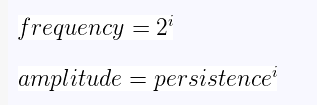
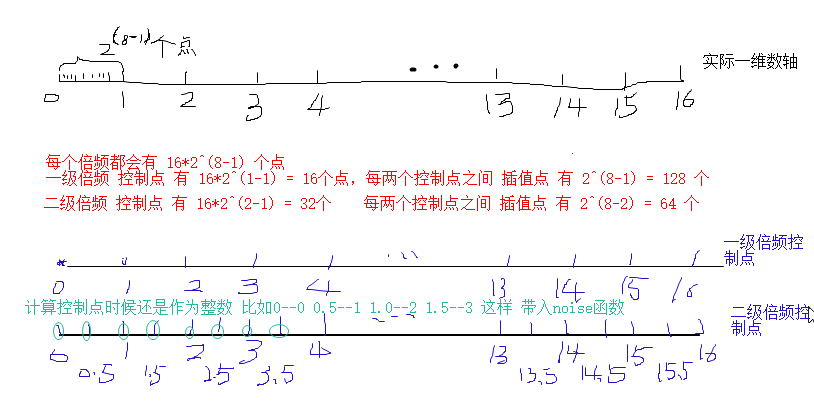

# 柏林噪声

### 参考

[一篇文章搞懂柏林噪声算法]: https://www.cnblogs.com/leoin2012/p/7218033.html
[Unity3D教程：PerlinNoise原理及实现]: http://gad.qq.com/article/detail/19340
[2002年发表的改进版柏林噪声算法]: https://mrl.nyu.edu/~perlin/paper445.pdf	"英文2页pdf"
[柏林噪声(Perlin Noise)(译)]: http://www.cnblogs.com/Memo/archive/2008/09/08/1286963.html	"概念定义和插值函数比较细"
[3D数学之柏林噪声(Perlin Noise)]: https://blog.csdn.net/seamanj/article/details/11271097	"官方各种版本实现比较"


### 作用

自然界中的随机现象有哪些？例如水波的扰动、树木的年轮或者纹理、山脉的高低起伏（想想大名鼎鼎的“我的世界”）、天上飘来飘去的云以及跳动的火焰等等。这些现象中包含有随机的成分，但是相互之间又有关联，主要表现为，它们是平滑的进行变化，而不是像白噪声那么尖锐。所以，柏林噪声就出现了，它就是用于程序模拟生成自然纹理 

2D柏林噪声可以通过插值生成地形，而3D柏林噪声则可以模拟海平面上起伏的波浪


### 简单过程

#### 二维理解：

1. 对于二维来说我们可以获取点P(x, y)，最近的四个__整数点__ABCD，ABCD四个点的坐标分别为A(i, j)、B(i+1, j)、C(i, j+1)、D(i+1, j+1)，随后通过__伪随机函数__，得到ABCD__四点的二维梯度值__G(A)、G(B)、G(C)、G(D)，并且算出ABCD到P点的向量AP、BP、CP以及DP ，红色箭头表示该点处的梯度值，绿色箭头表示该点到P点的向量 

   

2. 将G(A)与AP进行__点乘__，计算出A点对于P点的__梯度贡献值__，然后分别算出其余三个点对P点的梯度贡献值，最后将(u, v)代入__插值函数__中，得到插值比例，然后用__双线性插值__(三维是三线性插值)，算出P点的最终噪声值 


#### 一维理解：

1. 它需要一个整数作为参数，然后返回根据这个参数返回一个随机数。如果你两次都传同一个参数进来，它就会产生两次相同的数 

   

2. 通过在值之间平滑的插值，我们定义了一个带有一个非整参数的连续函数 

   


### 伪随机函数产生梯度（ 噪声控制点）

1. 伪随机是指，对于任意组相同的输入，必定得到相同的输出。因此，虽然每个顶点生成的梯度向量看似随机，实际上并不是。这也保证了在梯度向量在__生成函数不变__的情况下，__每个坐标__的__梯度向量__都是确定不变的。

2. 在柏林噪声中，它需要一个__整数__作为参数，然后返回根据这个参数返回一个随机数。如果你两次都传同一个参数进来，它就会产生两次相同的数。这条规律非常重要，否则柏林函数只是生成一堆垃圾 。__也就是，生成函数不变下，整个三维空间，所有整数的点上，梯度向量不变__，就看目标点在什么整数点之间

3. 旧版本2D的4个顶点、3D的8个顶点，要用伪随机函数，输入一个整数，生成 -1到1之间的梯度(浮点数，一维叫斜率，2D/3D可以叫梯度向量) 

   ```
   function IntNoise( 32-bit integer: x)       
      x = (x<<13) ^ x;
      return ( 1.0 - ( (x * (x * x * 15731 + 789221) + 1376312589) & 7fffffff) / 1073741824.0); 
   end IntNoise function
   ## 那些可怕的数字都是质数，所以你可以改成其他差不多大小的质数
   ## !!!! 实际测试 在数值比较小的时候都在-1,0；数值比较大在-1,1; 另外可对返回值 +1)/2 得到0~1.0区间
   ```

   

4. 后来改进柏林噪声，伪随机函数的输出，在3维上，只输出对应12个方向向量，是由12条单位正方体（3维）的中心点到各条边中点的向量组成 （新旧版本的柏林噪声文章中， 预定义的梯度表 不一样 ）

   ```
   (1,1,0),(-1,1,0),(1,-1,0),(-1,-1,0), (1,0,1),(-1,0,1),(1,0,-1),(-1,0,-1), (0,1,1),(0,-1,1),(0,1,-1),(0,-1,-1)
   ```

   预先生成256个伪随机的梯度值（以及二维和三维的梯度向量）保存在```G1[256]```、```G2[256][2]]```以及```G3[256][3]```  

   预先生成排列表P[256] （permutation table）

   ```
   
   /*------------------------------------------------------------
   main.cpp -- http://mrl.nyu.edu/~perlin/noise/
   (c) Seamanj.2013/9/6
   ------------------------------------------------------------*/
   
   int permutation[] = { 151,160,137,91,90,15,
   131,13,201,95,96,53,194,233,7,225,140,36,103,30,69,142,8,99,37,240,21,10,23,
   190, 6,148,247,120,234,75,0,26,197,62,94,252,219,203,117,35,11,32,57,177,33,
   88,237,149,56,87,174,20,125,136,171,168, 68,175,74,165,71,134,139,48,27,166,
   77,146,158,231,83,111,229,122,60,211,133,230,220,105,92,41,55,46,245,40,244,
   102,143,54, 65,25,63,161, 1,216,80,73,209,76,132,187,208, 89,18,169,200,196,
   135,130,116,188,159,86,164,100,109,198,173,186, 3,64,52,217,226,250,124,123,
   5,202,38,147,118,126,255,82,85,212,207,206,59,227,47,16,58,17,182,189,28,42,
   223,183,170,213,119,248,152, 2,44,154,163, 70,221,153,101,155,167, 43,172,9,
   129,22,39,253, 19,98,108,110,79,113,224,232,178,185, 112,104,218,246,97,228,
   251,34,242,193,238,210,144,12,191,179,162,241, 81,51,145,235,249,14,239,107,
   49,192,214, 31,181,199,106,157,184, 84,204,176,115,121,50,45,127, 4,150,254,
   138,236,205,93,222,114,67,29,24,72,243,141,128,195,78,66,215,61,156,180
   
   
   ```

   通过以下方法获取梯度

   二维  G2[P[x] + y]         

   三维  G3[P[P[x] + y] +z]  

   对于 给定任意点(浮点数)附近 的整数点 的梯度 可以 把 左上角 (  (int)x  , (int)y   , int(z)  ) ,  右下角 (  (int)x +1 , (int)y + 1 , int(z) + 1 ) 等代入 

   对于改进后用十二个方向向量，就不用G1/G2/G3表，直接把最后得到的P作为hash，按照下面的方法选择方向向量，并且同时求叉积 

5. 梯度向量与顶点位置向量的点积 

   ```
   hash&0xF 代表要选择 哪个方向向量  (x,y,z)是代表 整数顶点 指向 目标点 的向量 
   public static double grad(int hash, double x, double y, double z)
   {
       switch(hash & 0xF)
       {
           case 0x0: return  x + y; // 就是(x,y,z)*(1,1,0)
           case 0x1: return -x + y;
           case 0x2: return  x - y;
           case 0x3: return -x - y;
           case 0x4: return  x + z;
           case 0x5: return -x + z;
           case 0x6: return  x - z;
           case 0x7: return -x - z;
           case 0x8: return  y + z;
           case 0x9: return -y + z;
           case 0xA: return  y - z;
           case 0xB: return -y - z;
           case 0xC: return  y + x; // 重复0x8
           case 0xD: return -y + z;
           case 0xE: return  y - x;
           case 0xF: return -y - z;
           default: return 0; // never happens
       }
   }
   ```

   

   

### 插值函数

相邻两个整数之间的梯度，要进行插值计算，使得相邻两点之间平滑过渡。平滑度取决于所选用的插值函数 

老版的柏林噪声使用```f(t)=3*t*t-2*t*t*t*```  (GLSL或者HLSL中的smoothStep平滑过渡函数，三次两点埃尔米特插值：节点上的函数值相等，而且还要求对应的导数值也相等,甚至要求高阶导数也相等)

改进后的柏林噪声使用```f(t)=t*t*t*(t*(t*6-15)+10)``` (5次的埃尔米特插值，在x=0和x=1的一阶导数和二阶导数都是0)

```
public double perlin(double x, double y, double z) {
    ...
    
    double u = fade(xf);
    double v = fade(yf);
    double w = fade(zf);

    double x1, x2, y1, y2;
    // The gradient function calculates the dot product between a pseudorandom
    // gradient vector and the vector from the input coordinate to the 8
    // surrounding points in its unit cube.
    // This is all then lerped together as a sort of weighted average based on the faded (u,v,w)
    // values we made earlier.
    x1 = lerp( grad (aaa, xf  , yf  , zf), grad (baa, xf-1, yf  , zf), u);          
    x2 = lerp( grad (aba, xf  , yf-1, zf), grad (bba, xf-1, yf-1, zf),  u);
    y1 = lerp( x1, x2, v); // 双线性插值 
    
    x1 = lerp( grad (aab, xf  , yf  , zf-1), grad (bab, xf-1, yf  , zf-1), u);
    x2 = lerp( grad (abb, xf  , yf-1, zf-1), grad (bbb, xf-1, yf-1, zf-1), u);
    y2 = lerp (x1, x2, v); // 双线性插值 
    
    // For convenience we bind the result to 0 - 1 (theoretical min/max before is [-1, 1])
    return (lerp (y1, y2, w)+1)/2;   // 三线性插值  并且从-1,1映射到0,1
}

// Linear Interpolate
public static double lerp(double a, double b, double x) {
    return a + x * (b - a);
}

// Fade function as defined by Ken Perlin.  This eases coordinate values
// so that they will ease towards integral values.  This ends up smoothing
// the final output.
public static double fade(double t) {   // 非线性插值 5次埃尔米特插值
    return t * t * t * (t * (t * 6 - 15) + 10);         // 6t^5 - 15t^4 + 10t^3
}

```

还有余弦插值

```
function Cosine_Interpolate(a, b, x)
  ft = x * 3.1415927       // x 是 0~1 
  f = (1 - cos(ft)) * .5   // x 不是直接融合(线性插值) -cos(ft) -1~1  1-cost(ft) 0~2 * 0.5 = 0~1
  return a*(1-f) + b*f  
end of function
```


### 频率,幅度,**持续度** 

持续度persistence 是 1/N ，比如1/4，或者 1/root2，i 是表示第i个被叠加的噪声函数 



在实际应用中，我们更需要，__频率越高，那么幅度越小__


多个不同频率与振幅的噪声的叠加属于__分形噪声__的思想 

为了展示柏林函数在输出上持续度的表现效果，请看下下面的图表。他们展示了叠加的每个组成部分，持续度的效果和最终的柏林函数 （i 从0开始 ）

每个你所叠加的噪声函数就是一个倍频。因为__每一个噪声函数是上一个的两倍频率__。具体多少倍频你叠加在一起，这完全取决于你。你可以叠加很多也可以很少。尽管如此，还是让我给你一些建议吧。如果你正使用柏林噪声函数在屏幕上渲染图象的话，如果__倍频频率太高将会使缩成一个点以至于不能显示，这就是因为你屏幕的分辨率不够__。一些柏林噪声函数的实现，会自动叠加噪声函数直到达到屏幕分辨率的极限。当振幅变的很小的时候，也应该明智的停止再叠加噪声函数。 


```
public double OctavePerlin(double x, double y, double z, int octaves, double persistence) {
    double total = 0;
    double frequency = 1;
    double amplitude = 1;
    double maxValue = 0;  // Used for normalizing result to 0.0 - 1.0
    for(int i=0;i<octaves;i++) {
        total += perlin(x * frequency, y * frequency, z * frequency) * amplitude;
       
        maxValue += amplitude; // 累计每一倍频的幅度
        
        amplitude *= persistence;
        frequency *= 2;
    }
    
    return total/maxValue; // 归一化
}
```


#### 旧版实现

```
function Noise1(integer x, integer y)  // 二维上,某个整数点  生成 对应的伪随机数
	n = x + y * 57 
	n = (n<<13) ^ n;
	return ( 1.0 - ( (n * (n * n * 15731 + 789221) + 1376312589) & 7fffffff) / 1073741824.0); 
end function

function SmoothNoise_1(float x, float y) // 平滑函数 对于某个点 对应 整数点 做平滑处理
	/*
	1/16  1/8  1/16
	1/8   1/4  1/8
	1/16  1/8  1/16
	*/
	corners = ( Noise(x-1, y-1)+Noise(x+1, y-1)+Noise(x-1, y+1)+Noise(x+1, y+1) ) / 16
	sides   =   ( Noise(x-1, y) +Noise(x+1, y) +Noise(x, y-1) +Noise(x, y+1) ) / 8
	center  = Noise(x, y) / 4  // 相当于平滑处理了([x],[y])
	return corners + sides + center
end function

function InterpolatedNoise_1(float x, float y)
	integer_X = int(x)
	integer_Y = int(y)
	fractional_X = x - integer_X // 小数部分
	fractional_Y = y - integer_Y
	
	v1 = SmoothedNoise1(integer_X, integer_Y)
	v2 = SmoothedNoise1(integer_X + 1, integer_Y)
	v3 = SmoothedNoise1(integer_X, integer_Y + 1)
	v4 = SmoothedNoise1(integer_X + 1, integer_Y + 1) // 附近4个点的伪随机数
	
	// 新的方法，这里还要做叉积
	
	i1 = Interpolate(v1 , v2 , fractional_X)
	i2 = Interpolate(v3 , v4 , fractional_X)
	return Interpolate(i1 , i2 , fractional_Y) // 双线性处理
end function

function PerlinNoise_2D(float x, float y)
	total = 0
	p = persistence
	n = Number_Of_Octaves - 1
	loop i from 0 to n
		frequency = 2i
		amplitude = pi
		total = total + InterpolatedNoisei(x * frequency, y * frequency) * amplitude
	end of i loop
	return total // 如果要归一化，还要把每次的amplitute累加 然后total/sum_of_amplitude 
end function
```


#### PerlinNoiseTool的实现

一维：

1. 噪声函数 

   x = (x << 13) ^ x 

   result =  ((1.0 - ((x * (x * x * 15731 + 789221) + 1376312589) & 0x7fffffff) / 1073741824.0) + 1) 

   比论文 加了1 ，因为x比较小的时候，论文公式返回-1~0 

2. 插值函数  余弦插值  X =  ( - cos ( x * Math.PI ) + 1 ) * 0.5  result = a * (1-X) + b * X 

3. 大致图：





二维：

1. 噪声函数： int n = x + y * 57;    后面跟一位一样
2. 插值函数：利用Graphic2D标准接口，把二位的控制点的噪声值作为一个图片，一个控制点对应一个像素（R/G/B都是同一个对应控制点的噪声值)，然后经过仿射变换的bicubic/双三次插值，放大到512*512
3. 一级倍频的控制点 是  (16x16) ， 就是对应一个16x16像素的图片，然后双三次插值到512*512
4. 二级倍频的控制点 是 (32x32) ，就是一个32x32像素图片，双三次插值到 512*512 


三维：

1. 噪声函数：

   int n = x + y * 57 + z * 3249; // 与一维的区别，先根据(x,y,z)生成一个数n 

   n = (n << 13) ^ n;

   double result = ((1.0 - ((n * (n * n * 15731 + 789221) + 1376312589) & 0x7fffffff) / 1073741824.0) + 1) / 2.0; // 返回的是0~1的浮点数  , 论文没有+1  也没有/2  应该是在这种情况 ( 与一维的区别)

2. 插值函数：使用平滑函数，当前像素点的噪声值，为周围像素点的噪声值的平均值

3. 每个倍频对应不同的分辨率 比如（16x16x16）(32x32x32)  但最终平滑插值到  --> （512x512x512）

4. 下图是二维表达的，实际PelinNosieTool是三维的

   


