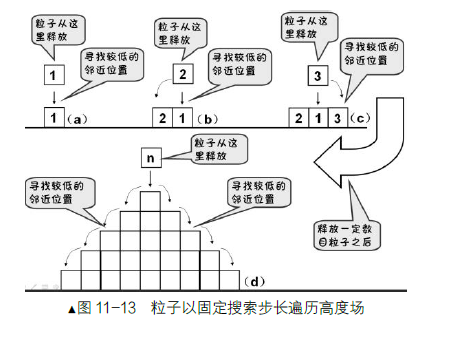
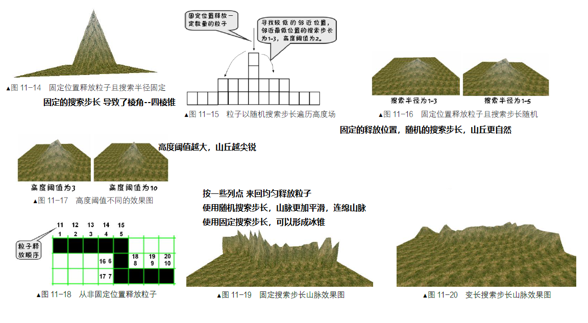

#### 粒子沉积算法 实现地形设计 
* Particles 目录是Eclipse工程，加载编译运行即可使用
* 运行后为 地形设计工具并可导出灰度图
* 原理：
  * 在某个释放位置，在搜索步长范围内寻找周围的最低点，并以这个为最低点继续在周围寻找，直到周围的高度跟当前一直
  * 模拟高空落砂成"沙丘"

 
* 三个技术补充
  * “搜索步长”：要随机，如果固定的话，容易形成四棱锥，可以形成冰锥
  * “高度阈值”：阈值越大，山丘越尖锐，阈值越小，山丘越平缓
  * “山脉地形”：设置一系列点来回释放粒子

 