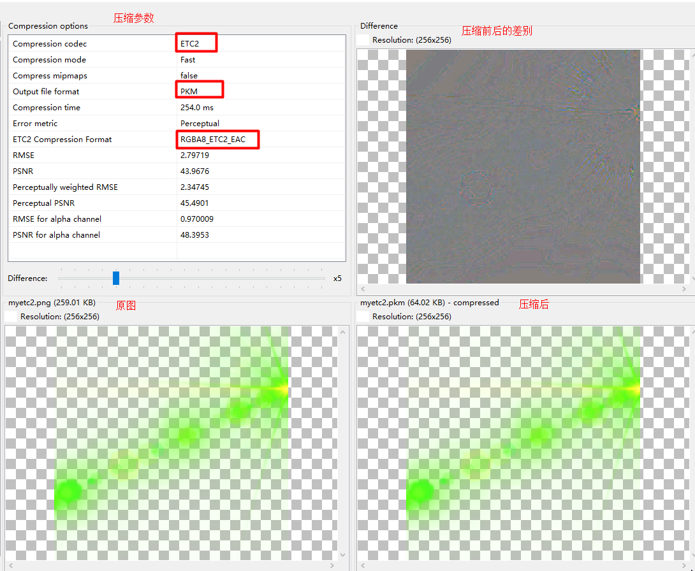
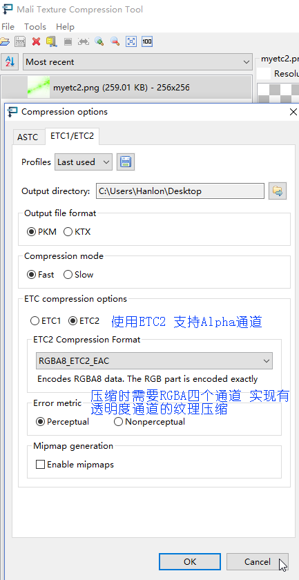

#### ETC1 ETC2 EAC 纹理压缩工具

* ETC1 OpenGLES 2.0支持 但是ETC1不支持透明通道
* ETC2 OpenGLES 3.0才开始支持，ETC2支持透明通道
* ETC1 可以用SDK/tools/etc1tool.exe工具生成
* ETC2 可以用Mail工具 https://developer.arm.com/products/software-development-tools/graphics-development-tools/mali-texture-compression-tool

#### 文件格式
* ETC1/ETC2 文件头  16个字节 特征符——编码宽——编码高——实际宽——实际高
    * static const char kMagic[] = { 'P', 'K', 'M', ' ', '1', '0' };
    * static const etc1_uint32 ETC1_PKM_FORMAT_OFFSET = 6;
    * static const etc1_uint32 ETC1_PKM_ENCODED_WIDTH_OFFSET = 8;
    * static const etc1_uint32 ETC1_PKM_ENCODED_HEIGHT_OFFSET = 10;
    * static const etc1_uint32 ETC1_PKM_WIDTH_OFFSET = 12;
    * static const etc1_uint32 ETC1_PKM_HEIGHT_OFFSET = 14;
    * ETC1则是4X4的像素块压缩成固定的64位编码（8字节），
* 调用 GLES30/GLES10.glCompressedTexImage2D 指向的数据buffer指针都要去掉头部

#### API 
* ETC2.0 GLES30.glCompressedTexImage2D GLES30.GL_COMPRESSED_RGBA8_ETC2_EAC

```
public static native void glCompressedTexImage2D(
        int target, // GL_TEXTURE_2D
        int level,
        int internalformat, // GL_COMPRESSED_RGBA2_ETC2_EAC
        int width,
        int height,
        int border,
        int imageSize,
        java.nio.Buffer data
    );
```

* ETC1.0 ETC1Util.loadTexture
    * 根据设备是否支持ETC1
        * 支持：实际内部调用 GLES10.glCompressedTexImage2D
        * 不支持：实际内部调用ETC1.decodeImage解码成GL_RGB type是GL_UNSIGNED_BYTE或者GL_UNSIGNED_SHORT_5_6_5(useShorts),最后GLES10.glTexImage2D
``` 
public static void loadTexture(
        int target, // GL_TEXTURE_2D
        int level, 
        int border, 
        int fallbackFormat, // GL_RGB
        int fallbackType,   // GL_UNSIGNED_BYTE
        InputStream input // 可以是Context.getResources().openRawResource(R.id.pkm)
        ) 

```

* GLES10.glCompressedTexImage2D  ETC1.ETC1_RGB8_OES
```
 public static native void glCompressedTexImage2D(
        int target,
        int level,
        int internalformat, // ETC1.ETC1_RGB8_OES
        int width,
        int height,
        int border,
        int imageSize, // etc1 pkm文件除了16个字节头部后面的
        java.nio.Buffer data
    );
```


#### 压缩效率
* ETC1 缩减7/8空间
* ETC2 缩减4/5空间


#### Mali纹理压缩工具参数和效果




#### pkm aapt打包 不压缩
* 需要在build.gralde中 设置 
```
    android {
        ...
        aaptOptions {
            noCompress 'pkm'
        }
    }
```
* 默认情况下assets目录，如下资源不压缩：
```
static const char* kNoCompressExt[] = { 
　　".jpg", ".jpeg", ".png", ".gif", 
　　".wav", ".mp2", ".mp3", ".ogg", ".aac", 
　　".mpg", ".mpeg", ".mid", ".midi", ".smf", ".jet", 
　　".rtttl", ".imy", ".xmf", ".mp4", ".m4a", 
　　".m4v", ".3gp", ".3gpp", ".3g2", ".3gpp2", 
　　".amr", ".awb", ".wma", ".wmv" 
　　};
```

* 只有没有被aapt压缩的assets才能使用openFd 然后可以使用ByteBuffer读取
```
context.getResoxe.getAssets().openFd
```

#### assets使用ByteBuffer读取 注意事项
* 必须没有经过aapt压缩  aaptOptions.noCompress
* 要使用 openFd().createInputStream().getChannel() 而不是 new InputStream(openFd().getFileDescriptor()).getChannel()
* FileChanel.read最后要ByteBuffer.flip()才能是 positon=0 remaining()=数据大小
* ETC2头部数据是大端的 在读取多字节数据(宽 高) getShort(index) 之前要 ByteBuffer.order(BIG_ENDIAN)
* ByteBuffer.getShort(index) 读取第index个字节 开始的两个字节 并以order指定的字节序返回对应的值 
