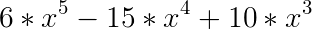

#### 雾效果 灰尘 
* 随着距离越来越远，景物越来越不清晰 

* 雾化因子 的 线性模型 和 非线性模型
    * 1.0f 没有雾，直接用光照后的结果
    * 0.0f 完全是雾，直接用雾的颜色
    * 0.0~1.0f之间，雾化因子*光照结果 + (1-雾化因子)*雾颜色


#### 各种插值 和球运动轨迹
* http://sol.gfxile.net/interpolation/ 

#### OpenGL 重要函数
* smoothstep


```
#define SMOOTHSTEP(x) ((x) * (x) * (3 - 2 * (x)))
```
* smootherstep = 6 * x^5 -  15 *  x^4 + 10 * x^3  


```
#define SMOOTHERSTEP(x) ((x) * (x) * (x) * ((x) * ((x) * 6 - 15) + 10))
```
