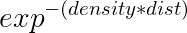
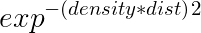

#### 雾效果 灰尘 雾化因子( fogFactor or fogAlpha )
* 随着距离越来越远，景物越来越不清晰 

* 雾化因子 的 线性模型 和 非线性模型
    * 1.0f 没有雾，直接用光照后的结果
    * 0.0f 完全是雾，直接用雾的颜色
    * 0.0~1.0f之间，雾化因子*光照结果 + (1-雾化因子)*雾颜色

* 优化计算效率
    * 如果雾化因子是0的话，就是雾的颜色，可以不用计算雾跟关照结果的混合blend/mix
    * 如果采用每片元关照计算的话，雾化因子为0的话，不仅不用计算雾和关照mix，甚至连关照都可以不用计算，直接就是雾颜色

#### 截断到最大值和最小值 clamp
* max(  min(y,最大值) , 最小值  )
* 不低于某个最小值，用max，max(y, 最小值/最低值)
* 不高于某个最大值，用min，min(y, 最大值/最高值)
* 也就是'不高于用min，不低于用max'
* 或者直接使用OpenGL shader内建函数clamp

#### 线性模型
* flogFactor = 
* dist < start  1
* dist > end    0
* other   (end-dist)/(end-start)
* 或者写成  max ( min( (end-dist)/(end-start) , 1  ) , 0)
* 最终颜色计算 finalColor = flogFactor * lightColor + (1-flogFactor)*flogColor 


#### 各种插值 球运动轨迹
* http://sol.gfxile.net/interpolation/ 

#### 埃尔米特插值

#### OpenGL 重要函数 平滑过渡函数 指数雾
* smoothstep


```
#define SMOOTHSTEP(x) ((x) * (x) * (3 - 2 * (x)))
```
* smootherstep


```
#define SMOOTHERSTEP(x) ((x) * (x) * (x) * ((x) * ((x) * 6 - 15) + 10))
```


* exp 




#### OpengGL shader API 内建函数

| 函数名 | 签名 | 作用 | 备注 |
| --- | --- | --- | --- |
|length| float length (genType x) | 向量的模/长度 | genType可以是vec2,vec3|
|distance| float distance(genType p0,genType p1)|向量p0到向量p1的距离| genType可以是vec2,vec3，也可以用lenght(p0-p1)代替|
|mod| genType mod (genType x, float y) | 求余  | 区别与length，这个是求余数，计算%，不是向量的模 |
|cross| vec3 cross (vec3 x,vec3 y) | 叉乘 | 可以用来计算x和y所在平面(比如三角面)的法向量| 
|dot| float dot (genType x, geType y)| 点乘 | 两个单位向量的点乘就是cosθ, 两向量的夹角的余弦值可以将两向量规格化后求点乘|
|normalize| genType normalize (genType x) | 标准化向量，返回一个方向和x相同但长度为1的向量 | 两个单位向量的和，就是在夹角的平分线，用于计算光入射光线和视线向量的半向量 |
|pow| float pow (float x, float y) | x^y | x不能是负数，x为0时y不能是负数，这两种情况结果没有定义 |
|smoothstep| genType smoothstep (genType edge0,genType edge1,genType x) |如果x <= edge0，返回0.0 ；如果x >= edge1 返回1.0；如果edge0 < x < edge1，则执行0~1之间的平滑埃尔米特差值|如果edge0 >= edge1，结果是未定义的|
|clamp|genType clamp (genType x, genType minVal, genType maxVal)|夹具函数|minval的值必须比maxVal小|
|mix|genType mix(genType x,genType y, genType a)|功能使用因子a对x与y执行线性混合,即返回x*(1-a)+y*a|注意不是x*a+y*(1-a)|

#### Shader中注意
* 内置函数名字smoothstep是全部小写
* mat3(*)不是Mat3(*)，开头不用大写
* 1 和 1.0 字面值区别 ，一个是整数，一个是浮点数，shader中大部分用浮点数

#### 摄像机到表面点的距离
* 方案1:表面点经过模型变换得到世界坐标系，然后跟摄像机位置的距离(欧式距离)
* 方案2:表面点经过视图变换得到摄像机坐标系，得到的坐标，然后求坐标向量的长度(欧式距离)或者abs(z)(z方向的距离)

#### 线性雾和指数雾 参考实现
* https://blog.csdn.net/hb707934728/article/details/77977962
    * 指定雾的开始距离,结束距离,雾颜色
    * 将模型上的点变换到眼睛坐标系
    * 计算雾浓度
    * 线性雾原理：开始位置到结束位置之间，雾的浓度越来越高，浓度的变化和距离成正比

* https://blog.csdn.net/hb707934728/article/details/78016238
    * 雾浓度越大，斜线越抖，越快看不清景物
    * 雾浓度不能是负数


#### Unity中的雾效果
* Linear、Exponential和Exp2 三种模式
* https://blog.csdn.net/candycat1992/article/details/41595239
