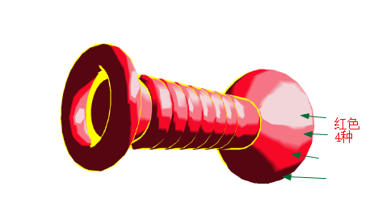
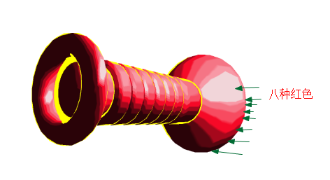
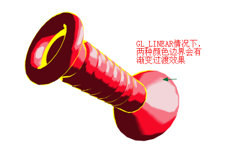

## 非真实绘制
* 水粉画效果,卡通着色
* 

* 使用一个色块纹理贴图作为查找表(LUT,调色板)，使用色块纹理贴图中的纯色填充，减少颜色的变化来得到非真实绘制效果
* 真实绘制=物体颜色(丰富的)*光照强度(连续)，结果是色数较多
* 非真实绘制=光照强度*物体颜色的结果，离散成少数可明显辨别的颜色值

## 色块纹理
* 连续的光照强度结果，映射到不连续的色块中，转换为离散的4个/8个颜色
* 色块纹理相当于调色板或者LUT查找表，根据ST纹理坐标，在色块纹理中，找到离散的颜色
* 色块数目越多越真实

## 边缘绘制
* 这个边缘不是物体的棱角，而是差不多看不到的物体表面点，就是差不多去到背面的点
* 判断当前片元是否在边缘位置：视线向量(物体表面点到摄像头)与表面点(片元)的法向量的夹角大于一定角度，也就是判断余弦值小于某个值，就是边缘
* 工程实践：两个单位向量的点积，就是这两个向量夹角的余弦值

## Demo
* 原来整个都是红色的,根据光照结果应该是红色渐变的
* 使用非真实绘制，采用色块纹理，取代原来光照强度*红色的渐变结果，直接映射为离散的4到8个红色
* 光照强度在0~1.0之间作为纹理S坐标，纹理采样方式为GL_NEAREST，T坐标固定为0.5
* S坐标在0.0~0.25取同一个颜色，0.25~0.5取另外一个颜色，这样连续的关照强度就被离散成4个红色
* 

* Demo中光照结果只用一个通道，之前离散光强度和镜面光强度都有RGB通道的
* 如果纹理有GL_NEAREST改成GL_LINEAR，在边界处会有过渡
