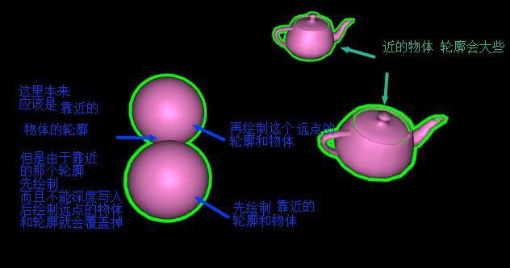

## 描边效果
* 沿法线挤出轮廓
* 沿着法线挤出一些，用描边用的纯色进行绘制，然后再在上面绘制物体本身
* 沿着法线挤出 计算公式  a + r*n  a和n分别是该点的顶点坐标和(单位)法向量，r是挤出的长度
* 沿着法线挤出后的顶点，在顶点着色器中再做MVP转换

## 深度写入
* 全程都是打开深度检测的 glEnable(GL_DEPTH_TEST)
* 打开深度检测，可以关闭深度写入，但是依旧会做深度判断

## Demo
* 关闭深度写入描边 
* 后绘制的较远的物体轮廓时，即使关闭深度写入，但是深度检测还是起效的，不会覆盖掉较近的物体
* 

* 打开深度写入描边
*

* 顶点挤出长度是0.4，在vertexedge.sh中，得到物体坐标系，‘膨胀’后的物体
* 对挤出后的顶点再做MVP转换
* 片元着色器只是，把所有片元纯色绘制
* 物体的绘制跟以前一样计算光照强度，物体是纯色的
* 一直打开‘深度检测’的方案，通过修改‘背面剔除’的正面
    * 在绘制轮廓的时候，要保留轮廓的后面，所以要裁剪轮廓的前面，这样只要将‘背景裁剪正面’改为‘顺时针CCW’
    * 也即是轮廓保留背面，物体保留前面
* 背面裁剪是在光栅化之前，图元装配之后，剔除的部分就不会做深度测试和深度写入

## 渲染管线
顶点属性(顶点坐标,纹理坐标,法向量)传入管线
顶点着色器
图元装配和裁剪(*视锥裁剪操作/背面剔除)
光栅化
片元着色器
裁剪测试
深度测试/模板测试
颜色混合(blend)
抖动(??)
帧缓冲