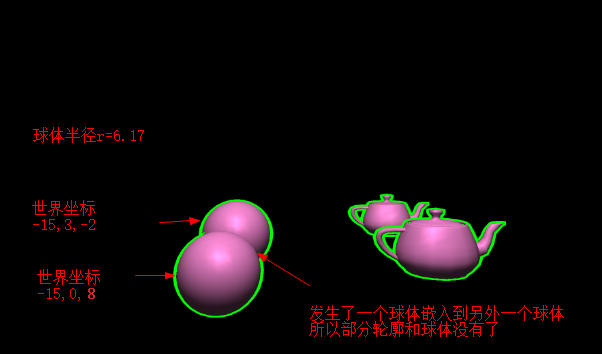

## 描边效果
* 沿法线挤出轮廓
* 在物体坐标系中，沿法线挤出
* 在视空间(做完了MVP后，不是转换到世界空间)，沿法线挤出：物体轮廓不随着摄像机远近变化

## 在视空间挤出
* 通过最终变换矩阵(MVP)得到最终的顶点坐标和法向量，然后顶点坐标再沿法向量方向挤出

## MVP后的法向量
* MVP之后的顶点坐标是齐次坐标，要做透视除法，才能得到最后标准设备空间的坐标,本来是在渲染管线自动完成的
```
  vec4 ydskj      =   uMVPMatrix*vec4(0,0,0,1);
  vec4 fxldskj    =   uMVPMatrix*vec4(aNormal.xyz,1.0);
  vec2 skjNormal  =   fxldskj.xy - ydskj.xy;  // 只用x y ??? 后面把z坐标直接设置为1.0
  
  vec4 finalPosition=uMVPMatrix * vec4(position.xyz,1);
  finalPosition=finalPosition/finalPosition.w; 
  // MVP之后的顶点坐标是齐次坐标，要做透视除法，才能得到最后标准设备空间的坐标
  
  gl_Position = vec4(finalPosition.xyz + vec3(skjNormal.xy,1.0)*0.01,1.0); 
  // 渲染管线不用做透视除法，因为w=1
  
```


## Demo
* 原Demo在顶点shader中有错误，按原Demo两个球体的位置应该有发生嵌入，所以应该有部分轮廓没有的，之所以原Demo还出现轮廓时因为shader中，最后计算轮廓挤出的顶点坐标时候，把w也乘以了0.01，导致w最后是1.01
* 修改Demo两个球体距离大于2倍半径，并修改轮廓挤出的顶点坐标的计算方法，效果是
* 


* 按原Demo的球体距离，效果应该是
* 

* 齐次坐标经过渲染管线，会做透视除法，就是x,y,z都除以w，越远的话，w越大
* 背面裁剪 是在 片元着色器后 的 所有测试的最前面，如果剔除了，就不会做深度测试和深度写入

## 渲染管线
顶点属性(顶点坐标,纹理坐标,法向量)传入管线
顶点着色器(* 齐次坐标经过渲染管线，会做透视除法，就是x,y,z都除以w)
图元装配和剪切
光栅化
片元着色器
裁剪测试
深度测试/模板测试
颜色混合(blend)
抖动(??)
帧缓冲