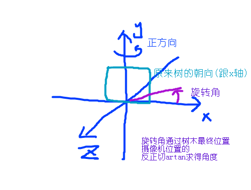
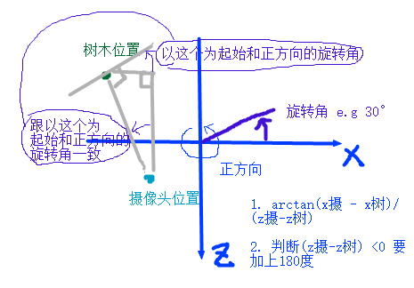

#### 标志板
* 矩形纹理，透明纹理图
* 矩形纹理永远对着摄像头
* 适合左右轴对称的，否则很假

#### 正切值求角度
* x > 0  θ = arctan ( y/x ), 值域在(π/2,-π/2)
* x = 0  y > 0 θ = π/2
* x = 0  y < 0 θ = -π/2
* x < 0  θ = arctan ( y/x )+π , 值域在(π/2,π) (π,3/2*π)(这个实际就是(-π/2,-π))

#### 混合
* 先绘制远处的物体，再绘制近处的物体
* SingleTree需要实现Comparable接口compareTo 
* 使用Collections.sort(ArrayList)进行排序 

#### API
* Matrix.rotateM(currMatrix,0,angle,x,y,z);
    * 右手螺旋为正方向，e.g XOZ平面y轴旋转轴并且y轴正方向与拇指方向一样
    
* Comparable接口
    * Java 平台库中的所有值类 (value classes) 都实现了Compareable接口
    * Comparable 接口只有一个方法 compareTo(Object obj) obj是要比较的对象
    * compareTo就是比较两个值，如果前者大于后者，返回1，等于返回0，小于返回-1
    * 返回-1时候 当前对象会排在比较对象之前，也就是按照compareTo返回值从小到大来排序
    * 类的自然排序 类的compareTo方法被称为它的自然比较方法 
    * 实现此接口的对象列表（和数组）可以通过 Collections.sort（和 Arrays.sort）进行自动排序
    * 实现此接口的对象可以用作有序映射中的键或有序集合中的元素，‘无需指定比较器’
    * 对于类 C 的每一个 e1 和 e2 来说，当且仅当 e1.compareTo(e2) == 0 与 e1.equals(e2) 具有相同的 boolean 值时，类 C 的自然排序才叫做与 equals 一致。
    
    
  Comparator接口
    * Comparator接口其实就是一种策略模式的实践
    * 策略模式定义了一系列的算法，并将每一个算法封装起来，而且使它们还可以相互替换。策略模式让算法独立于使用它的客户而独立变化
    * 它一定要实现compareTo(T o1, T o2) 
    * 将算法和数据分离
        * 类的设计师没有考虑到 Compare 的问题而没有实现 Comparable 接口
        * 为了使用不同的排序标准做准备，比如：升序、降序或其他什么序
        * 
    
* Arrays.sort 
    * 排序算法：
        * 如果数组长度大于等于286且连续性好的话，就用归并排序
        * 如果大于等于286且连续性不好的话，就用双轴快速排序
        * 如果长度小于286且大于等于47的话，就用双轴快速排序
        * 如果长度小于47的话就用插入排序
        
* Collections.sort
    * 排序算法：
        * Timsort是结合了合并排序(merge sort)和插入排序（insertion sort）而得出的排序算法
        * 实现原理：https://blog.csdn.net/yangzhongblog/article/details/8184707
        * JSE7 对 对象进行排序，没有采用快速排序，是因为快速排序是不稳定的，而Timsort是稳定的
        * Timsort是稳定的算法，当待排序的数组中已经有排序好的数，它的时间复杂度会小于nlogn
        * 与其他合并排序一样，Timesrot是稳定的排序算法，最坏时间复杂度是O(nlogn)
        * 在最坏情况下，Timsort算法需要的临时空间是n/2，在最好情况下，它只需要一个很小的临时存储空间 
    
#### 图示

#### Demo
* TreeForDraw只是一个普通的画矩形的Render，外部通过传递textureID和修改MatrixState改变Render行为，矩形大小是 UNIT_SIZE*3,UNIT_SIZE*5 在xoy平面原点处
* TreeGroup由SingleTree聚合，创建SingleTree并提供每个SingleTree在世界坐标系中的位置，对SurfaceView提供calculateBillboardDirection和drawSelf接口  
* SingleTree负责计算自己的Rotate和保存自己的位置，渲染时候更新顶点变换矩阵MatrixState，P(全局)*V(全局)*M(位移)*M(旋转)
* Desert，一个简单的矩形Render，SurfaceView创建时给定纹理坐标和宽高尺寸*UNIT_SIZE(顶点坐标)，纹理采用GL_REPEAT，纹理坐标超过1.0会重复，通过传递textureID和修改MatrixState改变Render行为，P(全局)*V(全局)*M(只做位移到(0, -2, 0))
* SurfaceView 创建并上传Desert和SingleTree需要的纹理图，根据触摸位置，调整摄像头位置(半径和旋转角)，所有Tree的旋转方向，对需要混合的Tree计算与摄像头当前的距离并进行Collections.sort排序
* 半径和水平角度-->改变摄像机位置-->重新计算Tree的朝向(只跟摄像头位置和自己的位置有关)-->计算Tree跟摄像头的距离从而排序-->重新渲染