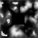
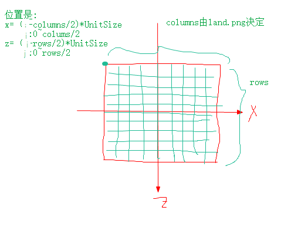
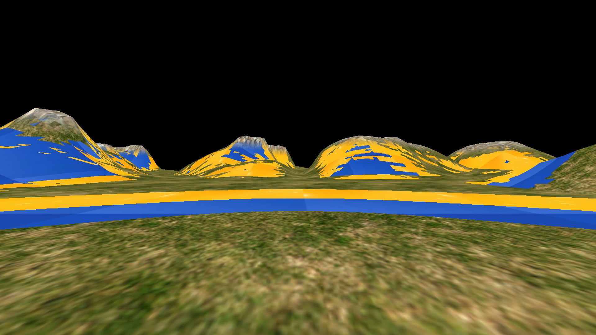
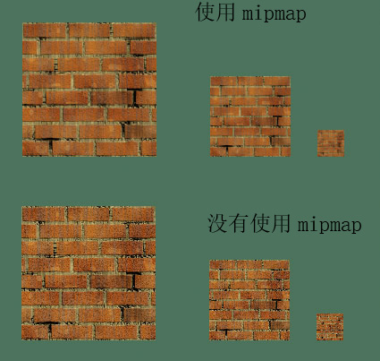

#### 灰度图地形生成技术
* 一个灰度图land.png(64*64)的r g b的平均值作为高度，灰度图的宽高决定了地形网格的数目



* 灰度图land.png的白色像素 代表海拔最高处
* 由于灰度图的值是在0~255，转换成高度需要换算：最大高度差*平均值/255 + 最低海拔，高度差20.0f 最低-2.0f
* Mountion生成顶点坐标，决定了在XOZ平面上的宽高尺寸， 分割成多少个格子由灰度图决定，每个格子大小UNIT_SIZE=2.0f
* XOZ平面顶点计算:



* 纹理坐标生成
    * 确定S/T轴的最大坐标值(纹理重复的次数) 16.0f
    * 按照灰度图的尺寸生成同样多个格子对应的纹理坐标
    * 也可以设置每个格式纹理大小就是1.0f，每个格子就是完整一个纹理图
    
    
#### 过程纹理
* 可以使用更多的纹理
* 顶点着色器 要把没有变换之前的顶点高度 传递给片元着色器
* 片元着色器 根据顶点高度，决定用草皮 石头还是两者混合 

#### 顶点着色器中也可以使用texture
* 顶点的属性，还可以包含纹理图的坐标，每个顶点对应一个纹理坐标
* 在顶点着色器中使用texture，获取对应纹理图的rgb

#### MIPMAP
* Mipmap在3D图形学中主要是用来做anti-aliasing，这跟图像学中的概念是一致的：
* 图像在缩小时因为采样率不够，就会导致混叠现象，如果是线，就表现为断线，如果是纹理比较复杂，就表现为纹理变得杂乱。
* 用来贴图的纹理大小与真正要render的区域不一定是刚好匹配的，这样就需要做放大或缩小，如果缩小，也就会产生上面所述的混叠现象
* 原始纹理逐步做下采样（即图像缩小），从而生成一系列的不同大小的纹理，这些纹理被称为mipmap
    * 图形学中经常会用到z值来控制物体的远近，有时会在一个多边形中用z值变化来生成纵深感很强的物体，
    * 这时在一个多边形内部的纹理贴图就会用到不同的缩小比率，如果只用原始的纹理去采样，就会在缩小比率大的地方（通常是z值大的地方）出现混叠
    * 比如，
        * 我们要用做贴图的纹理大小为 64x32，对它做下采样生成32x16，16x8，8x4，4x2，2x1，1x1的纹理
        * 如果要render的区域大小为14x6，那么我们要么选16x8的纹理贴，要么选16x8与8x4的两块纹理做完线形平均的结果贴
    * 算法：
        * http://www.cnblogs.com/kfqcome/archive/2011/08/11/2136997.html
        * https://www.lihuasoft.net/article/show.php?id=4509 (文中有说明mipmap不能解决的情况，特别是横向和竖向缩小不一致时)
    * 过程:
        * 实际是二次采样，因为纹理图本来就是采样量化后的，重新采样会有两种问题：
            * 放大的取样，取样点间隔比原来纹理图/贴图的要小，采用sinc filter，会出现ring effect振铃效应，但没有锯齿，(奈奎斯采样定理>2fps)
            * 缩小的取样，取样点间隔比原来贴图要大，切除高频成分，并会出现失真现象
        * 抽样，缩小的话，就相当于在纹理图上隔开一大段距离采样，像低通滤波器那样，高频率部分没有了
            * 数字图像处理中的Box Filter. 图像处理中常常会听到盒子滤波（Box Filter）
            * 当前像素及其相邻的的像素点都一视同仁，统一进行平均处理，这样就可以滤去图像中的噪声
            * 但是box filter在缩小得越大，就需要更大的box，比如缩小4倍就需要4x4的box
            * 为了解决这个问题，就出现了MIP MAP ,预先把贴图用各种大小的box filter处理，建立大小不同的贴图
            * MIP is many things in a small place
            * 举例，贴图256*256，可以计算出用2x2,4x4,8x8...的box filter计算出128×128、64×64、32×32、…、4×4、2×2 和 1×1贴图
            * 举例，使用时候需要缩小5倍，就是64×64的贴图，不需要用5x5的box再计算
        * 重建，缩小的话，在重建时候，如果选择邻近的采样点(nearest sampling),由于每个取样点只选择一个点，所以也叫point sampling，就会导致马赛克(生成了高频)
        * 重建，或者用一次多项式去逼近，也就是线性內插(linear interpolation)，在二维上由于在两个方向上，所以是双线性内插/bilinear interpolation,每个取样点需要取2x2个点來计算
        * 重建，如果再提高逼近的次数，就是以三次多项式來逼近了，cubic interpolation，在二维的情形下，叫做 bicubic interpolation
        * 重建，三次內插有很多不同的型式，不過，對每個取樣點，它都需要 4x4 的計算
        
* 近处的山投射到屏幕上占面积大,远处的山投射到屏幕面积小
* 近处的山体纹理采样使用MAG方式,纹理图会被拉大
* 远处的山体纹理采样使用MIN凡是,纹理图被缩小
* 纹理图拉大后会不清晰(GL_LINEAR),缩小后会很锐利(GL_NEAREST)
    * 纹理尽可能以原始尺寸的大小显示在屏幕上，但是在现实的3D场景中这几乎是不可能的。
    * 首先纹理附着在三维物体表面肯定会有形变，再有随着视角位置的变化三维物体的位置可近可远，
    * 较近时会放大拉伸纹理，较远则会压缩纹理尺寸
* 使用Mipmap可以提升性能,但需要纹理空间接近普通纹理的两倍??
* 部分机型要求MipMap的纹理图必须长宽相等，否者不能正确显示
* Mipmap纹理采样本身也分线性采样和最近点采样
* OpenGL ES3.1 获取 特定mipmap层的尺寸
```
    glGetTexLevelParameteriv(GL_TEXTURE_2D,MIPMAP_LEVEL, GL_TEXTURE_WIDTH,texDims,0);
```
* OpenGL ES 读取 特定mipmap层的图像 
```
    glFramebufferTexture2D(GL_FRAMEBUFFER, GL_COLOR_ATTACHMENT0,GL_TEXTURE_2D, textures, MIPMAP_LEVEL);
    glReadPixels(x,y,w,h,GL_RGBA,GL_UNSIGNED_BYTE,buffer) 这里可以指定开始位置宽高 不受glViewPoint影响
```
* 产生mipmap纹理
```
    glBindTexture(GLES30.GL_TEXTURE_2D, textureId);
    glTexParameterf(GL_TEXTURE_2D, GL_TEXTURE_MIN_FILTER, GL_LINEAR_MIPMAP_NEAREST);
    glTexParameterf(GLES30.GL_TEXTURE_2D,GL_TEXTURE_MAG_FILTER, GL_LINEAR_MIPMAP_LINEAR);
    GLUtils.texImage2D( GL_TEXTURE_2D,0,orgin256x256,0 );           // 加载原始图片作为纹理 基本图像层 
    glGenerateMipmap(GL_TEXTURE_2D)                                 // 产生mipmap
    GLUtils.texImage2D( GL_TEXTURE_2D,1,custom_img128x128,0 );      // 覆盖mipmap的第一层
    GLUtils.texImage2D( GL_TEXTURE_2D,2,custom_img64x64,0 );        // 覆盖mipmap的第二层
```
* 原纹理基本图层256x256(草地),第一层和第二层分别被自定义的128x128,64x64的纹理图替换,效果(屏幕1920x1080):


#### 各种采样方式/过滤方式

|param值 | 含义 |
| --- | --- |
|GL_NEAREST|在纹理基层上执行最邻近过滤|
|GL_LINEAR| 在纹理基层上执行线性过滤|
|GL_LINEAR_MIPMAP_NEAREST|选择与显示尺寸最相近的一个纹理，然后运用LINEAR算法进行采样|
|GL_NEAREST_MIPMAP_NEAREST|选择与显示尺寸最相近的一个纹理，然后运用NEAREST算法进行采样||
|GL_NEAREST_MIPMAP_LINEAR|选择两个与显示尺寸相近的纹理，然后都运用NEAREST算法进行采样，最终再算一个加权平均值|
|GL_LINEAR_MIPMAP_LINEAR|择两个与显示尺寸相近的纹理，然后都运用LINEAR算法进行采样，最终再算一个加权平均值。这种模式也被称为trilinear filtering（三线性过滤），运算量大效果也最好|


* MIPMAP_后面的参数 为如何在Mipmap这一组纹理中选择哪一个或者哪几个纹理进行纹理贴图
* GL_后面的参数 为如何在选定的纹理上进行纹理采样

* 使用MipMap时设置GL_TEXTURE_MIN_FILTER选项才能起作用，设置MAG是没有作用的


#### MIP层之间的选择 最邻近与线性插补(三线性过滤)
* 假设一张32768x32768的mipmap贴图，当前屏幕分辨率为1024*1024。
* 眼睛距离物体比较近时，mipmap最大也只可能从1024*1024的Mipmap图层选取texel。
* 再次，当使用三线性过滤（trilinear）时，最大也只能访问2048*2048的图层选取texel，
* 来和1024*1024图层中的像素进行线性插值
* 为了加快渲染速度和减少图像锯齿，贴图被处理成由一系列被预先计算和优化过的图片组成的文件,这样的贴图被称为mipmap


#### Direct3D 纹理链 三线性过滤
* 多级渐进纹理由一组分辨率逐渐降低的纹理序列组成，每一级纹理宽度和高度都是上一级纹理宽度和高度的一半
* Direct3D在纹理映射时，自动选择一幅与物体大小最接近的纹理进行渲染
* Direct3D将纹理序列看成一条多级渐进纹理链。链头处纹理的分辨率最高，下一级往后依次递减，链尾处纹理的分辨率最低
* Direct3D能估计出多级渐进纹理链中哪幅纹理的分辨率最接近想要的输出结果，然后它将(这张纹理的)像素映射到纹理空间
* 多级纹理过滤是缩小和放大过滤器的结合。
    * 如果将缩小和方法过滤器设为线性过滤，但是多级纹理过滤方式设为最近点采样，
        * Direct3D就会选择与要显示的纹理贴图大小最接近的纹理级别，在该级纹理上完成双线性纹理过滤，并将结果作为像素的值。
    * 如果将缩小、放大过滤器和多级渐进纹理都设置为线性过滤，
        * 则Direct3D就会在两个最接近的纹理级别上都进行双线性纹理过滤，
        * 然后再对相邻两级纹理图形上对应的两个纹理颜色进行加权平均，
        * 最后的结果作为单个像素值。
        * 这种为了图元中的一个像素，而结合了“两幅纹理”，共8个像素的技术，称为“三线性过滤”
        * 因为它在纹理的三个方向----u、 v和纹理级别上都进行了线性过滤。

#### MIP 深度
* num_levels = log_2(maxsize) + 1
* where (for 2D tex, array, cube and cube array) 
* maxsize = max(width, height)

#### MIP is Much In Little
* mip实际上是三个拉丁词的首字母：multum in parvo
* 翻译成英文就是：much in little
* 其意思也就是说可以在一个纹理对象中生成很多不同尺寸的纹理。

#### 代码调用


```
gl.texImage2D(gl.TEXTURE_2D, 0, gl.RGBA, gl.RGBA, gl.UNSIGNED_BYTE, image);
gl.generateMipmap(gl.TEXTURE_2D);
```
* 还有一种方式，需要你事先生成好不同尺寸的纹理，然后通过 texImage2D 来设置mipmap：
```
gl.texImage2D(gl.TEXTURE_2D, 0, gl.RGBA, gl.RGBA, gl.UNSIGNED_BYTE, image_0);
gl.texImage2D(gl.TEXTURE_2D, 1, gl.RGBA, gl.RGBA, gl.UNSIGNED_BYTE, image_1);
gl.texImage2D(gl.TEXTURE_2D, 2, gl.RGBA, gl.RGBA, gl.UNSIGNED_BYTE, image_2);
```
* 在上面代码中，我们调用了三次texImage2D，每次传递不同的纹理图片。
* 注意第二个参数，它是来指定mipmap的level，0表示原始级别，1表示缩小一半的级别、2表示再缩小一半的级别。

* 需要指定纹理缩小时需要采取的采样方式为mipmapping，比如：
```
gl.texParameteri(gl.TEXTURE_2D, gl.TEXTURE_MIN_FILTER, gl.NEAREST_MIPMAP_LINEAR);
```


#### 对比


* 使用了mipmap更加平滑了~


#### 使用MIPMAP注意
* 目前测试宽高不一样，在晓龙820上没有问题
* 目前测试500*256,250*250,500不是2的N次方,在晓龙820上没有问题,250*250第一层mip是125*125