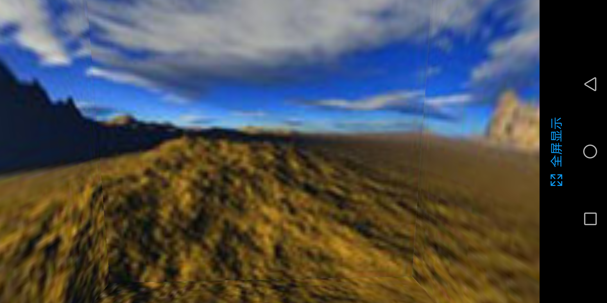
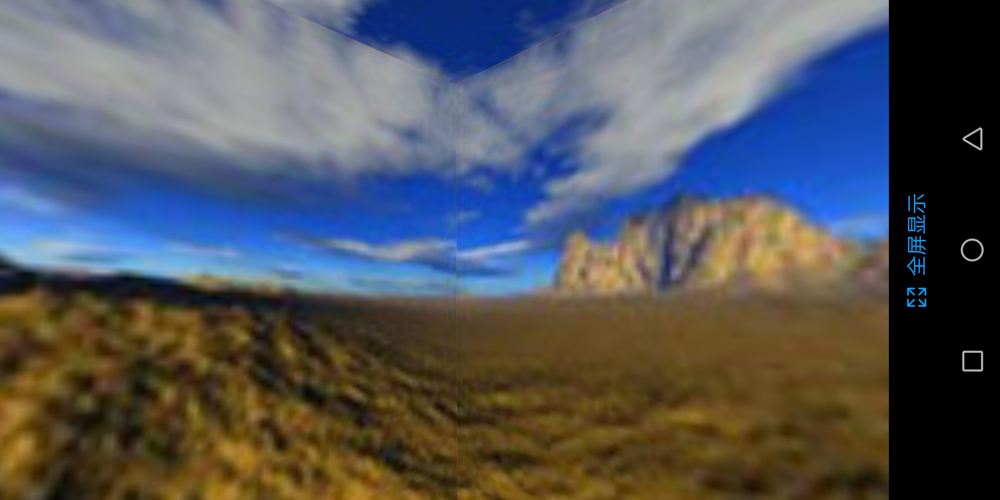
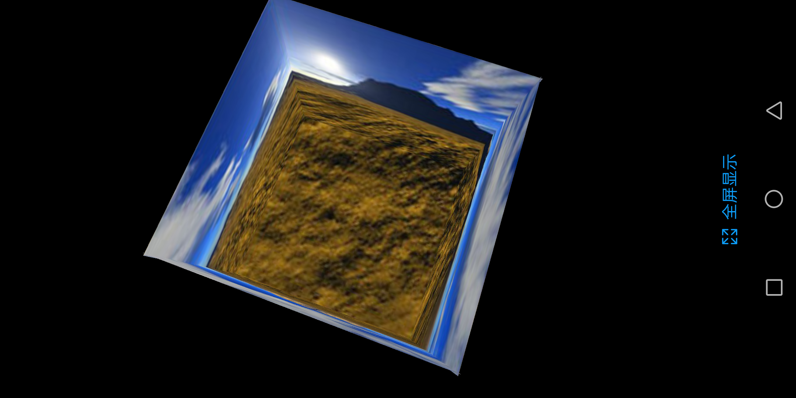

#### 天空盒
* 就是画一个立方体，立方体每一个面都是正方形纹理
* 纹理是正方形的
* 摄像头要为与正方体内，也就是在世界坐标系中，要位于立方体内部
* 立方体的前和后面的矩形TextureRect要旋转个180度，因为要区分正反方向(GL_CULL_FACE)
* GL_CULL_FACE默认逆时针为正面，剔除背面

#### 缺点
* 接缝处 有明显分界
* 正对着接缝时，去移动摄像头，会见到两边有各自拉长 
* 使用天空穹/半球面方法解决

#### Example

