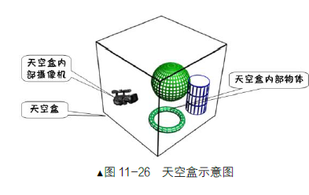
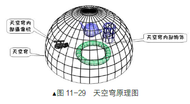
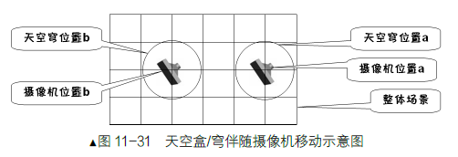

#### 天空穹
* 原理: 使用一个半球面模拟天空，半球面上贴上对应天空的纹理
* 半球体采用等水平角，等俯仰角划分，纹理是全景图
* 半球面切分得越细，效果越好，但对性能不好

* 可以使用天空穹/天空盒罩住整个场景，但是如果场景很大的话，那么成像会不好
* 大场景一般只会用天空穹/天空盒罩住场景一小部分，并随着摄像机一起移动

#### Demo
* 按屏幕下方，左边/右边，摄像机绕场景旋转，修改摄像头望向的位置，旋转以当前摄像头位置的y方向为轴心
* 按屏幕上方，左边/右边，摄像机前进和后退，修改摄像头位置
* USING_SMALL_SKY_FALLOW_CAMERA = true 设置使用小场景天空穹并跟随摄像头