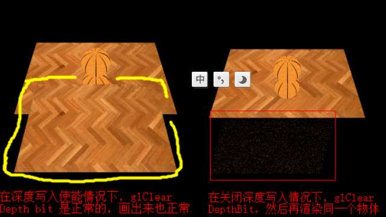
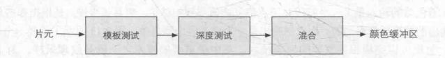
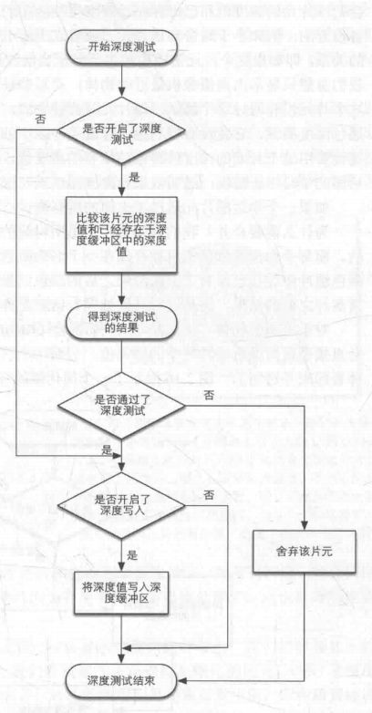
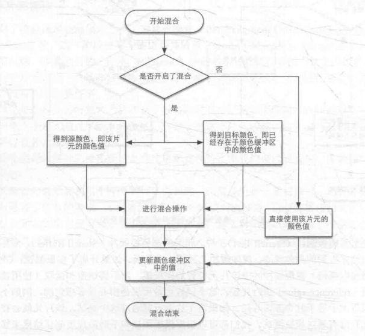
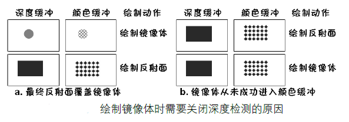
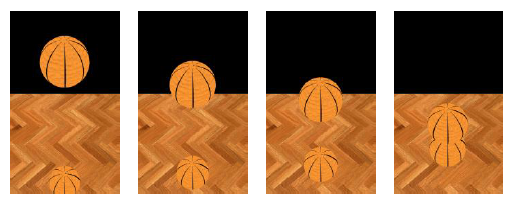
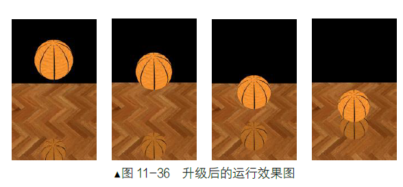

#### 关闭深度缓冲与深度缓冲可读
* glDepthMask(GL_FALSE); 可将深度缓冲区设置为只读形式 
* 虽然关闭了深度写入，但是没有关闭了深度缓冲，此时深度缓冲还是可读的，可以进行深度测试
* glDepthMask(GL_TRUE) ; 可将深度缓冲区设置为可读可写形式
* glDisable(GL_DEPTH_TEST); 关闭深度检测 
* 深度测试、深度写入
  * 关闭了深度检测，深度写入也是不能的；但相反打开深度检测，是可以单独关闭深度写入的
  * 如果关闭了深度写入(glDepthMask(false))，那么glClear(GL_DEPTH_BUFFER_BIT)会没有作用，也就是深度buffer还是会有上一次的深度值，但是clear Color有作用，结果就是该深度位置是黑色，下次画同一个物体时候，就会出现深度冲突，出现沙粒效果，如图：


* 深度缓冲 z-buffer，默认情况下深度测试是关闭的
* 深度缓冲有系统窗口创建并将其深度值存储为16、24或32位的浮点数。一般使用的是24位深度缓冲区
* 开启深度测试后，片段的深度信息z值将存储在深度缓冲区中，测试时，将当前的片段的深度值与缓冲区的 z 值进行比较，大于缓冲区的 z 值时，将丢弃该片段；否则保留该片段并更新深度缓冲区的深度值。
* 启用深度测试时，还应该使用glClear(GL_COLOR_BUFFER_BIT | GL_DEPTH_BUFFER_BIT) 清除深度缓冲区，否则将保留上一次进行深度测试时写入的深度信值
* 深度测试函数(depth function)，默认的函数是glDepthFunc(GL_LESS)， 在片段深度值小于深度缓冲区使测试通过
* glDepthFunc(GL_ALWAYS)，相当于默认情况下的没有开启深度测试的效果相同
* 渲染顺序,深度测试和深度写入流程






#### 内置变量
* gl_Position 顶点着色器写入顶点位置坐标到渲染管线，类型是vec4 
* gl_PointSize 顶点着色器把一个点的大小写入渲染管线，单位像素，仅在点绘制有意义
* gl_FragCoord vec4 片元着色器 可以获取当前绘制片元在视口中的位置，其中z表示深度
* gl_FrontFacing 布尔值，片元着色器，在光栅化阶段当前片元是否在对应图元的正面，用于双面关照
* gl_PointCoord vec2 点精灵，当前图元中片元的位置，从0~1


#### 深度可视化 深度冲突
* <https://blog.csdn.net/u011371324/article/details/77414190>
* 远处深度值大，对应灰度图的白色，而且远处的颜色精度低，所以看起来都是白色的
* 深度的非线性特点，近处时，稍微移动一点，颜色就会明显由暗变亮或由亮变暗
```
void main()
{
    color = vec4(vec3(gl_FragCoord.z), 1.0f); 
    // 使用内建变量gl_FragCoord知道当前片元的标准设备空间系中的坐标
} 
```
* 当距离越远时越容易出现，因为距离较远时精度较低，这时候无法区分开哪些三角形在前，哪些在后，就会导致两个物体的面相互交替出现
* 远处的物体不用很好分辨出远近，而近处的物体则需要很好分辨远近，即远处和近处得深度值应该有不同的精度，所以采用了 1/z 来计算深度信息，则距离近平面较近的拥有很高的精度，距离越远精度值越低
* 解决深度冲突：
  * 1.增加远处物体距离 
  * 2.深度缓冲精度24bit到32bit 
  * 3.近平面选远点，但又要保证近处的物体不会被裁剪掉


#### 渲染常用顺序：
* 先渲染所有不透明物体，开启深度测试和深度写入
* 半透明物体按离摄像机距离远近排序，从后往前渲染，开启深度测试，关闭深度写入(由于需要手动排序半透明的物体，写入深度已没有意义，还有排序不完美，见下)
* 如果能完美地手工排序不透明fragment(不是图元,而是光栅化后的片元)，写入深度也没有影响；但若(?半透明的?)物体在深度方向有重叠，有些fragment的顺序会有误，如果开启深度写入，会令到渲染错误很明显(?后画的本来是近处的半透明物体中比较深的部分会由于另外一个比较深的半透明物体挡住而深度测试丢弃，没有混合?)，而关掉的话影响较小一点(即使混合有可能是有问题的)。
* 交叉物体的渲染 
  * <https://www.zhihu.com/question/60898307> 
  * 对于半透明的渲染，是可以同时开启深度测试和深度写入的。方法是使用2个Pass。一个先只负责保证像素级片元深度正确，一个负责渲染


#### example

