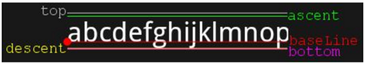

# 渲染文字
### 直接用Paint画到Bitmap的Canvas上
```
Paint paint=new Paint();                    // 创建画笔对象
paint.setARGB(255, R, G, B);                // 设置画笔颜色
paint.setTextSize(textSize);                // 设置字体大小 单位是像素 可能超过画布Bitmap的尺寸/宽高
paint.setTypeface(Typeface.DEFAULT_BOLD);   // 粗体
paint.setFlags(Paint.ANTI_ALIAS_FLAG);      // 打开抗锯齿，使字体边缘光滑
Bitmap bmTemp=Bitmap.createBitmap(width, height, Bitmap.Config.ARGB_8888);// 创建指定大小的bitmap
Canvas canvasTemp = new Canvas(bmTemp);     // 根据指定的位图创建画布
canvasTemp.drawText("你的名字", 0, textSize ,paint);// 把字体用指定的画笔画到画布上 坐标是baseline的位置
return bmTemp;
```
* 缺点:
  * 会超出画布尺寸，超出后就直接截断了
  * 不能实现文字左对齐或者右对齐

### 把TextView画到Bitmap的Canvas上
```
FrameLayout layout = (LinearLayout) LayoutInflater.from(context).inflate(textlayout , null);
TextView textView = (TextView)layout.findViewById(textViewInLayout);


textView.setTextSize(TypedValue.COMPLEX_UNIT_PX, FONT_SIZE_IN_PIXEL);
textView.setText(textString);
textView.setTextColor(Color.argb(200, 255, 0, 0));
FrameLayout.LayoutParams layoutParams = (FrameLayout.LayoutParams) textView.getLayoutParams();
layoutParams.gravity = Gravity.CENTER_VERTICAL|Gravity.RIGHT|Gravity.END;
textView.setLayoutParams(layoutParams);


// 宽度是屏幕View的宽度 固定 layout_width = viewWidth
int width = View.MeasureSpec.makeMeasureSpec(viewWidth, View.MeasureSpec.EXACTLY); 
// 高度跟着字体大小 wrap_content
int height = View.MeasureSpec.makeMeasureSpec(viewHeight, View.MeasureSpec.AT_MOST);
// 参数是 int widthMeasureSpec, int heightMeasureSpec 不只是宽高
layout.measure(width, height); 
layout.layout(0, 0, viewWidth, FONT_SIZE_IN_PIXEL);


Bitmap result = Bitmap.createBitmap(viewWidth, viewHeight, Bitmap.Config.ARGB_8888); 
Canvas canvasL = new Canvas(result);
canvasL.setDrawFilter(new PaintFlagsDrawFilter(Paint.ANTI_ALIAS_FLAG,  Paint.ANTI_ALIAS_FLAG | Paint.FILTER_BITMAP_FLAG));
// 实际是view.draw(canvas)  TextView(Layout)画到Bitmap(Canvas)上
layout.draw(canvasL); 
```
* 优点:
  * 可以做到右对齐
  * 使用Layout过长的话可以换行
* 缺点:
  * 还是存在换行后截断的问题


# Demo
* Bitmap黑色背景的问题
  * 虽然Bitmap带有alpha通道，但需要渲染时候打开blend
  * Bitmap默认是预乘的，所以glBlendFunc 源因子是GL_ONE  目标是 GL_ONE_MINUS_SRC_ALPHA

* 调整z轴没有近大远小效果
  * 原来是使用正交投影(MatrixState.setProjectOrtho)，所以不会出现近大远小效果* 

* 第一行没有显示完整
  * Canvas.drawText("hello world", x, y, paint);中x、y是指画的时候字符串“hello world”中心的坐标，还是左上角的坐标呢？
  * 答案：x默认是“hello world”字符串的左边在屏幕的位置，如果设置了paint.setTextAlign(Paint.Align.CENTER);那就会变成字符串的中心；y是指这个字符串的baseline在屏幕上的位置，特别注意下它并不是传统意义上的左上角（在这里是字符串的顶端），而是字体绘制时的baseline，如下图
 
 
 

# MeasureSpec

### MeasureSpec的概念：
* MeasureSpec通过将SpecMode和SpecSize打包成一个int值来避免过多的对象内存分配
* 为了方便操作，其提供了打包和解包的方法
* SpecMode和SpecSize也是一个int值
* 一组SpecMode和SpecSize可以打包为一个MeasureSpec
* 一个MeasureSpec可以通过解包的形式来得出其原始的SpecMode和SpecSize。
* MeasureSpec的值由specSize和specMode共同组成的，其中specSize记录的是大小，specMode记录的是规格
* MeasureSpec是父控件提供给子View的一个参数，作为设定自身大小参考，只是个参考，要多大，还是View自己说了算

### SpecMode的三种模式：
* EXACTLY
  * EXACTLY(完全)，父控件为子View指定确切大小
  * 当我们将控件的“layout_width”属性或者“layout_height”属性指定为具体数值时，比如“android:layout_width="200dp"”
  * 或者指定为“match_parent”时，系统会使用这个模式。
* AT_MOST
  * AT_MOST(至多)，父控件为子元素指定最大参考尺寸，希望子View的尺寸不要超过这个尺寸
  * 当控件的“layout_width”属性或者“layout_height”属性设置为“wrap_content”时，控件大小一般会随着内容的大小而变化，但是无论多大，也不能超过父控件的尺寸。
* UNSPECIFIED
  * UNSPECIFIED(未指定),父控件对子控件不加任何束缚
  * 表示开发人员可以将视图按照自己的意愿设置成任意的大小，没有任何限制
  * 这种情况比较少见，一般在绘制自定义View的时候才会用到

  
### measure和layout
* measure设置view的大小，如果有child view, 循环调用其measure函数
* layout摆放child view的位置


