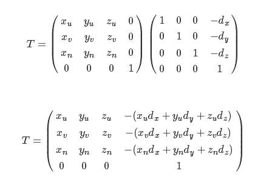

## 裁剪测试
* 渲染管线流程  ... 光栅化 ... 片元着色器 ... 裁剪测试 .. 模板测试和深度测试 .. 混合 .. 去抖 ... 帧缓冲
* 限制绘制区域，在屏幕/帧缓冲指定一个矩形区域，绘制只会在这个区域
* 无论怎么绘制，剪裁窗口以外的像素将不会被修改
* glEnable( GL_SCISSOR_TEST)
* glScissor(x,y,width,height); 
* 与glViewPort一样，以左下角为原点


## 注意点
* 裁剪测试只是在原来的视口标准的绘制区域内开辟一块矩形区域来显示，而不是把内容放到裁剪的区域内来显示

* 在绘制时我们把视口设置为屏幕的宽和高，那么在启用裁剪测试后，想让绘制的内容正好显示在指定的矩形区域内，就必须保证即便没有启用裁剪测试，内容也是绘制在指定的区域内，否则裁剪区域内将不会显示绘制内容。

* 所以开发的时候，可以先不用设置裁剪测试，然后看调试效果，最后再加上裁剪窗口

## glViewPort与glScissor 
* glScissor 可以控制 glClear(GL_COLOR_BUFFER_BIT | GL_DEPTH_BUFFER_BIT);的区域,glViewPort不能,整个FB会清除
* glViewport 的宽高对应顶点的-1到1，而glScissor则不会，依旧按照viewport宽高作为顶点的-1到1


## 经验
### Matrix.setLookAtM(mVMatrix,0,  cx,cy,cz,  tx,ty,tz,  upx,upy,upz);
* upy 取反，可以导致图像左右上下都镜像，左上角变成右下角

### Matrix.scaleM(float[] m, int mOffset,  float x, float y, float z)
* x = 0 , z = 0 ,  y = -1 可以y轴 关于XoZ平面 上下镜像

### 透视除法
* 标准设备空间(立方体空间)中往原点远离或者靠近原点    
```
//根据总变换矩阵计算此次绘制此顶点位置
gl_Position = uMVPMatrix * vec4(aPosition,1); 

// 这样等效，管线做透视除法
gl_Position = gl_Position / gl_Position.w ; 

float new_w = 2.0 ; // 0.9
gl_Position = vec4(gl_Position.xyz, new_w);
// new_w > 1.0 , x,y,z(绝对值)都会变小, 并且由于原来的gl_Position.xyz已经在标准设备空间(-1,1) 所以结果就是在标准设备空间(立方体空间)中往原点靠近
// new_w < 1.0 , x,y,z(绝对值)都会变大, 所以就是在标准设备空间(立方体空间)中往原点远离，可能超出-1,1，导致没有显示
```

### OpenGL视图变换矩阵
* 计算过程
  * 目标方向向量 = 目标坐标-位置坐标 (规范化后单位向量 作为'摄像头坐标系z轴负方向' )
  * 摄像机正上方方向向量 由外部给定 (作为 '摄像头坐标系y轴正方向'(但后面会重新计算) )
  * 目标方向向量 叉乘 摄像机正上方方向向量 的结果(规范化后)，作为 摄像机坐标系x轴正方向
  * 然后把上一步结果的向量(摄像机x轴正) 叉乘 目标向量 的结果(规范化后)，作为 摄像头坐标系y轴正方向
  * 上面几步，就把摄像机坐标系的 三个轴的基向量 都求出来了
  * 由于世界坐标系和摄像机坐标系的原点不一样，所以应该先做一次平移，然后再做坐标系转换，即
  * 
  
  * 负号是代表，物体移动方向，和摄像机原点在世界坐标系中的坐标，相反
  
* 从上面推导过程可知:
  * 目标方向向量(目标-位置) 如果方向不变的话,只是长度变化的话，那么得到的视图变换矩阵也不变
  * 摄像机正上方方向向量 与 目标方向向量 方向一致，会导致计算异常NaN

### 在摄像头前方不同位置的投影
*


### Android Studio GLSL插件 并关联.sh文件
*
