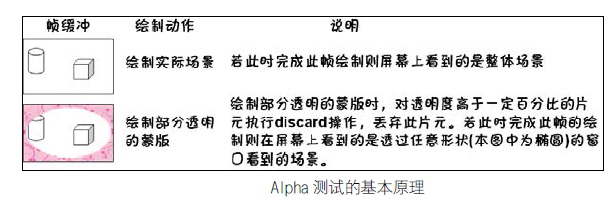
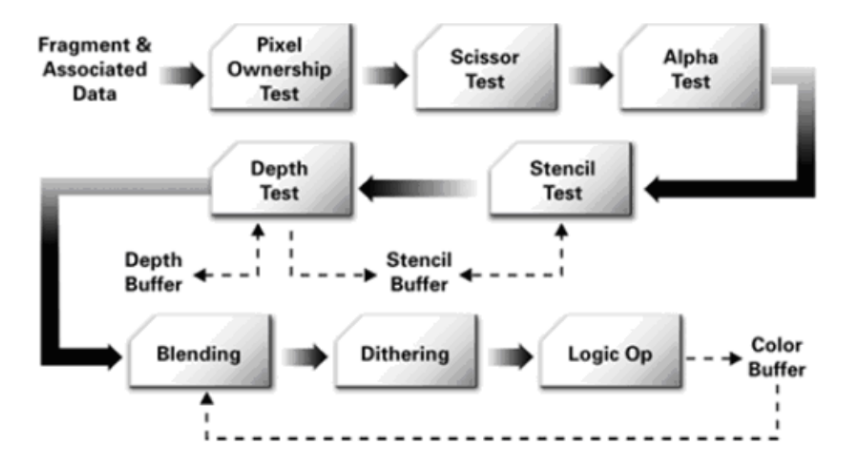

# Alpha测试
* 在片元着色器中，当纹理的alpha值超过一定值，就丢弃(discard)该片元
* 因为外框(mask)__不属于主场景，不应该与主场景中的物体,以同一个深度进行检测__



# Discard操作(GLSL丢弃片段)
* 使用discard会退出片段着色器，不执行后面的片段着色操作。片段也不会写入帧缓冲区
* GLSL为我们提供了discard命令，它保证了片段不会被进一步处理，这样就不会进入颜色缓冲
* 在某些硬件实现中非常消耗资源，可能会减低渲染的帧速率
* 在片元着色器中执行该操作，丢弃片元与经过深度或者裁剪等测试后，丢弃片元是没有本质区别，只是discard要自己调用，深度和裁剪测试是渲染管线自动完成的功能
* 除了超过一定透明度可以discard，满足其他条件也可以discard


# 渲染管线(Alpha测试)
* ...片元着色器，裁剪测试，alpha测试，深度测试，模板测试，alpha混合...



# 带有透明通道的多物体渲染
* Demo中对树木渲染，有根据距离摄像机的远近，进行排序
* 由于树木带有Alpha通道，需要从远到近渲染，才能保证深度测试正确，并混合正确
* 即使纹理图片带有透明，但是只要顶点深度更近摄像机，就不会被后续渲染的覆盖
* 具体做法，就是对比，__每树木在世界坐标系中的位置(位移后，translateM)，与摄像机在世界坐标系中的位置(setLookAtM)，之间的距离__
```
MySurfaceView.java 
  Collections.sort(mRender.tg.alist);

SingleTree.java 

  @Override
  public int compareTo(SingleTree another)
  {
    float xs=x-cx;
    float zs=z-cz;
    
    float xo=another.x-cx;
    float zo=another.z-cz;
    
    float disA=(float)Math.sqrt(xs*xs+zs*zs);
    float disB=(float)Math.sqrt(xo*xo+zo*zo);
    
    return ((disA-disB)==0)?0:((disA-disB)>0)?-1:1;  
  }
  
```