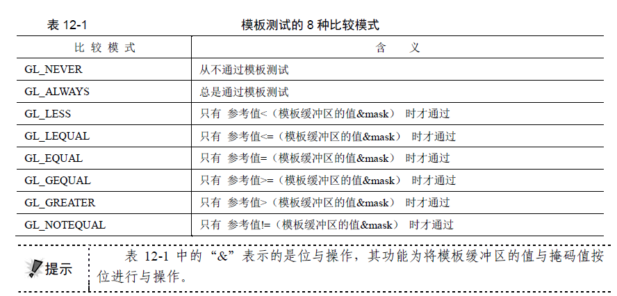
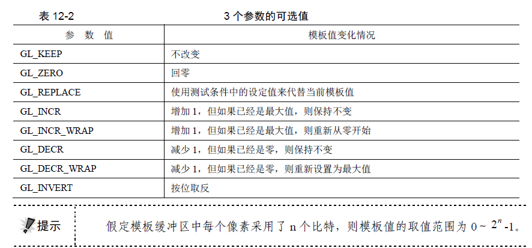

## 模板测试
* 蒙版测试
* 把绘制限定在一个不规则区域(裁剪测试,矩形区域,不能实现)
* 渲染管线在‘模板缓冲区’为每个像素保存一个‘模板值’，一般8bit的(取值范围是0~2^n-1)，当一个物体的片元，要绘制到像素上时，会根据当前设定的参考值(glStencilFunc)，这个参考值，是整个物体的模板值，物体每个片元的这个模板值都一样，并且跟绘制到的像素(模板缓冲区上)的原模板值，对比测试，不通过就丢弃不渲染
* 所以，先以一个模板值，绘制一个物体，测试方法总是通过(作为蒙版)；然后绘制另外一个物体，设定参考值为上个物体的模板值，并且测试方法是GL_EQUAL相等，这样，就只有上个物体，光栅化后的像素区域上，能够显示后一个物体(当然也可以设置为GL_NOTEQUAL，在上个物体以外区域，可以绘制)
* 一般流程
  * 开启模板测试
  * 绘制模板，写入模板缓冲(不写入color buffer和depth buffer)
    * 方法1：测试通过条件设置成GL_NEVER,测试失败的模板值设置成参考值,GL_REPLACE,这样所有片元都会测试失败
    
    * 方法2：禁止写入颜色和深度缓冲区 glColorMask(GL_FALSE, GL_FALSE, GL_FALSE, GL_FALSE); glDisable(GL_DEPTH_TEST);
  * 关闭模板缓冲写入
  * 利用模板缓冲中的值，绘制后续场景


  * <http://www.cnblogs.com/Pickcle/p/5396186.html>
  * <https://blog.csdn.net/wangdingqiaoit/article/details/52143197>
  
## API
* 打开模板测试 
```
GLES30.glClear(GLES30.GL_STENCIL_BUFFER_BIT); 
GLES30.glEnable(GLES30.GL_STENCIL_TEST); 

```
* 每当绘制一个物体，都要 __指定这个物体的模板值__
```
glStencilFunc(GL_ALWAYS, 1, 1); // 测试模式  参考值  掩码
glStencilOp(GL_KEEP, GL_KEEP, GL_REPLACE);// 测试后操作
```

* 写入模板缓冲区
  * glStencilMask 函数用于控制模板缓冲区的写入，使用位掩码的方式决定是否可以写入模板缓冲区
  * 使用得较多的是0x00表示禁止写入，0xFF表示允许任何写入

* 测试模式
  * 测试都是  模板缓冲区的值 & mask 按位与掩码，然后跟 物体设定的模板参考值 对比
  * e.g GL_ALWAYS 总是通过 
  * e.g GL_EQUAL 相等时通过
  
  
* 测试后操作
  * 分别对应 没有通过模板测试 通过模板测试没通过深度测试 通过深度测试
  * e.g GL_KEEP 保留原来模板缓冲区的值
  * e.g GL_REPLACE 使用物体设定的模板参考值 替换
  * e.g GL_ZERO 归零
  * e.g GL_INCR 增加1 如果是最大值不变
  * e.g GL_INCR_WRAP 增加1 如果是最大值回零开始
  * 可以设置 GL_KEEP,GL_KEEP,GL_KEEP，这样，无论是否通过，都不改变原有值
  

* 指定清除值
  * glClearStencil(s)  
    * s默认为0 
    * s会被2^n-1 进行位屏蔽, n为目标缓冲区的比特位数
    * glClearStencil指定了glClear函数清理目标缓冲区时使用的重置值.
  * glClearDepth(d)
    * The initial value is 1.
    * clamped to the range [0,1] 
    * 1代表距离摄像头最远，深度最深
  * glClearColor(a,g,b,a)
    * 缺省值全是0.即(0，0，0，0),黑色
    * 分别取值在(0，1)之间
    
## 兼容性
* 部分机型支持24bit的深度检测进度
* 部分机型默认不分配模板缓冲区
  * 在SurfaceView setEGLContextClientVerion(3.0 or 2.0)之后setEGLConfigChooser(8,8,8,16,8)
  * 抛出异常的话，是由于系统默认的像素格式，与设置的颜色缓冲参数不匹配导致的，加上getHolder().setFormat(PixelFormat.TRANSLUCENT) 设置像素格式自动匹配

## Demo

* 使篮球的镜像体，不会绘制到地板以外
  * 由于地板不透明，所以先要绘制地板，然后再画上镜像体
  * 由于镜像体不能跟原来一样，要绘制多一个透明的地板
  * 但地板宽高有限制，镜像体会超出

  
  (?? 绘制地板(带模板)， 绘制一个带透明的篮球(关闭深度写入) 绘制实体)