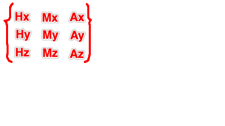

### 欧拉角
* 欧拉角 姿态角

* 欧拉角是表示__两个坐标系相对取向关系__的一种__表示方法__，当然还有其他方法( 旋转可以有很多种表示：__欧拉角__、__四元数__、__旋转矩阵__、旋转矢量 )

* 对于在三维空间里的一个参考系，任何坐标系的取向，都可以用三个欧拉角来表现(参考系即为大地参考系，是静止不动的；坐标系则固定于四轴飞行器，随着四轴飞行器的旋转而旋转)

* 欧拉角使用roll，pitch，yaw来表示这些分量的旋转值。需要注意的是，这里的旋转是针对大地参考系说的，这意味着第一次的旋转不会影响第二、三次的转轴(还是绕原来的坐标系轴)，因为欧拉描述中针对x,y,z的‘旋转描述’是世界坐标系下的值，所以当任意一轴旋转90°(绕其他的轴)的时候会导致该轴同其他轴(旋转之前的)重合，此时旋转被重合的轴可能没有任何效果(roll,pitch,yaw是参考旋转之前的坐标系，在这一组旋转中，参考坐标系都是旋转之前的，可以认为就是大地参考系)，这就是Gimbal Lock

* 对于一个物体的姿态，需要提供"参考系"和"顺规"，这样才可根据欧拉角，知道物体姿势，得到物体坐标系

* 参考系，一般是实验室参考系或者大地坐标系，静止不动的

* 机体坐标系与大地参考系之间的夹角关系：欧拉角

* 顺规
  * 由于先绕某个轴旋转，再绕着另外一个轴旋转，跟倒过来，先绕另外一个轴旋转，再绕某个轴旋转，会导致结果不一样，所以要定义顺规，这个给定的一组欧拉角，就可在同一个参考系内，得到同一个结果
  * 在一样的参考坐标系(比如，大地坐标系)，不同顺规(比如，顺规是zxz和zxy)，对于同样的一组欧拉角(roll,pitch,yaw)，按不同的顺规旋转后的结果是不一样的
  * 一般是zxz(wiki 经典力学 x顺规)和zxy(Unity,航空航天工程学)
  * 一共有12种顺规(3x2x2，规定:任何两个连续的旋转，必须绕着不同的转动轴旋转)
  * ~~zxz就是，先在参考坐标系，绕z轴旋转，然后绕着'旋转后的x轴'在旋转，最后绕着‘旋转后的z轴’再旋转~~
  * 对于夹角的顺序和标记，夹角的两个轴的指定，并没有任何定义，科学家对此从未达成共识，此外，实际上，还有许多其他方法，可以设定__两个坐标系的相对取向__，‘欧拉角方法’只是其中的一种。
  * Unity中的欧拉旋转，是指定一组欧拉旋转(90,60,30)，通过前述的顺规我们知道，先绕Z轴旋转30度，再绕X轴旋转90度，再绕Y轴旋转60度，虽然有这样的顺序，但是Z旋转后相对X轴、Y轴，都是__执行本组欧拉旋转前的那个轴向__，它没有发生变动，也就是Transform.Rotate(new Vector3(90,60,30))，是参考变化之前的参考系(大地坐标系)
  * Unity中的欧拉旋转。它是沿着Z、X、Y顺规执行的旋转，一组欧拉旋转过程中，相对的轴向不会发生变化。Transform.Rotate(new Vector3(90,60,30))，代表执行了一组欧拉旋转，它__相对的是旋转前的局部坐标朝向__
  * 插值，比如，[欧拉角与万向节死锁](https://blog.csdn.net/AndrewFan/article/details/60981437) 文章中的，Rotate(90,0,1) Rotate(90,0,2) Rotate(90,0,3).....Rotate(90,0,N) ， 每一次Rotate都是机体从原水平位置，根据先z轴转N度，然后绕x轴转90度，最终的结果显示出来

* 姿态角均为零时，两个坐标系相应坐标轴重合

* 欧拉角 https://en.wikipedia.org/wiki/Euler_angles 有两个系列

* 欧拉角zxy为

  

  
  
  extrinsic=fixed=static,外旋=固定轴=静态
  
  intrisic=rotating,内旋=连续轴=旋转轴
  
  
  
  静态欧拉角和动态欧拉角的关系
  
  对于坐标系E下的欧拉角(α，β，r)和以下哪个旋转矩阵是等价的
          1.绕坐标系E下的x轴旋转α，绕坐标系E下的y轴旋转β，绕坐标系E下的z轴旋转r，三个矩阵的复合
          2.绕坐标系E下的x轴旋转α，绕 坐标系E在绕x轴旋转α后的新系E'下的y轴旋转β，绕 坐标系E'在绕y轴旋转β后的新系 E''下的z轴旋转r，三个矩阵的复合
  
  
  
  当我们讲到坐标系E下的欧拉角(α，β，r)时，这句话是有歧义的，我们必须定义旋转顺序，因为旋转顺序会影响旋转结果。
  如果假设旋转顺序是先绕x轴再y轴再z轴，x-y-z，那么这个欧拉角对应的旋转矩阵是指上述的2所表示的旋转矩阵。
  如果假设旋转顺序是先绕z轴再y轴再x轴，z-y-x，那么这个欧拉角对应的旋转矩阵是指上述的1所表示的旋转矩阵
  
  这难道不是把2中的先后顺序换一下就行了吗 ？ 是的，当然也是这样。
  
  下面我来证明两种复合方式是相等的，
  为了方便证明我先定义一些记号，
  记：
  绕坐标系E下的x轴旋转α的旋转矩阵为Rx,
  绕坐标系E下的y轴旋转β的旋转矩阵为Ry,
  绕坐标系E下的z轴旋转r的旋转矩阵为Rz,
  
  绕坐标系E下的z轴旋转r的旋转矩阵为Rr（Rr=Rz），
  绕 坐标系E在绕z轴旋转r后的新系E'下的y轴旋转β的旋转矩阵为Rb，
  绕 坐标系E'在绕y轴旋转β后的新系E''下的x轴旋转α的旋转矩阵为Ra，
  
  另外，将矩阵R的逆记作R~
  
  求证：Rx * Ry * Rz = Rr * Rb * Ra
  
  证明：
  Rr = Rz 定义就是一样的，显然相等
  
  Rb = Rr~ * Ry * Rr 
  
  要得到绕 坐标系E在绕z轴旋转r后的新系E'下的y轴旋转β的旋转矩阵为Rb，可以先应用Rr~这时可以视作在E下，然后使用E下的旋转Ry绕旧的y轴旋转，在应用Rr转回到E'
  
  Ra = (Rr * Rb)~* Rx * (Rr * Rb)
  
   理由同上
  
  所以 右边=Rr*Rb * Ra
       =Rr * Rb * (Rr * Rb)~ * Rx * (Rr * Rb)
       =(Rr * Rb)* (Rr * Rb)~* Rx * (Rr * Rb)
       =Rx * (Rr * Rb)
       =Rx * (Rr * Rr~ * Ry * Rr)
       =Rx * Ry * Rz =左边 
  \#证毕


### 九轴传感器原理

http://taylorliu.com/2019-09-16-9-dof-imu/ 


假定这个盒子不在重力场中或者其他任何会影响球的位置的场中，球处于盒子的正中央。如果我们突然把盒子向左移动（加速度为1g=9.8m/s^2），那么球会撞上X-墙。然后我们检测球撞击墙面产生的压力，根据F=ma，计算出X轴加速度输出值为-1g。

请注意加速度计检测到的力方向与它本身加速度的方向是相反的。这种力量通常被称为惯性力或假想力 。

在这个模型中你应该明白**加速度计是通过间接测量力对一个墙面的作用来测量加速度的**，在实际应用中，可能通过弹簧等装置来测量力。


### 重力传感器

android手机坐标系(device's coordinate): 垂直屏幕向上为z轴正方向，短边向右为x轴正方向，长边向上为y轴正方向  

在手机水平放置在桌面的时候，重力传感器返回的是(0,0,9.8)  z值是正的，所以可以认为重力传感器返回的是**重力的反方向向量**   **反重力方向向量**

为了得到手机坐标系下的  **重力方向向量**    G =   -   (gravity[0], gravity[1], gravity[2])    取反即可 

对一个或者三个轴**(奇数个轴)取反**，就相当于**改变 左右系**

对两个轴(偶数数目)取反，没有改变左右系 


### getRotationMatrix 原理

* [官网说明](https://developer.android.com/reference/android/hardware/SensorManager.html#getRotationMatrix)

* 文档中说明了返回的R是 

  ```
  * R is the identity matrix when the device is aligned with the
  * world's coordinate system(世界坐标系), that is, when the device's X axis points
  * toward East(正东), the Y axis points to the North Pole (磁北)and the device is facing
  * the sky(向上).
  ```

  ```
  * I is a rotation matrix transforming the geomagnetic vector into
  * the same coordinate space as gravity (the world's coordinate space).
  * I is a simple rotation around the X axis. The inclination angle in
  * radians can be computed with {@link #getInclination}.
  旋转磁场向量指向重力方向???
  ```

* 加速度和磁场传感器，返回的值，都是参照一样的坐标系(手机机体/物体/自身坐标系)，以手机左下角为原点，垂直平面向上为z轴正方向，符合右手准则

* 因此，加速度和磁场传感器，返回的值，可看成，这个物体坐标系上的两个向量，一个垂直水平面~~向下~~向上(__垂直向量__，重力的反方向，放在水平桌面的值是(0,0,9.8) )，一个指向北极方向(__北极向量__，但未必跟重力向量垂直)

* 这两个向量叉乘(代码实现中是磁场叉加速度(注意重力传感器的话是重力反方向))，得到水平东西方向的向量，按照右手准则，指向东方(__东方向量__)

* 由于之前的垂直向量和北极向量不一定相互垂直，所以，再 垂直向量 叉 东方向量，得到__最终的北极向量__(这个北极向量跟垂直向量 一定相互垂直)

* 最终，__北极向量，东方向量，垂直向量__，三个__基向量__构成__大地坐标系__ 在 __物体坐标系__中 的 位置

* 大地坐标系的这三个基向量组成的矩阵，自然也就是__旋转矩阵__。和__三维旋转矩阵__推导出的__含有航向角（方向角）、倾斜角、旋转角的旋转矩阵__一一对应，就可以求出相应的角度。

* 注意：实现中返回的矩阵是 跟OpenGL一样，按列为主的，R[0],R[1],R[2] 是作为一列(东方向量)

* 旋转变换矩阵
  * 旋转变换矩阵(线性变换) 用原来的坐标系表示，那么右边的向量可以是：
    * 一个点用原坐标系表示，得到结果是  这个点 在变换后 在原坐标系的位置
    * 一个点用变换后坐标系表示，得到结果是  这个点 在原坐标系上的位置
  * 这个__变换矩阵__是用物体坐标系表示的，变换成大地坐标系，所以可以右乘某个点在大地坐标系表示的位置向量 ，得到这个点 在 手机物体坐标系上表示 的 位置向量
  
* 这个__'旋转'的变换矩阵__ ，可以通过下面的getOrientation原理，多次右乘一个围绕某个轴矩阵得到

```
public static boolean getRotationMatrix(float[] R, float[] I,
            float[] gravity, float[] geomagnetic) {
        // TODO: move this to native code for efficiency
        float Ax = gravity[0];
        float Ay = gravity[1];
        float Az = gravity[2];  
        // 这个A是重力反方向的方向向量，可以认为是‘反重力方向向量’ 固定垂直向上
        // (Ax,Ay,Az)是‘反重力向量’在手机坐标系上的坐标  (反重力向量在手机坐标系上的表示)

        final float normsqA = (Ax*Ax + Ay*Ay + Az*Az);
        final float g = 9.81f;
        final float freeFallGravitySquared = 0.01f * g * g;
        if (normsqA < freeFallGravitySquared) {
            // gravity less than 10% of normal value
            return false;
        }

        final float Ex = geomagnetic[0];
        final float Ey = geomagnetic[1];
        final float Ez = geomagnetic[2];
        float Hx = Ey*Az - Ez*Ay;   
        // x分量是 E的y分量 - A的y分量 可以根据这个快速得到是E向量叉乘A分量
        float Hy = Ez*Ax - Ex*Az;
        float Hz = Ex*Ay - Ey*Ax;
        // 这里得到的H向量 按照右手系，得到的是正东方向向量，在手机坐标系中的坐标
        final float normH = (float)Math.sqrt(Hx*Hx + Hy*Hy + Hz*Hz);

        if (normH < 0.1f) {
            // device is close to free fall (or in space?), or close to
            // magnetic north pole. Typical values are  > 100.
            return false;
        }
        final float invH = 1.0f / normH;
        Hx *= invH;
        Hy *= invH;
        Hz *= invH;
        final float invA = 1.0f / (float)Math.sqrt(Ax*Ax + Ay*Ay + Az*Az);
        Ax *= invA;
        Ay *= invA;
        Az *= invA;
        // 由于‘反重力’方向向量和‘磁场’方向向量，不一定是相互垂直的，这里纠正磁场方向向量
        final float Mx = Ay*Hz - Az*Hy;
        final float My = Az*Hx - Ax*Hz;
        final float Mz = Ax*Hy - Ay*Hx;
        if (R != null) {
            if (R.length == 9) {
                R[0] = Hx;     R[1] = Hy;     R[2] = Hz;
                R[3] = Mx;     R[4] = My;     R[5] = Mz;
                R[6] = Ax;     R[7] = Ay;     R[8] = Az;
            } else if (R.length == 16) {
                R[0]  = Hx;    R[1]  = Hy;    R[2]  = Hz;   R[3]  = 0;
                R[4]  = Mx;    R[5]  = My;    R[6]  = Mz;   R[7]  = 0;
                R[8]  = Ax;    R[9]  = Ay;    R[10] = Az;   R[11] = 0;
                R[12] = 0;     R[13] = 0;     R[14] = 0;    R[15] = 1;
            }
        } // 返回的R是 东北坐标系在当前手机坐标系中的表示 
        
        if (I != null) {  
            // compute the inclination matrix by projecting the geomagnetic
            // vector onto the Z (gravity) and X (horizontal component
            // of geomagnetic vector) axes.
            // 计算倾角矩阵  将地磁矢量投影到  重力的z轴 和 磁场向量水平分量x轴  ???  
            final float invE = 1.0f / (float)Math.sqrt(Ex*Ex + Ey*Ey + Ez*Ez);
            final float c = (Ex*Mx + Ey*My + Ez*Mz) * invE;
            final float s = (Ex*Ax + Ey*Ay + Ez*Az) * invE;
            if (I.length == 9) {
                I[0] = 1;     I[1] = 0;     I[2] = 0;
                I[3] = 0;     I[4] = c;     I[5] = s;
                I[6] = 0;     I[7] =-s;     I[8] = c;
            } else if (I.length == 16) {
                I[0] = 1;     I[1] = 0;     I[2] = 0;
                I[4] = 0;     I[5] = c;     I[6] = s;
                I[8] = 0;     I[9] =-s;     I[10]= c;
                I[3] = I[7] = I[11] = I[12] = I[13] = I[14] = 0;
                I[15] = 1;
            }
        }
        return true;
  }
  
     * Note that because OpenGL matrices are column-major matrices you must
     * transpose the matrix before using it. However, since the matrix is a
     * rotation matrix, its transpose is also its inverse, conveniently, it is
     * often the inverse of the rotation that is needed for rendering; it can
     * therefore be used with OpenGL ES directly.
     
  由于openGL是列主，所以必须转置矩阵
  但由于这是旋转矩阵，转置就是逆矩阵
  而一般在shader中使用的是旋转矩阵的逆，所以可以直接送渲染管线
```

* 旋转矩阵是正交矩阵

  * 正交矩阵每一列都是单位矩阵，并且两两正交
  * 正交矩阵的逆（inverse）等于正交矩阵的转置（transpose）
  * 正交矩阵的行列式的值肯定为正负1的

* getRotationMatrix得到的矩阵的三个列向量，作为北极向量，东方向量，垂直向量，代表大地坐标系三个维度的基向量，可以通过这个矩阵，把大地坐标系的某个点的坐标位置，换算成手机物体坐标系上的表示

* 而从上面一节，注意 : 得到的矩阵 R[0] R[1] R[2] 是第一列 (我们获得的传感器数据其实是__行主序__的，右边是向量 坐标是这个矩阵 )

* 由于OpenGL会认为R[0] R[1] R[2] 作为第一列，所以矩阵不用转置就可以给到OpenGL

* 由于旋转矩阵是正交矩阵，所以其逆矩阵就是转置矩阵，从大地坐标系到物体坐标系，就是getRotaionMatrix返回矩阵的转置，就是用大地坐标系表示的旋转矩阵


### getOrientation的原理

* 参考文章 [三维旋转矩阵推导](https://blog.csdn.net/yhl_leo/article/details/50732966)

* getOrienttation是将旋转向量按照 azimuth, pitch, roll 的顺规得到欧拉角 
  
  * Applying these three rotations in the azimuth, pitch, roll order transforms an identity matrix to the rotation matrix passed into this method. 
  
* Yaw角(Azimuth)，偏航角， 0度是正北方，90度(1.57rad)是正东方，-90度(-1.57rad)是正西方 [-π~π]
  * the device's y   axis and the magnetic north pole. 代表设备y轴和磁北之间的夹角
  * angle of rotation about the -z axis.  是绕着-z轴旋转!! 
  *  -z轴的右手，z轴的左手螺旋为正

* Pitch角，俯仰角， 上翘为负   [-π  ~ π]。 ??  实际是 -pi/2 ～ pi/2 ???  跟方向传感器 方向一样 

  * 该值表示平行于设备屏幕的平面与平行于地面的平面之间的角度。
  * angle of rotation about the x axis  绕x轴 ， 假设设备的底部边缘面向用户并且屏幕朝上，则将设备的顶部边缘向地面倾斜会产生正的俯仰角。 
  * 如果是右手的话，是-x轴；

* Roll角，右倾斜为正(右侧高时为负) ，[-π/2 ~ π/2].   ??  实际是 -pi  ～ pi/  ???   

  * 该值表示垂直于设备屏幕的平面和垂直于地面的平面之间的角度。
  * 假设设备的底部边缘面向用户且屏幕朝上，则将设备的左侧边缘向地面倾斜会产生正的侧倾角。?? 负的 

* 大地坐标系，北为正，东为正，重力方向反方向(即天空方向)为正

* 下图的y轴旋转不是按右手 ？？

* 

  ```
  
  
  * R[0] = Hx;     R[1] = Hy;     R[2] = Hz;//【地球坐标系】X方向，指东
  * R[3] = Mx;     R[4] = My;     R[5] = Mz;//【地球坐标系】Y方向，指北 
  * R[6] = Ax;     R[7] = Ay;     R[8] = Az;//【地球坐标系】Z方向，反重力
  
  Applying these three rotations in the azimuth, pitch, roll order
  transforms an identity matrix to the rotation matrix 
  应用这三个角度 按照yaw,pitch,roll顺序去转换单位矩阵到旋转矩阵
  Azimuth, angle of rotation about the -z axis. 
  Pitch, angle of rotation about the x axis.
  Roll, angle of rotation about the y axis.
  
  
  public static float[] getOrientation(float[] R, float values[]) {
      /*
       * 4x4 (length=16) case:
       *   /  R[ 0]   R[ 1]   R[ 2]   0  \
       *   |  R[ 4]   R[ 5]   R[ 6]   0  |
       *   |  R[ 8]   R[ 9]   R[10]   0  |
       *   \      0       0       0   1  /
       *
       * 3x3 (length=9) case:
       *   /  R[ 0]   R[ 1]   R[ 2]  \
       *   |  R[ 3]   R[ 4]   R[ 5]  |
       *   \  R[ 6]   R[ 7]   R[ 8]  /
       *
       */
      if (R.length == 9) {
          values[0] = (float)Math.atan2(R[1], R[4]); // arctan2(Hy,My) ? 几何上怎么得到？
          values[1] = (float)Math.asin(-R[7]);       // arcsin(-Ay)
          values[2] = (float)Math.atan2(-R[6], R[8]);// arctan2(-Ax,Az)
      } else {
          values[0] = (float)Math.atan2(R[1], R[5]);
          values[1] = (float)Math.asin(-R[9]);
          values[2] = (float)Math.atan2(-R[8], R[10]);
      }
  
      return values;
  }
  
  values[0]: azimuth, rotation around the Z axis.  绕z轴旋转的 航向角
  values[1]: pitch, rotation around the X axis.    绕x轴旋转的 俯仰角
  values[2]: roll, rotation around the Y axis.     绕y轴旋转的 滚筒角
  ```

* 注意推导过程中参考轴是变化的！按照 顺规ZXY，__每次旋转，都按照上一次旋转后的新物体自身坐标系，来旋转__

* 按右手系右手螺旋为正：

  绕x

  

  绕y

  

  绕z

  

* 推导旋转矩阵结果是：( φ是滚筒角 values[2] y,  ω是俯仰角values[1] x , κ是航向角 values[0]  z, 下面的推导矩阵是列主序, 列向量,放在矩阵右边,  合成的R 可以看成是__大地坐标系表示的旋转变换矩阵__ ,上面的三个基向量是__物体坐标系表示的旋转变换矩阵__)，这旋转过程中的__三个矩阵都是按旋转前的参考系的三个轴向，即大地坐标系__

   

  这里是列主

  

这个是从手机坐标系到东北参考系的旋转矩阵：




### Android平台获得欧拉角
* 加速度传感器三轴+磁场传感器三轴，总共六轴联算
* 两个API，一个获取旋转矩阵，一个获取欧拉角: 
```
  // gravity geomagnetic 分别是 加速度和磁场传感器 的三轴值
  // I 可以为空
  // R 用来转载返回值：旋转矩阵R
  public static boolean getRotationMatrix(float[] R, float[] I,
            float[] gravity, float[] geomagnetic)
  
  // R 旋转矩阵
  // values 用来装载返回值 欧拉角
  public static float[] getOrientation(float[] R, float values[]) 
  
  values[0]: azimuth, rotation around the Z axis.  绕z轴旋转的 航向角
  values[1]: pitch, rotation around the X axis.    绕x轴旋转的 俯仰角
  values[2]: roll, rotation around the Y axis.     绕y轴旋转的 滚筒角

```

* tan2

  * atan2(a, b)与atan(a/b)稍有不同
  * atan2(a,b)的取值范围介于-pi到pi之间(不包括-pi): 这个得到的弧度，考虑了原来坐标点所在的四个像限
  * atan(a/b)的取值范围介于-pi/2到pi/2之间(不包括±pi/2)

  


### 欧拉角的万向节死锁
* 参考文章 [欧拉角与万向节死锁](https://blog.csdn.net/AndrewFan/article/details/60981437)   
* 平衡环架 ( 万向节 Gimbal)
    * 目标是保证中间的"转子和转轴",转子要保持水平，中间的旋转轴要保持垂直
    * 从外面到里面来看，每个平衡环到里面的平衡环的连接头，就是自己的旋转轴，一共有三个连接头，提供3个自由度(偏航 俯仰 旋转/桶滚)
    * 万向锁的结果是，有两个连接头/旋转轴，的转动都是改变同一个自由度，所以虽然可以指定三个角，但是只会有两个方向上的改变
    * 只要当一个轴先旋转90度，然后再其他轴做旋转，就会出现
* 欧拉角的“万向节死锁”问题，是__由于欧拉旋转定义本身造成的__，欧拉角顺规和轴向的定义方式，造就了“万向节死锁”问题的自然形成
    * 一个轴的转动会影响另外一个轴，所以后面的轴要旋转，必然受到之前的轴的影响
    * 物体旋转了一次之后(比如z轴)，其自身的坐标系已经跟大地坐标系不一样了，如果绕z轴旋转了90度，之后的自身坐标系就会另外有一个轴，与
* <https://blog.csdn.net/andrewfan/article/details/60866636>
* public void Rotate(Vector3 eulerAngles, Space relativeTo = Space.Self);
* Space.Self 局部坐标系，意味着本次欧拉旋转以物体当前的局部坐标朝向为基础出发执行旋转。
* Space.World 世界坐标系，意味着本次欧拉旋转以物体当前的世界坐标朝向为基础出发执行旋转。 
* 最重要的倒不是它有可选的世界坐标系，一般而言，常用的旋转都是相对当前局部坐标系执行的
* 最重要的是：在本次欧拉旋转过程中，它的相对轴是始终不变的，不变的，不变的
* 比如我们可以指定一组欧拉旋转(90,60,30)，通过前述的顺规我们知道，先绕Z轴旋转30度，再绕X轴旋转90度，再绕Y轴旋转60度
* 虽然有这样的顺序，但是Z旋转后相对X轴、Y轴，都是执行本组欧拉旋转前的那个轴向，它没有发生变动，所以我称它为“当前轴”。
* 在Unity中的欧拉旋转就是这样定义的，不排除其它学术中欧拉旋转有不一样的定义方式。因此，执行：
    * Transform.Rotate(new Vector3(90,60,30))
* 和执行
    * Transform.Rotate(new Vector3(0,0,30))；
    * Transform.Rotate(new Vector3(90,0,0));
    * Transform.Rotate(new Vector3(0,60,0))；
* 的结果是不一样的。
* 第一种情况，只执行了一组欧拉旋转
* 第二种情况，执行了三组欧拉旋转，后两组欧拉旋转的相对轴在旋转时已经发生了变动
* 
* 上面万向节平衡环就是第二种情况
* 以极坐标不一样，__极坐标__强调是__一个点的位置__，所以__可用三个角唯一表示__，但不是一个点的，而是有__取向__的一个坐标系(立体物体)，用欧拉角的方法表示，会导致__不是一一映射__(即使按照顺规，同样一个方向位置，可以有两种欧拉角来表示，如上面例子(90,180,180)和(90,0,0)是同样的效果 )

### Demo
* 在高通晓龙820,小米5上跑是正常的(如上面yaw,pitch,roll所述)，但在荣耀v10是不正确的，原因不清楚

### 其他传感器
* 加速度传感器: 左下角 右手准侧  m²/s    F合 = F外 + G    a合 = a外 + g    a外 = a合 - g (g是向量 方向向下) 如果水平放在桌面，就是 a外 = 0 - (-g)   这里g是标量=9.8 所以a外=9.8 向上为正，比如手机放在水平桌面，结果是(0,  0, 9.8) , 注意最后一个是正的
* 磁场传感器：左下角 右手准侧  微特斯拉
* 陀螺仪传感器：左下角 右手准侧 rad/s 
* 接近传感器：1cm左右，离散值分别表示接近和非接近
* 光传感器：返回光强度，流明单位 
* 温度传感器：返回摄氏度


### 四元数（Quaternion）

* 四元数比欧拉角多了一个维度，不容易直观的理解
* 三维旋转就是四维旋转的一个子集，因此，用四元数可以很方便的表示三维旋转
* 优点
  * 可以避免万向节锁
  * 往往效率更高
  * 可以提供平滑插值