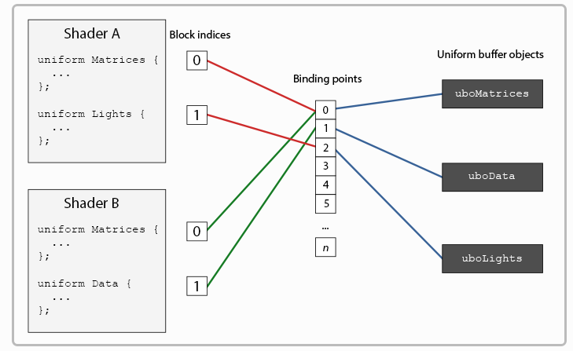

##  多重渲染目标

1. OpenGL ES3.0支持 glDrawBuffers 指定输出到FrameBuffer的哪几个颜色附件(ES2.0没有glDrawBuffers)

2. 如果不设置framebuffer的glDrawBuffers，默认只会渲染到第一个颜色附件(location=0那个fragColor)，即使shader中有输出到fragColor0/1/2/3 也只会有一个有效果

3. 片元着色器代码

   ```
   layout (location=0)out vec4 fragColor0; // 这个location是跟FrameBuffer的第几个颜色附件 对应的
   layout (location=1)out vec4 fragColor1; // 颜色附件1 对应fragColor1
   layout (location=2)out vec4 fragColor2; 
   layout (location=3)out vec4 fragColor3;
   
   main
   {
   	....
      fragColor0=fragColor;
      fragColor1=vec4(fragColor.r,0.0,0.0,1.0);
      fragColor2=vec4(0.0,fragColor.g,0.0,1.0);
      fragColor3=vec4(0.0,0.0,fragColor.b,1.0);
   }
   ```

4. 获取最大颜色附件数目

   ```
   int[] maxColorAttachment = new int[1];
   GLES30.glGetIntegerv(GLES30.GL_MAX_COLOR_ATTACHMENTS,maxColorAttachment,0);
   Log.w("TOM","最大颜色附件数目是 " + maxColorAttachment[0]); //小米5(晓龙820)最大颜色附件数目为 8
   ```

   

## 正交投影

1. 如果摄像机位置移动，但望向的目标不变，那么正交投影的结果类似，从某个非正面来看物体，会变形的
2. 深度1是最大，投影时 near 映射为-1 ，far 映射为1 


## 顶点缓冲区

1. 两种类型的顶点缓冲区对象 GL_ARRAY_BUFFER GL_ELEMENT_ARRAY_BUFFER

2. GL_ARRAY_BUFFER 数组缓冲对象，可以存放顶点坐标，纹理坐标，法向量

3. GL_ELEMENT_ARRAY_BUFFER 索引数组缓冲对象，可以存放索引法绘制时索引数据

4. API：创建glGenBuffer，更新数据glBufferData,glBufferSubData，删除glDeleteBuffer，查询glGetBufferParameteriv

5. 一般glBindBuffer使用完之后，需要绑定到系统默认缓冲 glBindBuffer(target, 0 )

6. 缓冲区类型

   | target值                       | 说明         | 作用                                                         |
   | ------------------------------ | ------------ | ------------------------------------------------------------ |
   | GL_ARRAY_BUFFER                | 数组缓冲     | glVertexAttribPointer指定某个顶点属性(顶点坐标，纹理坐标 ，法向量)前，通过glBindBuffer，指定顶点属性对应缓冲区对象 |
   | GL_ELEMENT_ARRAY_BUFFER        | 索引数组缓冲 | void glDrawElements( GLenum mode, GLsizei count, GLenum type, const GLvoid *indices);                glDrawElement之前通过glBindBuffer指定，这样draw最后一个参数indices(索引)就作为偏移(offset) |
   | GL_COPY_READ_BUFFER            | 复制只读缓冲 | glCopyBufferSubData 的数据源                                 |
   | GL_COPY_WRITE_BUFFER           | 复制只写缓冲 | glCopyBufferSubData 的目标                                   |
   | GL_PIXEL_PACK_BUFFER           | 像素打包缓冲 | glReadPixels()和glGetTexImage() 是 "pack"像素操作， glDrawPixels(),  glTexImage2D() ,glTexSubImage2D() 是"unpack" 操作<br />e.g : <br /> glBindBuffer  <br /> glReadPixels(最后一个参数是偏移)  <br />glMapBufferRange(GL_PIXEL_PACK_BUFFER   映射得到一个指针/Buffer，可以在CPU操作数据<br />glUnmapBuffer(GL_PIXEL_PACK_BUFFER); |
   | GL_PIXEL_UNPACK_BUFFER         | 像素解包缓冲 |                                                              |
   | GL_TRANSFORM_  FEEDBACK_BUFFER | 变换反馈缓冲 |                                                              |
   | GL_UNIFORM_BUFFER              | 一致变量缓冲 | shader中使用了uniform 一致块，用这个更新数据                 |

   

7. 用途 glBufferData( int target，int size ，Buffer data，int usage)

   即使设置为GL_STATIC_DRAW，也可以进行修改

   STATIC 只设置一次  DYNAMIC 频繁更新(OpenGL或者应用程序)   STREAM 

   DRAW 用于绘制   READ应用程序读取    COPY拷贝到另外一个缓冲区?

   | 用途            | 说明                                                         |
   | --------------- | ------------------------------------------------------------ |
   | GL_STATIC_DRAW  | 缓冲区内容将由应用程序__设置一次__，并经常用于绘图或复制到其他图像 |
   | GL_STATIC_READ  | 缓冲区内容将被__设置一次__，作为 OpenGL 的输出，并被应用程序多次查询 |
   | GL_STATIC_COPY  | 缓冲区内容将被__设置一次__，作为 OpenGL 的输出，并经常用于绘制或复制到其他图像 |
   | GL_DYNAMIC_DRAW | 冲区内容将由__应用程序频繁更新__，并经常用于绘制或复制到其他图像 |
   | GL_DYNAMIC_READ | 缓冲区内容将作为 __OpenGL 的输出频繁更新__，并由应用程序多次查询 |
   | GL_DYNAMIC_COPY | 缓冲区内容将作为 __OpenGL 的输出频繁更新__ ，并经常用于绘图或复制到其他图像 |
   | GL_STREAM_DRAW  | 缓冲区内容将由应用程序设置一次，并且__不经常__用于绘图       |
   | GL_STREAM_READ  | 缓冲区内容将被设置一次，作为 OpenGL 的输出，并且__不经常__用于绘图 |
   | GL_STREAM_COPY  | 缓冲区内容将被设置一次，作为 OpenGL 的输出，并且__不经常__用于绘制或复制到其他图像 |

8. VAO 顶点数组对象

   可以把__顶点属性的操作(glEnableVertexAttribArray glVertexAttribPointer)就会直接用VAO，一个gl指令就可以__

   但是__uniform的传入渲染管线(MVP，光源位置，M变换矩阵，摄像头位置)，还需要单独每个设置__，或者使用uniform一致块/GL_UNIFORM_BUFFER

   VAO 全称 Vertex Array Object，翻译过来叫顶点数组对象，但和Vertex Array（顶点数组）毫无联系！

   __VAO不是 buffer-object，所以不作数据存储；与顶点的绘制息息相关，即是说与VBO强相关。如上，VAO本质上是state-object（状态对象）,记录的是一次绘制所需要的信息，包括数据在哪，数据格式之类的信息__。如果抽象成数据结构，VAO 的数据结构如下：

   ```
    struct VertexAttribute  
       {  
           bool bIsEnabled = GL_FALSE;  
           int iSize = 4; //This is the number of elements in this attribute, 1-4.  
           unsigned int iStride = 0;  
           VertexAttribType eType = GL_FLOAT;  
           bool bIsNormalized = GL_FALSE;  
           bool bIsIntegral = GL_FALSE;  
           void * pBufferObjectOffset = 0;  
           BufferObject * pBufferObj = 0;  
       };  
       
       struct VertexArrayObject  
       {  
           BufferObject *pElementArrayBufferObject = NULL;  
           VertexAttribute attributes[GL_MAX_VERTEX_ATTRIB];  
       }  
   ```

   VAO里面存了一个__EBO的指针__以及__一个顶点属性数组__

   意味着上述一串操作的状态可以完全存储于VAO里面，而真正的数据依然在VBO里面。下面举一个示例代码：

   ```
   // 初始化
       unsigned int VAO;
       glGenVertexArrays(1, &VAO);  
       glBindVertexArray(VAO);
   
       glBindBuffer(GL_ARRAY_BUFFER, VBO);
       glBufferData(GL_ARRAY_BUFFER, sizeof(vertices), vertices, GL_STATIC_DRAW);
   
       glBindBuffer(GL_ELEMENT_ARRAY_BUFFER, EBO);
       glBufferData(GL_ELEMENT_ARRAY_BUFFER, sizeof(indices), indices, GL_STATIC_DRAW);
   
       glVertexAttribPointer(0, 3, GL_FLOAT, GL_FALSE, 3 * sizeof(float), (void*)0);
       glEnableVertexAttribArray(0); 
   
       ...
   
       // 绘制
       glBindVertexArray(VAO);
       glDrawElements(GL_TRIANGLES, 6, GL_UNSIGNED_INT, 0)
       glBindVertexArray(0);
   ```

   VAO 记录的是：

   ​	a. __vertex attribute 的格式，由 glVertexAttribPointer 设置__

   ​	b.  __vertex attribute 对应的 VBO 的名字, 由一对 glBindBuffer 和  glVertexAttribPointer 设置。 __

   ​	c.  __#当前#绑定的 GL_ELEMENT_ARRAY_BUFFER 的名字，由 glBindBuffer 设置。(用于索引法draw) __

   ​	注意: VAO 中并不保存#当前#绑定的 GL_ARRAY_BUFFER，VBO 和 vertex attribute 的绑定是在glVertexAttribPointer 中完成的。

   VBO是为了均衡数据的传输效率与灵活修改性；

   VAO的本质是储存绘制状态，__简化绘制代码__

   ```
       // set up vertex data (and buffer(s)) and configure vertex attributes
       // ------------------------------------------------------------------
       float vertices[] = {
            0.5f,  0.5f, 0.0f,  // top right
            0.5f, -0.5f, 0.0f,  // bottom right
           -0.5f, -0.5f, 0.0f,  // bottom left
           -0.5f,  0.5f, 0.0f   // top left 
       };
       unsigned int indices[] = {  // note that we start from 0!
           0, 1, 3,  // first Triangle
           1, 2, 3   // second Triangle
       };
       unsigned int VBO, VAO, EBO;
       glGenVertexArrays(1, &VAO);
       glGenBuffers(1, &VBO);
       glGenBuffers(1, &EBO);
       // bind the Vertex Array Object first, then bind and set vertex buffer(s), and then configure vertex attributes(s).
       glBindVertexArray(VAO);
   
       glBindBuffer(GL_ARRAY_BUFFER, VBO);
       glBufferData(GL_ARRAY_BUFFER, sizeof(vertices), vertices, GL_STATIC_DRAW);
   
       glBindBuffer(GL_ELEMENT_ARRAY_BUFFER, EBO);
       glBufferData(GL_ELEMENT_ARRAY_BUFFER, sizeof(indices), indices, GL_STATIC_DRAW);
   
       glVertexAttribPointer(0, 3, GL_FLOAT, GL_FALSE, 3 * sizeof(float), (void*)0);
       glEnableVertexAttribArray(0);
   
       // note that this is allowed, the call to glVertexAttribPointer registered VBO as the vertex attribute's bound vertex buffer object so afterwards we can safely unbind
       glBindBuffer(GL_ARRAY_BUFFER, 0); // 解绑VBO
   
       // remember: do NOT unbind the EBO while a VAO is active as the bound element buffer object IS stored in the VAO; keep the EBO bound.
       //glBindBuffer(GL_ELEMENT_ARRAY_BUFFER, 0);
       //!!!! 在VAO里面可以解绑VBO，却不能解绑EBO!!!!
   
       // You can unbind the VAO afterwards so other VAO calls won't accidentally modify this VAO, but this rarely happens. Modifying other
       // VAOs requires a call to glBindVertexArray anyways so we generally don't unbind VAOs (nor VBOs) when it's not directly necessary.
       glBindVertexArray(0); 
   ```

   

## 一致缓冲对象

ES3.0支持一致块 和 一致缓冲对象

一致块中的不同类型的一致变量在一致块内的组织规律：

| 类型                      | 对齐                                                         |
| ------------------------- | ------------------------------------------------------------ |
| bool/int/uint/float类型   | 这种一致块成员在内存中有特定偏移，分别作为单个bool/int/uint/float变量 |
| bool/int/uint/float的向量 | 连续内存，起始于特定偏移，第一个分量位于最低偏移量           |
| C列R行列主矩阵            | 当成一个C列的浮点型向量 的 数组 对待 <br />每个向量包含R个分量<br />两个向量之间的偏移量，叫做列步幅<br />通过glGetActiveUniformsiv(GL_UNIFORM_MATRIX_STRIDE)获取 |
| R行C列行主矩阵            | 同上                                                         |
| 数组                      | 数组成员0位于最低偏移处<br />数组元素之间的偏移量是一个常数，叫做数组步幅<br />通过glGetActiveUniformsiv(GL_UNIFORM_ARRAY_STRIDE)获取 |

__GLSL 默认使用的uniform内存布局叫做共享布局(shared layout)__，叫共享是因为一旦偏移量被硬件定义，它们就会持续地被多个程序所共享。使用共享布局，GLSL可以为了优化而重新放置uniform变量，只要变量的顺序保持完整。__因为我们不知道每个uniform变量的偏移量是多少__，所以我们也就不知道如何精确地填充uniform缓冲。我们可以使用像glGetUniformIndices这样的函数来查询这个信息

__由于共享布局给我们做了一些空间优化。通常在实践中并不适用分享布局，而是使用std140布局。__std140通过一系列的规则的规范声明了它们各自的偏移量，std140布局为每个变量类型显式地声明了内存的布局。由于被显式的提及，我们就可以手工算出每个变量的偏移量。

每个变量都有一个基线对齐(base alignment)，它等于在一个uniform块中这个变量所占的空间（包含边距），这个基线对齐是使用std140布局原则计算出来的。然后，我们为每个变量计算出它的对齐偏移(aligned offset)，这是一个变量从块（block）开始处的字节偏移量。变量对齐的字节偏移一定等于它的基线对齐的倍数。

准确的布局规则可以在OpenGL的uniform缓冲规范中得到，但我们会列出最常见的规范。GLSL中每个变量类型比如__int、float和bool被定义为4字节，每4字节被表示为N__。

| 类型                  | 布局规范                                                 |
| --------------------- | -------------------------------------------------------- |
| 像int和bool这样的标量 | 每个标量的基线为N                                        |
| 向量                  | 每个向量的基线是2N或4N大小。这意味着vec3的基线为4N       |
| 标量与向量数组        | 每个元素的基线与vec4的相同                               |
| 矩阵                  | 被看做是存储着大量向量的数组，每个元素的基数与vec4相同   |
| 结构体                | 根据以上规则计算其各个元素，并且间距必须是vec4基线的倍数 |

更加具体来说:

| **变量类型**                                                 | **变量大小/偏移量**                                          |
| ------------------------------------------------------------ | ------------------------------------------------------------ |
| 标量数据类型（bool,int,uint,float）                          | 基于基本机器类型的标量值大小（例如，sizeof(GLfloat)）        |
| 二元向量(bvec2,ivec2,uvec2,vec2)                             | 标量类型大小的两倍                                           |
| 三元向量(bvec3,ivec3,uvec3,vec3)                             | 标量类型大小的四倍                                           |
| 四元向量(bvec4,ivec4,uvec4,vec4)                             | 标量类型大小的四倍                                           |
| 标量的数组或向量                                             | 数组中每个元素大小是基本类型的大小，偏移量是其索引值（从0开始）与元素大小的乘积。整个数组必须是vec4类型的大小的整数倍（不足将在尾部填充） |
| 一个或多个C列R行列主序矩阵组成的数组                         | 以C个向量（每个有R个元素）组成的数组形式存储。会像其他数组一样填充。<br />如果变量是M个列主序矩阵的数组，那么它的存储形式是：M*C个向量（每个有R个元素）组成的数组。 |
| 一个或多个R行C列的行主序矩阵组成的数组<br />layout (std140,row_major) | 以R个向量（每个有C个元素）组成的数组。默认像其他数组一样填充。<br />如果变量是M个行主序矩阵组成的数组，则存储形式是M*R个向量（每个有C个元素）组成的数组。 |
| 单个结构体或多个结构体组成的数组                             | 单个结构体成员的偏移量和大小可以由前面的规则计算出。结构大小总是vec4大小的整数倍（不足在后面补齐）。<br />由结构组成的数组，偏移量的计算需要考虑单个结构的对齐和补齐。结构的成员偏移量由前面的规则计算出。 |


```
layout (std140) uniform ExampleBlock
{
                     // base alignment ----------  // aligned offset
    float value;     // 4                          // 0
    vec3 vector;     // 16                         // 16 (必须是16的倍数，因此 4->16)
    mat4 matrix;     // 16                         // 32  (第 0 行)
                     // 16                         // 48  (第 1 行)
                     // 16                         // 64  (第 2 行)
                     // 16                         // 80  (第 3 行)
    float values[3]; // 16 (数组中的标量与vec4相同)//96 (values[0])
                     // 16                        // 112 (values[1])
                     // 16                        // 128 (values[2])
    bool boolean;    // 4                         // 144
    int integer;     // 4                         // 148
};
```

```
uniform MyDataBlock
{
	vec3 uLightLocation;	//光源位置    offset = 0
	vec3 uCamera;			//摄像机位置  offset = 12  
} mb;

layout (std140) uniform MyDataBlock
{
	vec3 uLightLocation;	//光源位置    offset = 0
	vec3 uCamera;			//摄像机位置  offset = 16 (std140的话,vec3会补上一个float)

} mb;

```


函数`glBindBufferBase`接收一个目标、一个绑定点索引和一个uniform缓冲对象作为它的参数 

使用`glBindBufferRange`函数，这个函数还需要一个偏移量和大小作为参数，这样你就可以只把一定范围的uniform缓冲绑定到一个绑定点上了。使用`glBindBufferRage`函数，你能够将多个不同的uniform块链接到同一个uniform缓冲对象上 

调用`glUniformBlockBinding`函数来把uniform块设置到一个特定的绑定点上。函数的第一个参数是一个程序对象，接着是一个uniform块索引（uniform block index）和打算链接的绑定点 

glUniformBlockBinding 设置程序的状态

glBindBufferRange  设置上下文的状态 ( 也即是 UBO 是指向 参数给定的 绑定点(而非索引点)   )，如果当前使用的program中的一致块没有调用(glUniformBlockBinding )，那么一致块索引就会用跟""索引""同样号码的当前上下文的 绑定点（相当于调用了glUniformBlockBinding( program , 索引 , 索引 ); ）

一致绑定点：



编程套路：

```
init:
		// Step.1 获取一致块的索引
		int blockIndex = GLES30.glGetUniformBlockIndex(mProgram, "MyDataBlock");
		
		// Step.2 一致块索引 指向 一致绑定点(uniform binding point) (e.g 2) 
		//        OpenGL4.2起，可添加布局标识符来储存一个uniform块的绑定点
		//        layout(std140, binding = 2) 这样就不用调用 glUniformBlockBinding
        GLES30.glUniformBlockBinding(mProgram,blockIndex, blockIndex );
        
        // Step.3 获取一致块的尺寸
        int[] blockSizes = new int[1];
        GLES30.glGetActiveUniformBlockiv(mProgram, blockIndex, GLES30.GL_UNIFORM_BLOCK_DATA_SIZE, blockSizes, 0);
        int blockSize = blockSizes[0];

        // Step.4 获取一致块成员的偏移
        //     .4.a 声明一致块内的成员名称数组
        String[] names = {"MyDataBlock.uLightLocation", "MyDataBlock.uCamera"};
        //     .4.b 声明对应的成员索引数组
        int[] uIndices = new int[names.length];
        //     .4.c 获取一致块内的成员索引
        GLES30.glGetUniformIndices(mProgram, names, uIndices, 0);
        //     .4.d 获取一致块内的成员偏移量
        int[] offset = new int[names.length];
        GLES30.glGetActiveUniformsiv(mProgram, 2, uIndices, 0, GLES30.GL_UNIFORM_OFFSET, offset, 0);
       
         // Step.5 开辟存放一致缓冲所需数据的内存缓冲(每个一致块成员都按照偏移)
        ByteBuffer ubb = ByteBuffer.allocateDirect(blockSize);
        ubb.order(ByteOrder.nativeOrder());             // 设置字节顺序
        FloatBuffer uBlockBuffer = ubb.asFloatBuffer(); // 转换为Float型缓冲

        float[] data = MatrixState.lightLocation;       // 将光源位置数据送入内存缓冲
        uBlockBuffer.position(offset[0] / BYTES_PER_FLOAT);// 注意position这里是float为单位
        uBlockBuffer.put(data);
        float[] data1 = MatrixState.cameraLocation;     // 将摄像机位置数据送入内存缓冲
        uBlockBuffer.position(offset[1] / BYTES_PER_FLOAT);
        uBlockBuffer.put(data1);

        uBlockBuffer.position(0);
        
         // Step.6 创建一致块缓冲对象 并绑定，更新数据
        int[] uboHandles = new int[1];              // 用于存储一致缓冲对象编号的数组
        GLES30.glGenBuffers(1, uboHandles, 0);      // 创建一致缓冲对象
        uboHandle = uboHandles[0];                  // 获取一致缓冲对象编号
        GLES30.glBindBuffer(GLES30.GL_UNIFORM_BUFFER,uboHandle); // 编号绑定为一致块对象
        GLES30.glBufferData(GLES30.GL_UNIFORM_BUFFER, blockSize, uBlockBuffer, GLES30.GL_DYNAMIC_DRAW); // 将光源位置、摄像机位置总数据内存缓冲中的数据送入一致缓冲
        GLES30.glBindBuffer(GLES30.GL_UNIFORM_BUFFER,0);
        ....
        
draw:
		// Step.7 将UBO绑定到 一致块索引/一致绑定点
		GLES30.glBindBufferBase(GLES30.GL_UNIFORM_BUFFER, blockIndex, uboHandle);
		...

```


## 映射缓冲区

1.  glMapBufferRange 可以映射部分VBO，但是如果加上了GL_MAP_INVALIDATE_BUFFER_BIT 会出现其他部分被丢弃的情况，改成用GL_MAP_INVALIDATE_RANGE_BIT更加合适，除非更新范围以外内容真的不需要

2. glMapBufferRange访问标记

   | 访问标记                     | 作用                                                         |
   | ---------------------------- | ------------------------------------------------------------ |
   | GL_MAP_READ_BIT              | 缓冲数据仓储映射用以读入                                     |
   | GL_MAP_WRITE_BIT             | 缓冲数据仓储映射用以写出                                     |
   | GL_MAP_INVALIDATE_RANGE_BIT  | 告诉OpenGL我们不再在乎指定区域内的数据，在执行glBufferData之前，只能与GL_MAP_READ_BIT组合 |
   | GL_MAP_INVALIDATE_BUFFER_BIT | 告诉OpenGL我们不再在乎整个缓冲的数据，在执行glBufferData之前，只能与GL_MAP_READ_BIT组合 |
   | GL_MAP_FLUSH_EXPLICIT_BIT    | 表示应用程序会显式调用glFlushMappedBufferRange方法刷新子范围的操作，不可以GL_MAP_WRITE_BIT组合使用 |
   | GL_MAP_UNSYNCHRONIZED_BIT    | ???                                                          |

3. glUmMapBuffer

   a. map之后必须调用，否则后续渲染管线绘制时无法使用VBO中的数据

   b. umap返回后 不能再用map返回的映射地址，如果顶点缓冲区对象数据存储中的数据在缓冲区映射后被破坏了，umap返回false

   ​                                         

    

    

    

    

    