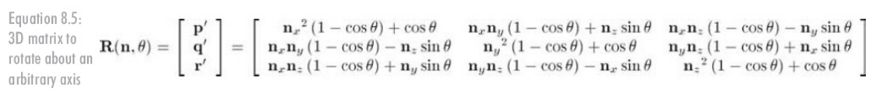
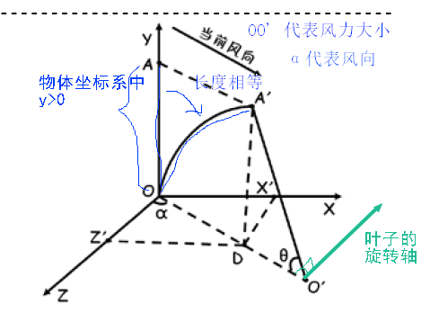

# 绕过原点任意轴旋转

Matrix.rotateM(  float[] m,   int mOffset,        float a, float x, float y, float z) 

a为旋转的角度(非弧度)，(x,y,z) 为旋转轴的 单位方向向量，一般绕x轴旋转，单位方向向量就是 (1,0,0)

如果(x,y,z)不是单位向量，内部会转换为单位向量

公式：(Android实现的是列主序 ，齐次坐标下(Mat4)，float[4] 代表的是 1行2列)




# 风的模型



假设 风力 大小是 OO'   z轴正向 到 x轴正向 为 旋转正方向  风的方向是α ，风方向与XOZ平面平行

树干的任意一点在物体坐标系中都是 y>0   已知 Ax,Ay,Az  , 求 A'x A'y A'z

θ弧度 =  OA' / OO' = OA / OO'   ， OA = Ay

树木部分：

树干是分节的，从下往上的半径减少，每一节是一个上小下大的类圆柱，这样来形成顶点坐标

A'y  (  > 0 ) = A'D  = O'A' * sinθ =   OO' * sin ( OA / OO' )  =  __OO' * sin ( Ay / OO' )__

A'x  = Ax +  OX'  =  Ax + OD * sinα  = Ax +  [ OO'  - OO' * cos ( OA / OO' ) ] * sinα  

​		=  __Ax +  [ OO'  - OO' * cos ( Ay / OO' ) ] * sinα __

A'z  = Az +  OZ'  = Az + OD * cosα = Az +  [ OO'  - OO' * cos ( OA / OO' ) ]  * cosα

​		 =   __Az + [ OO'  - OO' * cos ( Ay / OO' ) ]  * cosα __

上面可以在GPU中计算，只要把当前风的角度α和风力半径OO'传入，先在物体坐标系中处理(对aPostion处理)，然后再做MVP

```
uniform mat4 uMVPMatrix; 		//总变换矩阵
uniform float bend_R;	 		// 这里指的是树的弯曲半径 （风的力度）
uniform float direction_degree;		// 用角度表示的风向，沿y轴正方向逆时针旋转
in vec3 aPosition;  	// 顶点位置
in vec2 aTexCoor;    	// 顶点纹理坐标
out vec2 vTextureCoord;	// 用于传递给片元着色器的纹理坐标
void main()     
{      
	float curr_radian=aPosition.y/bend_R;		// 计算当前的弧度
	float result_height=bend_R*sin(curr_radian);// 计算当前点变换后的Y坐标
	float increase=bend_R-bend_R*cos(curr_radian);// 计算当前点的增加的长度
	float result_X=aPosition.x+increase*sin(radians(direction_degree));//计算当前点最后的x坐标
	float result_Z=aPosition.z+increase*cos(radians(direction_degree));//计算当前点最后的z坐标
	vec4 result_point=vec4(result_X,result_height,result_Z,1.0);// 最后结果顶点的坐标
    gl_Position = uMVPMatrix * result_point; //根据总变换矩阵计算此次绘制此顶点位置
   	vTextureCoord = aTexCoor;//将接收的纹理坐标传递给片元着色器
}
```


树叶部分：

固定的6个矩形，只是绕x轴旋转不同的角度( 每个矩形只有 x,和z坐标改变)

本身不发生形变，只是改变位置和形态

位移就是 (A'x,  A'y,  A'z) 

旋转角度 就是 θ弧度  =  Ay /  OO'    

旋转轴是 与 OO'  OA' 所在平面垂直，与OO' 方向垂直 ，OO‘的方向向量是 (1*sinα ,  0 ,  1*cosα)  ，按照互相垂直的两个向量应该是 A1 * A2 = 0  (A1,A2是向量)，并且一定在XOZ平面，即y=0，那么垂直的单位向量就是( 1*cosα,0, -1*sinα ) ，或者根据图示几何方法推导

在CPU端把上面的位置和旋转信息计算好，然后给到Matrix.translateM 和 Matrix.rotateM ，然后就作为M矩阵传到渲染管线，在顶点着色器做MVP处理


# 透明物体

1. 带有透明和不透明的物体，先开启深度渲染不透明的，然后打开混合，关闭深度，排序所有的透明物体，由远到近渲染

2. Java排序 Collections.sort 对 列表进行排序，或者其他对比函数，或者容器中对象类型实现Compare接口

   ```
       public static <T extends Comparable<? super T>> void sort(List<T> list) {
           Object[] array = list.toArray();
           Arrays.sort(array);
           int i = 0;
           ListIterator<T> it = list.listIterator();
           while (it.hasNext()) {
               it.next();
               it.set((T) array[i++]);
           }
       }
   ```

   ```
   // 这里对每片树叶距离摄像机的远近距离进行 排序, 从大到小排序
   // 由于是透明的 需要排序 后渲染
   @Override
   public int compareTo(TreeLeavesControl another) 
   {
   	//当前树叶距离摄像机的距离
   	float distanceX=(this.positionX+this.treeLeaves.centerX-GameSurfaceView.cx)*(this.positionX+this.treeLeaves.centerX-GameSurfaceView.cx);
   	float distanceZ=(this.positionZ+this.treeLeaves.centerZ-GameSurfaceView.cz)*(this.positionZ+this.treeLeaves.centerZ-GameSurfaceView.cz);
   	//比较点距离摄像机的距离
   	float distanceOX=(another.positionX+another.treeLeaves.centerX-GameSurfaceView.cx)*(another.positionX+another.treeLeaves.centerX-GameSurfaceView.cx);
   	float distanceOZ=(another.positionZ+another.treeLeaves.centerZ-GameSurfaceView.cz)*(another.positionZ+another.treeLeaves.centerZ-GameSurfaceView.cz);
   	
   	return (distanceX+distanceZ)>(distanceOX+distanceOZ)?-1:1;
   }
   ```

   


## 拉伸方式

1. 海洋，土地，绿地，顶点坐标对应的纹理坐标会超过1.0f，按照纹理拉伸方式，会REPEAT，所以只要整体的最大纹理坐标大于1.0，比如是6.0，8.0，再等间隔划分，就会有些顶点矩形/格子的顶点坐标，对应的纹理坐标超过1.0f