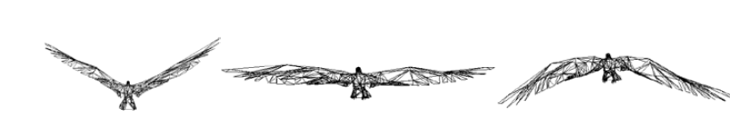
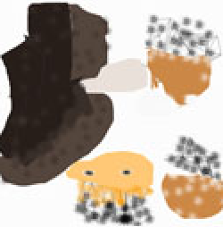
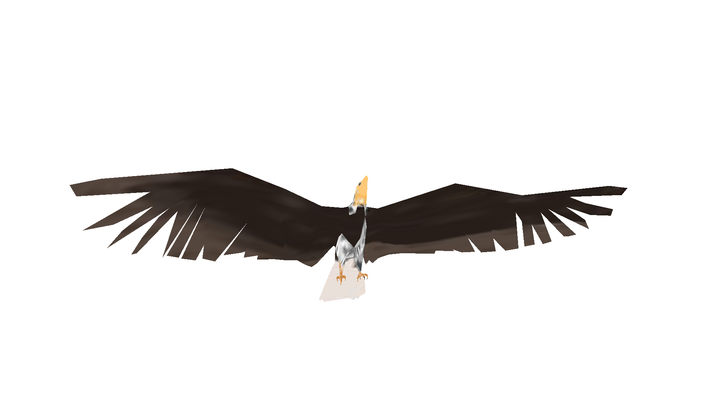

# 软体动画 与 数学模型

1. 飘动的旗帜 和  海洋波浪 
2. 扭动的软糖
3. 风吹大树(树干 与 树叶)
4. 关键帧动画(  要考虑 数学模型复杂，编程成本高  )
   1. 一次提供渲染管线中的顶点着色器，所有关键帧的顶点数据
   2. 每次更新融合比例
   3. 根据关键帧的顶点数据和融合比例，计算当前帧的顶点坐标
   4. 也可以去掉中间的关键帧，但效果不好
   5. 不重要的过程帧，可以按比例融合相邻的两个关键帧得到

## VAO 顶点数组对象

1. 一定要配合VBO使用！否则会崩溃

## 3DxMax 导出的纹理图

obj文件中的物体顶点对应的纹理坐标，会对应这张图的相应部位

