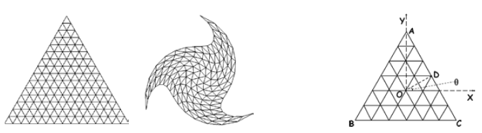
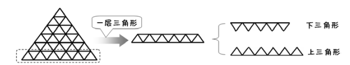
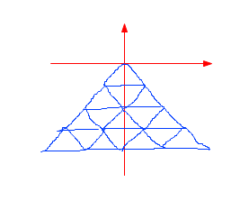
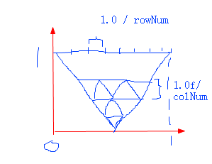

## 2D扭曲

1. 每个顶点相对于中心的距离，和当前最大的旋转角度，按照越外面旋转越大，最外面顶点旋转角度为当前最大角度，计算出当前顶点旋转的角度；传入顶点着色器：每单位长度 旋转的弧度

2. 每个顶点距离原点不变，只是旋转即可

3. 在物体坐标系下，先把顶点坐标旋转更新，再经过MVP变换

4. 由于物体的中心点不在物体坐标系的原点，所以每个顶点要先要计算当前的角度，再按距离的比例计算出旋转的角度，两个角度加起来为最后的角度，然后再计算在两个方向上的偏移(dx,dy)，最后加上物体中心点(X0,Y0)，(其实就是求距离(X0,Y0)为r的点(X1,Y1)，绕(X0,Y0)旋转θ，最后的坐标)

5. 大三角形下面划分很多小三角形

   1. 根据等边三角形每个边划分多少层

   2. 逐一层，计算每层的所有三角形的顶点，分向上和向下两组三角形分别生成

      

   3. 顶点模型:

      

   4. 纹理坐标：

      

# atan2

1. C++中反正切atan2(y,x)与atan(x) 
2. atan(x,y)  返回 -pi/2~~~pi/2 
3. atan2(x,y) 返回 -pi到pi 考虑到点(x,y)位于第二或者第三限象 
4. shader中的反正切atan 返回范围是-pi和pi，考虑到点位于哪个限象，跟C++的atan2一样！！！如果x=0返回值不确定
5. OpenGL shader中所有反*函数 asin acos atan都考虑到点位于哪个限象