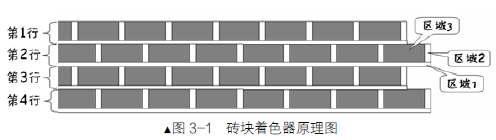

## 程序纹理技术

1. 砖块着色器

   

   a. shader中可按照俯仰角，12度划分一行，这个可以跟球体顶点坐标划分时候不一样，然后10~12度是水泥色，0~10度再根据水平角划分

   b. 在水平方向 按照 22度划分一格子，启动0~20就是砖块色，20~22就是水泥色，同时奇数行(可以shader中自定义为俯仰角12度一行，跟球体顶点形成可不一样的步进)做水平偏移11.0度

2. 沙滩球着色器

3. 不同表面不同的分割方式，球面可以用经纬度，平面可以用某个轴

4. 案例的球体，在计算顶点坐标和纹理坐标，是根据俯仰角和水平角(经纬度)，所以可直接作为顶点属性传入顶点着色器/渲染管线