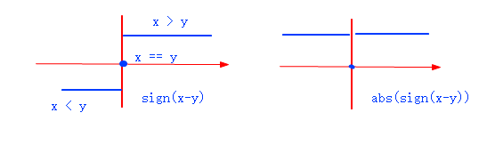

### shader优化

[如何在shader中避免使用if else]: https://www.bilibili.com/read/cv1469216/	"一些技巧"
[Unity Shader: 优化GPU代码--用step()代替if else等条件语句]: https://yq.aliyun.com/wenji/244797	"通过汇编指令看优化结果"

GPU中一共有三种分支语句

第一种是 #if #else，由宏来实现，被称作静态分支，在编译期决定，没有性能损失；

第二种是if else语句，但是if条件中仅有uniform变量和常量组成，在运行期相当于 #if #else，也没有运行期损失(但是驱动判断static uniform branch有轻微消耗)；

第三种就是真正的if else语句，也就是动态分支。 

#### 去除动态分支 

##### 可以考虑用 abs sign step等内置函数得到1.0/0.0 再用mix

```
if(x == 0){
    y += 5
}
```

```
vec4 when_eq(vec4 x , vec4 y ){
    return 1.0 - abs( sign(x-y) )
} // x==y 1.0   x!=y 0.0

// 如果x>0，返回1.0； 如果x=0，返回0， 如果x<0，返回-1.0
genType sign (genType x)

y += 5 * when_eq( x, 0)

```

```
if( x == 0 ){
    b = a1 ;
}else{
    b = a2 ;
}
```

```
vec4 when_neq(vec4 x , vec4 y ){
    return abs( sign(x-y) )
} // x!=y 1.0  

b = mix(a1, a2, when_neq(x,0) )
```

```
float4 a;
if(b > 1){
   a.a=1;
} else {
   a.a =0.5;
}
```

```
float4 a;
float tmp = step(b,1);
a = tmp * 0.5 + (1-tmp)
```




##### 常用关系运算符优化（满足返回1.0） 

```
// if ( == )
vec4 when_eq( vec4 x , vec4 y ){
    return 1.0 - abs( sign(x-y) ); 
}

// if ( != )
vec4 when_neq (vec4 x ,vec4 y){
    return abs( sign(x-y) );
} 

// if ( > )
vec4 when_gt (vec4 x , vec4 y){
    return max( sign(x-y) , 0.0);
}

// if ( < )
vec4 when_lt (vec4 x , vec4 y){
    return max(  sign(y-x) , 0.0);
}

// if ( >= )   equal not < 
vec4 when_ge( vec4 x , vec4 y ){
	return 1.0 - when_lt(x,y); 
}

// if ( <= )   equal not >
vec4 when_le(vec4 x , vec4 y ){
    return 1.0 - when_gt(x,y);
}
```

##### 常用逻辑运算符优化 

```
vec4 and(vec4 a ,vec4 b){
    return a*b;
}

vec4 or (vec4 a , vec4 b){
    return min( a+b , 1.0 )
}

vec4 not(vec4 a){
    return 1.0 -a ;
}

vec4 xor(vec4 a, vec4 b){
    return (a+b) % 2.0;
}
```

##### 并行运算

```
float x,y;
x = x * a;
y = y * b;

不如写成 

float2 v = float2(x,y);
v = v*float2(a,b);

因为前一种写法是两次乘法计算，而后一种只要1次

```

##### 尽量使用shader为我们提供的内置函数 

##### 使用swizzle是非常快的 

```
float4 a = float4(1,1,1,1)，
用
a.wz = float2(2，3）
要比
a.w=3; 
a.z=2;
要高效很多
```

##### 使用合适的数据类型 

gpu支持f的数值类型基本上分为fixed  half  float 

分别是12位的定点数，16位的浮点数以及32位的浮点数

尽可能的选择位数更少的数据类型来加快操作 


### 总结

1. 深--浅--深

   ```
   float stretch = frag(a) * 2.0 ;  // 0.0~1.0 --> 0.0~2.0
   float result = mix(stretch , (2.0 - stretch) , step(1.0, stretch) ) // 0~1.0 1.0~0.0
   ```

2. x+y+z=a 是一个平面，并且法向量是(1,1,1)