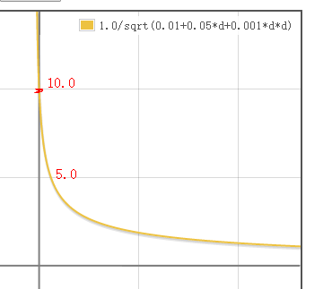
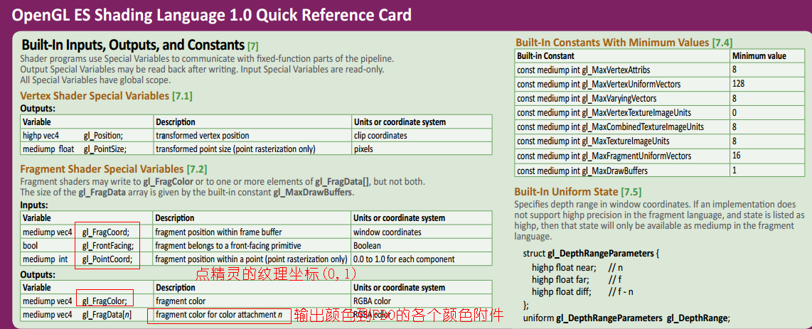

### 点精灵

* 优点
  * 顶点数目减少，原来一个粒子要6个顶点，现在只要1个顶点，提高渲染效率
  * 减少cpu端计算顶点位置的计算
  * 存储空间减少
  * 不需要纹理坐标，也就是不需要把纹理坐标送入渲染管线
* 三个注意点：
  * 点精灵只有一个顶点，所以图元不会根据顶点变大变小，__需要根据与摄像头的距离，设置gl_PointSize__，修改点精灵大小，从而得到__近大远小__的效果
  * __gl_PointCoord__是片元着色器的内建只读变量，它的值是当前片元所在点图元的二维坐标(纹理坐标)。点的范围是0.0到1.0 ，如果当前的图元不是一个点，那么从gl_PointCoord读出的值是未定义的 
  * 点精灵还是需要__标记板技术__，因为点精灵的粒子在物体坐标系上是在一个平面XOZ上


### 点精灵实现近大远小

```
    // 实现点精灵近大远小效果:
    // 1.求出变换后顶点在世界坐标系中的位置
    vec4 currPosition=uMMatrix * vec4(aPosition.xy,0.0,1);
    // 2.求出顶点到摄像机的距离
    float d=distance(currPosition.xyz,cameraPosition);
    // 3.求出距离缩放因子S的平方分之1
    float s=1.0/sqrt(0.01+0.05*d+0.001*d*d);
    // 4.设置点精灵对应点的尺寸
    gl_PointSize=bj*s;

```




### 传入渲染管线vec3 的方法

* GLES30.glUniform3fv(maCameraHandle,  1,   MatrixState.cameraFB);
* GLES30.glUniform3f(maCameraHandle,  MatrixState.cx, MatrixState.cy, MatrixState.cz);

### GLES 2.0 内建变量

[内建变量]: https://www.khronos.org/opengl/wiki/Built-in_Variable_(GLSL)#Vertex_shader_inputs
[ES2.0快速查询卡]: https://www.khronos.org/opengles/sdk/docs/reference_cards/OpenGL-ES-2_0-Reference-card.pdf

 


####  顶点着色器中的内置变量
* 输出变量
	* gl_Position(vec4):顶点数据位置
	* gl_PointSize(float):计算一个点的大小

#### 片元着色器中的内置变量

* 输入变量
  * gl_FragCoord(vec4类型)  含有当前片元相对于窗口位置的坐标值x、y、z与1/w  应用:仅绘制窗口中指定的区域。
  * gl_FrontFacing(布尔型)  判断正在处理片元是否输入光栅化阶段生成此片元的__对应图元的正面__
* 输出变量
  * gl_FragColor(vec4类型)内建变量用来由片元着色器写入计算完成的片元颜色值，此颜色值将送入渲染管线的后继阶段进行处理