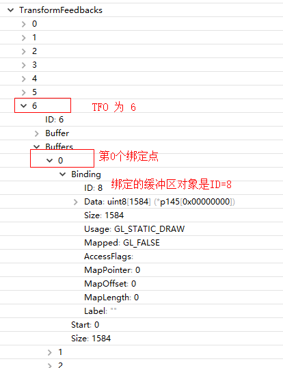
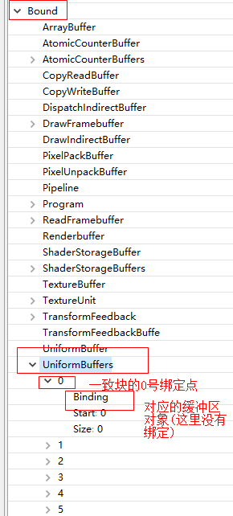

### 变换反馈

transform feedback是OpenGL渲染管线中，__顶点处理阶段结束之后，图元装配和光栅化之前__的一个步骤。transform feedback可以重新捕获即将装配为图元(点，线段，三角形)的顶点，然后你将他们的部分或者全部属性传递到缓存对象。__每个顶点在传递到图元装配阶段时__（之前），将所有需要捕获的属性数据记录到一个或者多个缓存对象当中（至于捕获那些数据，都是在我们控制之下的），程序可以通过缓存回读这些数据，或者将他们用于后续的渲染操作。


### TFO

- 概要：__TFO记录每个绑定点(0,1,2,3)对应的缓冲区对象是哪个__

- glBindTransformFeedback 启用某个TFO，并开始记录，glBindBufferBase指定某个绑定点的缓冲区对象

- Transform Feedback（GL_transform_feedback2）跟很多其他GL的概念一样，是作为一种__State Object（transfrom feedback object）__的形式存在的，可以在初始化时绑定一个或多个VBO作为自己的Transform Feedback Buffer（这一点__和VAO就很像__[AB是一家?VAO与VBO] ）

  ```
  GLuint glGenTransformFeedbacks(GLenum target,  GLuint *id);
  	为transform feedback对象生成n个名称，并且将生成的名称记录到数组id中
  	创建两个transform feedback对象(TFO)，“它们封装了所有绑定到它们上面的状态”
  	0是保留名称，openGL默认tranform feedback
  ```

  ```
  GLuint glBindTransformFeedback(GLenum target,  GLuint id);
  	将一个id(glGen*返回的名称)绑定到指定的target(必须是GL_TRANSFORM_FEEDBACK)所指定的环境中
  	他做了三个工作：
  	1、如果第一次绑定这个名称，将创建一个tranform feedback对象(TFO)，使用默认状态值对他进行初始化，并设为当前transform feedback;
  	2、否则单纯的帮该transform feedback激活为当前；
  	3、如果id为0，则相当于重新回到默认的transform feedback对象上（解除所有之前绑定的transform feedback对象）
  ```

  ```
  GLuint glDeleteTransformFeedbacks(GLsizei n, const GLuint* ids);
  	删除n个transform feedback对象
  ```

- tansform feedback所有__状态__通过一个__transform feedback对象__管理，这个状态包括

  - 所有用于记录顶点数据的缓存对象
  - 用于标识缓存对象的计数器（名称glGen*系列函数返回）
  - 用于标识transform feedback当前是否启用的状态量

- __transform feedback对象TFO__主要用于__管理将顶点捕捉到缓存对象的相关状态__，这个状态中包含了链接到transform feedback缓存绑定点的缓存对象，__transform feedback对象必须和一个缓存对象链接才能输出数据，它本身是不存储输出数据的__（与帧缓存对线和附加到它上的纹理缓存类似）。

- 如果想要将整个缓存绑定到transform feedback上，可以使用函数glBindBufferBase，如果想要将缓存的部分绑定到transform feedback上，可以使用函数glBindBufferRange

- 如果 程序有多个捕捉易变变量，并且使用了__GL_SEPARATE_ATTRIBS模式，每个捕捉易变变量就对应多个绑定点，那么TFO就要对每个绑定点，设置对应缓冲区对象__ GL_TRANSFORM_FEEDBACK_BUFFER： 

- 注意一个TFO(包括系统默认的TFO)最多只有4个绑定点

    ```
    void glBindBufferBase(GLenum target, GLint index, GLuint buffer)
    功  能：将缓存绑定到transform feedback上
    返回值：void
    参  数：target 绑定目标必须设为GL_TRANSFORM_FEEDBACK_BUFFER
    index  缓存绑定点索引
    buffer 绑定的缓存对象 (buffer可以是GL_ARRAY_BUFFER 或者GL_UNIFORMA_BUFFER)
    
    ?? 相当于 ?? 
    GLES30.glEnableVertexAttribArray(attributeOfPosition);
    GLES30.glBindBuffer(GLES30.GL_ARRAY_BUFFER, vbo );
    GLES30.glVertexAttribPointer(attributeOfPosition, 4, GLES30.GL_FLOAT, false, 4*4, 0);
    ```

    ```
    void  glBindBufferRange(GLenum target, GLuint index, GLuint buffer,
    GLintptr offset, GLsizeiptr size)
    功  能：将缓存绑定到transform feedback上
    返回值：void
    参  数：target 绑定目标必须设为GL_TRANSFORM_FEEDBACK_BUFFER
    index  缓存绑定点索引
    buffer 绑定的缓存对象
    offset  起始地址
    size   绑定的缓存大小
    ```

- 用例
    ```
    glGenTransformFeedbacks(2, m_transformFeedback); 
    glGenBuffers(2, m_particleBuffer);
    
    for (unsigned int i = 0; i < 2 ; i++) {
    	glBindTransformFeedback(GL_TRANSFORM_FEEDBACK, m_transformFeedback[i]);
    	glBindBuffer(GL_ARRAY_BUFFER, m_particleBuffer[i]);
    	glBufferData(GL_ARRAY_BUFFER, sizeof(Particles), Particles, GL_DYNAMIC_DRAW);
    	glBindBufferBase(GL_TRANSFORM_FEEDBACK_BUFFER, 0, m_particleBuffer[i]);
    }
    glBindTransformFeedback(GL_TRANSFORM_FEEDBACK, 0)
        
    glBindBuffer(GL_ARRAY_BUFFER, m_particleBuffer[m_currVB]); 
    glBindTransformFeedback(GL_TRANSFORM_FEEDBACK, m_transformFeedback[m_currTFB]);
    // 绑定TFO就是 相当于绑定VAO ，多个顶点属性(TFO就是多个绑定点)(glEnableVertexAttribArray,glVertexAttribPointer)和 glBindBuffer VBO(GL_ARRAY_BUFFER)等GL操作都执行了 
    // 每次glBindBufferBase之前都要记得glBindTransformFeedback否则就会修改了默认的TFO(ID=0)或者之前的TFO 
    
    glBeginTransformFeedback(GL_POINTS);
    if (m_isFirst) {
    	glDrawArrays(GL_POINTS, 0, 1);
    	m_isFirst = false;
    } else {
    	glDrawTransformFeedback(GL_POINTS, m_transformFeedback[m_currVB]);
    }
    glEndTransformFeedback();
    
     
    !!!IMPORTANT!!! 如果 程序有多个捕捉易变变量，并且使用了GL_SEPARATE_ATTRIBS模式，每个捕捉易变变量就对应多个绑定点，那么TFO就要对每个绑定点，设置对应缓冲区对象 GL_TRANSFORM_FEEDBACK_BUFFER： 
    另外注意一个TFO(包括系统默认的TFO)最多只有4个绑定点 !!!IMPORTANT!!!
    const GLchar* Varyings[4]; 
    Varyings[0] = "Type1";
    Varyings[1] = "Position1";
    Varyings[2] = "Velocity1"; 
    Varyings[3] = "Age1";
    glTransformFeedbackVaryings(m_shaderProg, 4, Varyings, GL_INTERLEAVED_ATTRIBS); 
    // 如果是GL_INTERLEAVER_ATTRIBS那就只对应一个绑定点，只需要为一个绑定点指定缓冲区对象就可以
    glLink....
    
    glGenBuffer(GL_ARRAY_BUFFER ..
    glGenTransormFeedback(...
    
    
    glBindTransformFeedback(GL_TRANSFORM_FEEDBACK, tb0);
    glBindBufferBase(GL_TRANSFORM_FEEDBACK_BUFFER, 0, vbo1);//Output 
    glBindBufferBase(GL_TRANSFORM_FEEDBACK_BUFFER, 1, vbo2 );//Output  glBindBufferBase(GL_TRANSFORM_FEEDBACK_BUFFER, 2, vbo3 );//Output  
    glBindBufferBase(GL_TRANSFORM_FEEDBACK_BUFFER, 3, vbo4); //Output  
    // 区分 GL_TRANSFORM_FEEDBACK 和  GL_TRANSFORM_FEEDBACK_BUFFER
    
    
    ```

- GAPID

    


* GAPID 
  * 一致块只有默认的状态容器, glBindBufferBase会修改默认的状态容器
  * 


### 绑定缓冲区对象到绑定点(属于上下文,操作当前绑定的TFO,默认TFO是0)

- ```
  void glBindBufferBase(	GLenum target,
   	GLuint index,
   	GLuint buffer);
  ```

- 作用：绑定一个 __绑定点__到 一个 __缓冲区对象__

- 注意，绑定点的数目是有限制的，对于每个GL_TRANSORM_FEEDBACK_BUFFER目标，只有4个绑定点，也就是index 可以是0,1,2,3，超过的话，就会glError = 0x501，GL_INVALID_VALUE

- 函数`glBindBufferBase`接收一个目标、一个绑定点索引和一个uniform缓冲对象作为它的参数 

- 使用`glBindBufferRange`函数，这个函数还需要一个偏移量和大小作为参数，这样你就可以只把一定范围的uniform缓冲绑定到一个绑定点上了。使用`glBindBufferRage`函数，你能够将__多个不同的uniform块(对应百uniform绑定点)链接到同一个uniform缓冲对象上__

- target：绑定操作的目标 ，GLES3.0 __只能是 GL_TRANSFORM_FEEDBACK_BUFFER 变换反馈缓冲区对象 or GL_UNIFORM_BUFFER一致缓冲区对象__

- index：指定绑定点，可以是 一致绑定点 或者 变换反馈绑定点；前者对应于某个程序的__glTransformFeedbackVaryings__（在链接程序之前传入的数组，每个数组索引0,1..就是一个绑定点），后者对应于某个程序的  __glUniformBlockBinding__（链接程序之后 调用这个绑定 uniform块引用 和 绑定点）

- buffer：缓冲区的名字 ,可以是GL_ARRAY_BUFFER或者是GL_UNIFORM_BUFFER缓冲区对象


### 一致绑定点（属于程序的状态,跟反馈变换易变变量glTransformFeedbackVaryings类似）

- ```
  void glUniformBlockBinding(	GLuint program, 
  				GLuint uniformBlockIndex,
  				GLuint uniformBlockBinding);
  ```

- 作用：把uniform块设置到一个特定的绑定点上

- 调用`glUniformBlockBinding`函数来把uniform块设置到一个特定的绑定点上。函数的第一个参数是一个程序对象，接着是一个uniform块索引（uniform block index）和打算链接的绑定点 

- program：一个程序对象

- uniformBlockIndex：uniform块索引

- uniformBlockBinding：打算链接的绑定点

- ```
  我们可以从图表设置Lights这个uniform块链接到绑定点2：
  GLuint lights_index = glGetUniformBlockIndex(shaderA.Program, "Lights");
  glUniformBlockBinding(shaderA.Program, lights_index, 2);
  ```


### 变换反馈绑定点（属于程序的状态）

* ```
  void glTransformFeedbackVaryings( GLuint program,
   	GLsizei count,
   	const char ** varyings,
   	GLenum bufferMode);
  ```

* 作用：告诉ES欲捕获到输出缓冲区的变量信息 

* program：program对象

* varyings/count：输出(易变)变量(varying variables)的数量及名称，在varyings数组指定Vertex Shader将输出的变量名 

* bufferMode：捕获顶点输出变量的模式

  * GL_INTERLEAVED_ATTRIBS : 将顶点输出变量捕获到一个缓冲区中，即指定输出属性数值交错写入一个缓冲区。交错数据需要指定读写跨距（stride）。
  * GL_SEPARATE_ATTRIBS : 将每一个顶点输出变量捕获到它自己的缓冲区中 ，即为输出属性指定多个目标缓冲区，一对一写入或不同偏移写入到一个缓冲区。 
  * 如果你使用GL_SEPARATE_ATTRIBS，则只需要绑定一个缓存即可（也就是虽然多个捕捉对象但只有一个绑定点）；但是如果你使用GL_SEPARATE_ATTRIBS，那么你需要为每一个属性都绑定一个缓存（多个捕捉对象分别对应各自一个绑定点，~~绑定的位置需要与属性的所在的槽相对应），缓存绑定的位置可以通过glBindBufferBase()函数的第二个参数来指定~~。此外，绑定的缓存的数量也是有明确限制的，其数量不允许超过GL_MAX_TRANSFORM_FEEDBACK_SEPARATE_ATTRIBS（通常是4）

* 用例：

  ```
  glCreateProgram ... 
  glAttachShader ... 
  glAttachShader ...
  const char *tf_varying[]= {"out_position","out_color"};  // 程序有两个易变变量需要捕获  glTransformFeedbackVaryings(update_program,2,  tf_varying,  GL_SEPARATE_ATTRIBS);//分别输出到两个FBO
  // shader中的输出变量"out_position"和"out_color"将被被保存到变换反馈缓冲区中，需要在shader链接之前指定。然而变换反馈并没有真正的缓冲区，它只是一个绑定点!!!
  glLinkProgram ...  // 必须在link之前调用 glTransformFeedbackVaryings
  
  glBindBufferBase(GL_TRANSFORM_FEEDBACK_BUFFER,0, render_positionBuffer);//当前上下文的0号绑定点到 render_positionBuffer这个VBO
  glBindBufferBase(GL_TRANSFORM_FEEDBACK_BUFFER,1, render_colorBuffer); // 当前上下文的1号绑定点到 render_colorBuffer这个VBO
  // 第二个参数0和1就代表了变换反馈的绑定点
  
  // 启用变换反馈渲染-顶点结果按GL_POINTS（点）组织形式输出到指定的变换反馈缓冲区中
  GLES30.glBeginTransformFeedback(GLES30.GL_POINTS);
  // 绘制 执行顶点着色器
  GLES30.glDrawArrays(GLES30.GL_POINTS, 0, vCount);
  // 关闭变换反馈渲染
  GLES30.glEndTransformFeedback();
  ```

* [变换反馈]: https://www.jianshu.com/p/0b66c00d7073

* ```
  void glBeginTransformFeedback (GLenum primitiveMode)
  void glEndTransformFeedback ()
  ```

* glBeginTransformFeedback和glEndTransformFeedback之间发生的__所有绘制命令的顶点输出__将会被__捕捉到__变换反馈缓冲区中，下表说明了根据变换反馈__图元类型__
* | Allowed Draw Mode | Allowed Draw Mode(glDraw)                        |
  | ----------------- | ------------------------------------------------ |
  | GL_POINTS         | GL_POINTS                                        |
  | GL_LINES          | GL_LINES, GL_LINE_LOOP, GL_LINE_STRIP            |
  | GL_TRIANGLES      | GL_TRIANGLES, GL_TRIANGLE_STRIP, GL_TRIANGLE_FAN |

  * 由于 Transform feedback 工作的方式，只有完整的图元才能被写入到缓存中。
  * 这个意思就是如果你绘制四个顶点（其拓扑结构是 triangle strip），或者六个顶点（其拓扑结构是 triangle list），不论你使用哪种方式最后输入到这个缓存中的数据都将是__六个顶点（两个三角形）__

  

### 绑定点的数量

- UBO的绑定点 GL_MAX_UNIFORM_BUFFER_BINDINGS  OpenGLES3.0 可以有84个
- 注意一个TFO(包括系统默认的TFO)最多只有4个绑定 GL_MAX_TRANSFORM_FEEDBACK_SEPARATE_ATTRIBS
- UBO没有容器的概念，是一个缓冲区对象，__可以通过glBindBufferBase绑定到全局只有84个绑定点，各个程序需要通过glUniformBlockBinding，指定某个uniform引用对应到哪个绑定点__    TFO是一个状态对象，每个TFO对应4个绑定点，每个绑定点可以对应一个缓冲区对象，全局可以有多个TFO，但是同一时间只有一个TFO为当前绑定，系统默认TFO ID是0


### 变换反馈

#### 好处：

* 粒子系统是三维计算机图形学中用来__模拟火，爆炸，雾，雪，流行尾迹或者发光轨迹__等视觉效果的技术。粒子系统模拟这些现象的步奏简单的分为以下两步：
  * 更新每个粒子的属性，如粒子的颜色、速度，位置等。
  * 渲染粒子。采用__billboard__和纹理渲染粒子对象。

* 粒子系统负责管理粒子的个数和属性，当粒子结束生命周期时，如粒子的位置变换到特定的位置后，粒子系统负责将粒子设置为初始状态并开始新的旅程。但粒子系统有如下两个问题：
  * 粒子系统是在__CPU中更新粒子的状态__。每次更新状态后都需要将数据从__cpu端拷贝到GPU端__，假设粒子状态每帧都更新，那么数据的传递将对渲染的效率产生很大的影响。
  * 粒子系统中__对每个粒子状态的更新都是用的同一个方法__，GPU正好适合处理这样的运算。

* Transform Feedback的一个优势是把顶点着色器处理后的数据写回顶点缓冲区对象（Vertex Buffer Objects, VBOs），避免GPU、CPU之间往返拷贝数据，节省时间

* 使用两个shaderprogram，其中一个shader负责更新粒子的属性，另一个shader负责渲染渲染

* 利用变换反馈(transform feedback)将两组顶点缓冲区轮流作为渲染用的顶点数据，和保存更新后的顶点数据

* 首先使用更新粒子状态的shader，该shader轮流使用两组缓冲区，最开始粒子的初始状态是保存在A组缓冲区中的，B组缓冲区中的数据没有初始化。第一次进入render函数的时候，frame_index & 1为真，变换反馈绑定到B组，所以A组中的数据变换更新后被保存到了B组，渲染着色器使用的是B组的数据；第二次进入render函数时，使用B组的数据进行更新，并将新的粒子属性保存到A组，渲染的时候使用A组数据，如此反复进行

* 缓冲器对象既可以作为顶点缓冲器(GL_ARRAY_BUFFER)也可以作为transform feedback缓冲器(GL_TRANSFORM_FEEDBACK )

* 变换反馈位于顶点着色器/几何图形着色器和顶点装配阶段之间

* OpenGL有一个强制限制，就是在同一个绘制回调中__相同的资源不可以同时绑定作为输入和输出__

* TFO每一个只有4个绑定点(Android OpenGLES3.0)，系统默认的TFO也__只有4个绑定点__（??所以捕捉的输出易变变量最多4个??，超出的话glBindBufferBase会返回GL_INVALID_VALUE（0x501）

  


#### 注意点：

1. OpenGL的program允许只使用vertex shader，没有fragment shader也可正常工作。然而，__ES 3.0规定program必须搭配一对vertex shader和fragment shader__，哪怕fragment shader输出无意义的颜色，否则链接阶段异常，片元着色器可以是 __#version 300 es void main(){}__
2. shader中的需要输出变量，要在shader链接之前指定
3. 在进行变换反馈时，我们可以通过GL_RASTERIZER_DISCARD参数调用glEnable和glDisable方法来__关闭和开启光栅化阶段，当开启GL_RASTERIZER_DISCARD时（也就是关闭光栅化），不会执行片段shader__


#### glBindBuffer 2.0

关联buffer
GLenum target:
GL_ARRAY_BUFFER              顶点属性，用于glVertexAttribPointer
GL_ELEMENT_ARRAY_BUFFER      顶点索引，用于glDrawElements等索引绘制方法
GL_COPY_READ_BUFFER          Buffer copy source
GL_COPY_WRITE_BUFFER         Buffer copy destination
GL_PIXEL_PACK_BUFFER         用于从纹理或帧缓冲区对象中读取像素数据     glGetCompressedTexImage, glGetTexImage, and glReadPixels.
GL_PIXEL_UNPACK_BUFFER       作为生成纹理数据源，用于glTexImage2D, glTexImage3D, glTexSubImage1D, glTexSubImage2D等

以下四个类型__含多个绑定点__，需要使用glBindBufferBase 或glBindBufferRange绑定
~~GL_ATOMIC_COUNTER_BUFFER        Atomic counter storage~~
~~GL_SHADER_STORAGE_BUFFER        Read-write storage for shaders~~
GL_TRANSFORM_FEEDBACK_BUFFER     Transform feedback buffer
GL_UNIFORM_BUFFER                 GLuint bufferID


GL_ARRAY_BUFFER (VBO) ，GL_ELEMENT_ARRAY_BUFFER   (VEO)  这些直接跟顶点属性变量相关 


#### glBindBufferBase

3.0+ 绑定索引的数组类型的缓冲区，也可绑定非索引类型缓冲区

索引缓冲区包括：GL_ATOMIC_COUNTER_BUFFER, GL_TRANSFORM_FEEDBACK_BUFFER, GL_UNIFORM_BUFFER or GL_SHADER_STORAGE_BUFFER

GLenum target,
GLuint index, 相比glBindBuffer增加了此参数，__指定对应绑定点索引__
GLuint buffer

#### glBindBufferRange
3.0+ 绑定索引的缓冲区中可用数据范围，也可用于绑定非索引类型缓冲区
索引缓冲区包括：GL_ATOMIC_COUNTER_BUFFER, GL_TRANSFORM_FEEDBACK_BUFFER
, GL_UNIFORM_BUFFER or GL_SHADER_STORAGE_BUFFER

GLenum   target,
GLuint   index,
GLuint   buffer,
GLintptr offset,
GLsizeiptr  size 相比glBindBufferBase__增加了offset和size__


### 网上案例

[一步步学OpenGL(28) -《Transform Feedback粒子系统》]: https://jiangxh1992.github.io/opengl/2017/05/02/openglstepbystep28/

* 案例使用了几何着色器：严格来说变换反馈是在几何着色器之后，OpenGLES没有几何着色器所以就是顶点着色器之后，如果没有用到几何着色器答案就简单了，只要根据当前帧的顶点数即可直接计算。但是如果用到了几何着色器，那么图元的数量就是未知的了，因为在几何着色器过程中是可以添加或者删除图元的（甚至可以包含循环和分支），我们无法总能在缓冲器中计算最终的图元数量。另外，由于Transform feedback工作的方式，只有完整的图元才能被写入到缓存中。这个意思就是如果你绘制四个顶点（其拓扑结构是triangle strip），或者六个顶点（其拓扑结构是triangle list），不论你使用哪种方式最后输入到这个缓存中的数据都将是六个顶点（两个三角形）
* 案例是从一个粒子爆炸出更多粒子，除了第一次变换反馈使用glDrawArray，其后变换反馈和粒子绘制都用__glDrawTransformFeedback，通过给定TFO来确定粒子的数量__
* VBO的大小在不断改变，通过TFO来记录，除了第一次使用VBO绘制，需要用glDrawArrays指定输入VBO大小外，后面都用glDrawTransformFeedback(GL_POINTS ，上次输出到VBO所在的TFO)
*  __glVertexAttribPointer__(2, 3, GL_FLOAT,GL_FALSE,sizeof(Particle),(const GLvoid*)16);   这个GL调用__没有说明顶点的数目__，只是说明__顶点属性的格式__，包括这个顶点属性的  有多少成分/组键(x,y,z,w/r,g,b)，每个成分用什么类型表示(GL_FLOAT) ，每个成分的对齐，顶点属性所在的buffer指针/偏移量，最后是__glDrawArrays给定count或者glDrawElements给定索引数组，或者glDrawTransformFeedback给定TFO中记录，来知道可以绘制多少个顶点__


### DEMO

1. 变换反馈程序，顶点着色器中 使用gl_VertextID(GLES2.0没有定义)作为每个粒子的编号（其实是当前绘制顶点的序号），用来判断当前的粒子是否需要激活