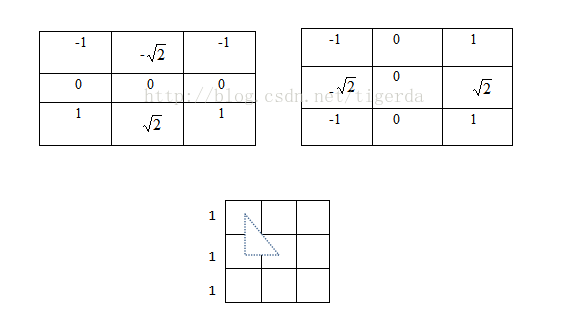

# 卷积

卷积内核 是一个 nxn矩阵，n一般是奇数 ，所以宽是 （n+1） / 2 


平滑过滤(模糊)

| 1    | 1    | 1    |
| ---- | ---- | ---- |
| 1    | 1    | 1    |
| 1    | 1    | 1    |

shader中获取  左上角 一个像素的颜色

```
vec2 offset0=vec2(-1.0,-1.0); // 当前位置的偏移  左上角 
cTemp0=texture(sTexture, vTextureCoord.st + offset0.xy/512.0); // 归一化当前ST坐标 + 偏移归一化
```


### 常见边缘检测算子

Roberts 、Sobel 、Prewitt、Laplacian、Log/Marr、Canny、Kirsch、Nevitia

 #### 一阶微分算子：Roberts 、Sobel 、Prewitt


#### 各向同性Sobel算子 



模板的权值是离中心位置越远则权值（看绝对值）影响越小，如上图，把模板看成是9个小正方形，小正方形边长为1，则虚线三角形的斜边长为，下直角边长为1，则如果（0,0）位置权值绝对值大小为1，则按照距离关系，位置（1,0）处的权值绝对值大小应该为才是准确的。


#### 计算边缘幅值与方向？

比如sobel算子


求幅值时是有多种选择的，一般根据具体应用选择用水平还是竖直或是两个方向同时检测。 

#### **二阶微分算子：Laplacian、Log/Marr** 

拉普拉斯算子来自拉普拉斯变换，而Log算子又称Marr算子 


拉普拉斯强调的是图像中__灰度的突变__，并__不强调图像的灰度缓变__（灰度缓变由一阶微分，也就是梯度，图像应用是sobel算子

__变化的转向，颜色突然的转变，加速度的变化，如下图__


#### 锐化处理

可以把拉普拉斯算子的结果 与 原图相加：


算子就是 拉普拉斯算子 + 原位置点


####   **非微分边缘检测算子：Canny** 


#### 浮雕效果的卷积内核 


```
precision mediump float;//给出默认的浮点精度
varying vec2 vTextureCoord;//从顶点着色器传递过来的纹理坐标
uniform sampler2D sTexture;//纹理内容数据
void main() {           
	//给出卷积内核中各个元素对应像素相对于待处理像素的纹理坐标偏移量
	vec2 offset0=vec2(-1.0,-1.0); vec2 offset1=vec2(0.0,-1.0); vec2 offset2=vec2(1.0,-1.0);
	vec2 offset3=vec2(-1.0,0.0); vec2 offset4=vec2(0.0,0.0); vec2 offset5=vec2(1.0,0.0);
	vec2 offset6=vec2(-1.0,1.0); vec2 offset7=vec2(0.0,1.0); vec2 offset8=vec2(1.0,1.0); 
	const float scaleFactor = 1.0;//给出最终求和时的加权因子(为调整亮度)
	//卷积内核中各个位置的值
	float kernelValue0 = 2.0; float kernelValue1 = 0.0; float kernelValue2 = 2.0;
	float kernelValue3 = 0.0; float kernelValue4 = 0.0; float kernelValue5 = 0.0;
	float kernelValue6 = 3.0; float kernelValue7 = 0.0; float kernelValue8 = -6.0;
	vec4 sum;//最终的颜色和
	//获取卷积内核中各个元素对应像素的颜色值
	vec4 cTemp0,cTemp1,cTemp2,cTemp3,cTemp4,cTemp5,cTemp6,cTemp7,cTemp8;	
	cTemp0=texture2D(sTexture, vTextureCoord.st + offset0.xy/512.0);
	cTemp1=texture2D(sTexture, vTextureCoord.st + offset1.xy/512.0);
	cTemp2=texture2D(sTexture, vTextureCoord.st + offset2.xy/512.0);
	cTemp3=texture2D(sTexture, vTextureCoord.st + offset3.xy/512.0);
	cTemp4=texture2D(sTexture, vTextureCoord.st + offset4.xy/512.0);
	cTemp5=texture2D(sTexture, vTextureCoord.st + offset5.xy/512.0);
	cTemp6=texture2D(sTexture, vTextureCoord.st + offset6.xy/512.0);
	cTemp7=texture2D(sTexture, vTextureCoord.st + offset7.xy/512.0);
	cTemp8=texture2D(sTexture, vTextureCoord.st + offset8.xy/512.0);
	//颜色求和
	sum =kernelValue0*cTemp0+kernelValue1*cTemp1+kernelValue2*cTemp2+
		 kernelValue3*cTemp3+kernelValue4*cTemp4+kernelValue5*cTemp5+
	     kernelValue6*cTemp6+kernelValue7*cTemp7+kernelValue8*cTemp8; 
	//灰度化
	float hd=(sum.r+sum.g+sum.b)/3.0;
  	gl_FragColor = vec4(hd) * scaleFactor; //进行亮度加权后将最终颜色传递给管线
} 
```


### 灰度化彩色图片

对rgb 三路通道做平均值，并作为3个通道的值

```
float hd=(sum.r+sum.g+sum.b)/3.0;
gl_FragColor = vec4(hd) ;
```


## 显示两张图片

如果要画两幅图片，显示在屏幕，思路:

1. 确定两个图片的矩形大小(假定一样大)
2. 假设 投影近平面距离是2 nearZ=2，近平面尺寸按物理屏幕计算为 -ratio ratio, 1,1 （假设ratio>1 也就是宽比高要大）
3. 可以按照下图，按比例算出，摄像头位置，和两个矩形位移距离


## shader中初始化Mat矩阵

1. mat2x3 代表是2列3行

2. mat2x3 a1 = mat2x3 (1.0, 2.0, 3.0,   4.0 ,5.0, 6.0) 代表

   | 1    | 4    |
   | ---- | ---- |
   | 2    | 5    |
   | 3    | 6    |

   

## shader中颜色置反

```
fFragColor =  vec4(1.0) -  fFragColor;  // 注意 颜色的范围是0~1 所以置反也是 (1-x)
```