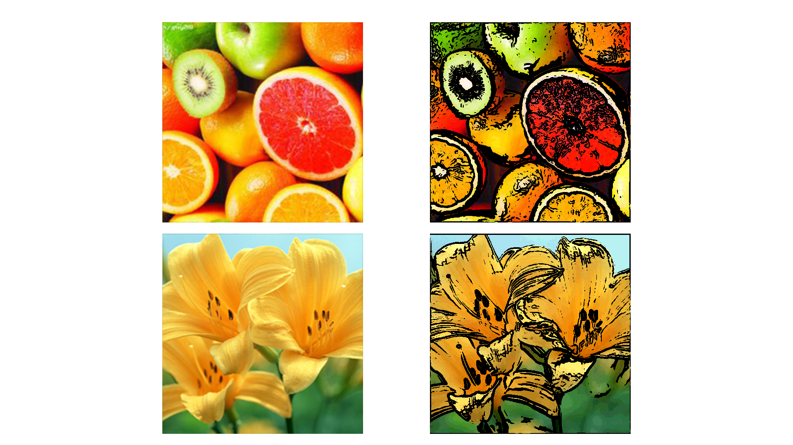

## 纹理采样特定的点

只要知道纹理图片的宽高，就可以得到当前纹素，附近任意偏移的纹素
```
ivec2 ires=textureSize(uImageUnit,0);		// 获得纹理图的宽高度
float uResS = float(ires.s);				// 获得纹理图的S值
float uResT = float(ires.t);				// 获得纹理图的T值
vec2 offset = vec2(1.0/uResS, 1.0/uResT);	 // 当前纹理右下角的纹素的偏移

vec4 color = texture( uImageUnit,vST+offset); // 当前纹理坐标 加上 偏移 

```


### shader中 RGB转YUV

```
const vec3 W=vec3(0.2125,0.7154,0.0721);			  // 公式 
// BT709   Y = 0.213 * R + 0.715 * G + 0.072 * B  
// BT601   Y = 0.299 * R + 0.587 * G + 0.114 * B  

float gray = dot( texture( uImageUnit,st).rgb,W ); // dot点乘 
```


### shader 中的sobel算子 ， 求梯度幅度 和 边界

```
	ivec2 ires=textureSize(uImageUnit,0);		// 获得纹理图的宽高度
	float uResS = float(ires.s);				// 获得纹理图的S值
	float uResT = float(ires.t);				// 获得纹理图的T值
	
	vec2 stp0=vec2(1.0/uResS, 0.0);			    // 与左右相邻像素间的距离向量
	vec2 st0p=vec2(0.0,       1.0/uResT);	    // 与上下相邻像素间的距离向量
	vec2 stpp=vec2(1.0/uResS, 1.0/uResT);		// 与左下、右上相邻像素间的距离向量
	vec2 stpm=vec2(1.0/uResS, -1.0/uResT);		// 与左上、右下相邻像素间的距离向量
	
	// dot 点乘 从rgb得到灰度值
	float m00 =dot( texture( uImageUnit,vST-stpp).rgb,W );
	float m01 =dot( texture( uImageUnit,vST-st0p).rgb,W );
	float m02 =dot( texture( uImageUnit,vST+stpm).rgb,W );

    float m10 =dot( texture( uImageUnit,vST-stp0).rgb,W );
    float m12 =dot( texture( uImageUnit,vST+stp0).rgb,W );

    float m20 =dot( texture( uImageUnit,vST-stpm).rgb,W );
    float m21 =dot( texture( uImageUnit,vST+st0p).rgb,W );
    float m22 =dot( texture( uImageUnit,vST+stpp).rgb,W );
	
	
	// 与图像作平面卷积计算，分别得出横向及纵向的亮度差分近似值，即sobel算子的横纵灰度值
	// (下面对方向没要求)
	float h = -1.0 * m20 - 2.0 * m21 - 1.0 * m22 + 1.0 * m00 + 2.0 * m01 + 1.0 * m02;
	float v = -1.0 * m00 - 2.0 * m10 - 1.0 * m20 + 1.0 * m02 + 2.0 * m12 + 1.0 * m22;
	
	// 当前像素点的梯度值
	float mag=length( vec2(h, v));
	
	// soble求边界 需要 给定阈值 
	// 梯度值大于阈值 才认为是边缘，阈值越小，更多元素变成边界，轮廓就越粗
	if(mag > uMagTol) {
        fFragColor=vec4(0.0,0.0,0.0,1.0); // 边界是黑色
	}else{
        fFragColor=vec4(1.0,1.0,1.0,1.0); // 其他是白色
	}
```


### 卡通特效原理

#### 如果把0~1.0区间的连续值，映射到等间隔的N个离散值

纹理采样得到的颜色，取值范围是0~1.0 ，卡通化就是要__减少颜色__ ，或者说__离散化成有限颜色__

量化值，就是要离散化成多少个整数值，比如，最后离散成等间隔的18个值，那量化值就是18

a. 1.0 * 量化  值 就会把 0~1.0的连续值  映射到  0 ~ 量化值 区间 的连续值 

b. 取整，这样就可以得到 0 ~ 量化值  区间 离散值 (  一共有‘量化值’个 比如18个  )

c. 最后归一化，这样就得到 0~1.0f 区间 的 ‘量化值’ 个 离散值 

#### shader实现 

```
rgb.rgb *= 18.0f ;                // 将当前片元的颜色值乘以量化值  （卡通成都 越大色彩越饱和)
rgb.rgb += vec3(0.5,0.5,0.5);     // hhl 这个可以不用加 只是为了向上取整
ivec3 intrgb = ivec3(rgb.rgb);    // 转换成整数类型的向量  实际这里才是量化!! 离散化成uQuantize个值
rgb.rgb = vec3(intrgb) /18.0f;    // 归一化 回到0~1.0f
```

#### 效果

