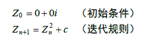
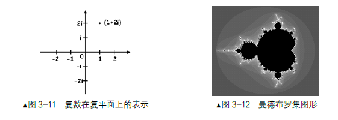
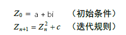
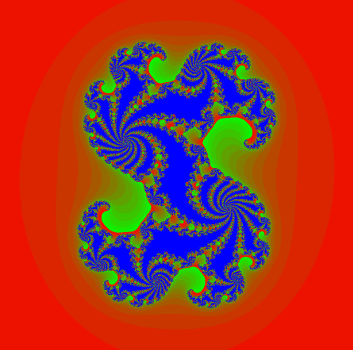

## 复数

__z=a+bi__  这里a和b是实数，i是虚数单位，-1的开根，i² = -1  

在复数a+bi中，a=Re(z)称为实部，b=Im(z)称为虚部。

当虚部等于零时，这个复数可以视为__实数__

当z的虚部不等于零时，实部等于零时，常称z为__纯虚数__ 

复数的四则运算规定为:

1. 加法法则:(a+bi)+(c+di) = (a+c)+(b+d)i;
2. 减法法则:(a+bi)-(c+di) = (a-c)+(b-d)i;
3. 乘法法则:(a+bi)·(c+di)=  (ac-bd)+(bc+ad)i
4. 除法法则:(a+bi)÷(c+di)=[(ac+bd）/（c²+d²）]+[（bc-ad）/（c²+d²）]i


## 曼德布罗集

迭代公式：



不同的复数c 会导致不同的结果 Zn+1    c是复数，比如 1+2i



某些c值，经过迭代之后会无穷大，有些不会，那些不会导致无穷大的c值，就构成曼德布罗集

也就是说，如果__c是复平面上的一点__，(c=a+bi)，如果迭代很多次后，Zn+1不会趋向于无穷大，或者在__有限次数不会超过某个值__，那么这个c点就在 曼德布罗集 

复平面，中心点(0,0) , 实部和虚部范围在(-2.5 到 2.5)


## 茱莉亚集

迭代公式：



c是常数，Z0 = a+bi ，如果迭代很多次后，Zn+1不会趋向无穷，那么Z0在 茱莉亚集 

复平面，中心点(0,0) , 实部和虚部范围在(-1.5 到 1.5)




## 纹理坐标映射

纹理坐标是从0到1的，如果要映射到 -2.5,2.5 可以

```
vTexPosition = (aTexCoor-0.5)*5.0;
```

 

## 取小数部分

```
floor(x): 底部取整
ceil(x):  顶部取整
fract(x): 取小数部分
```

