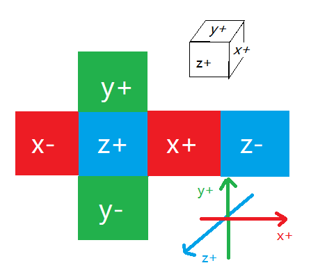

## 计算反射向量

1.  已知法向量和入射向量 求反射向量 reflect 

[推导]: https://blog.csdn.net/yinhun2012/article/details/79466517

    

    

     

   OB =  AO - 2 (AO * n ) * n   AO向量是指向表面点   OB向量是从表面点指向外部

2. OpenGL ES 内置函数 genType reflect (genType I, genType N) 可以求得反射变量

   ```
   genType reflect (genType I, genType N)  GLES2.0支持
   
   For the incident vector I（入射向量 指向入射点）and surface orientation N(法向量),returns the reflection direction: I – 2 ∗ dot(N, I) ∗ N. 反射向量，从原点指向外部
   N must already be normalized in order to achieve the desired result.N必须是单位向量
   ```

   

## 三维空间上的直线 和 面

1. 已知过空间上某个点(x0,y0,z0)，并且单位方向向量是N=(nx,ny,nz)

   ```
   1) 直线分别映射到XOY平面和XOZ平面的两条直线表达(过两条直线切垂直于XOY平面和XOZ平面的两平面相交线)
   a X + b Y + c = 0
   d X + e Z + f = 0
   
   2）两个平面 （可跟1)转换）
   a X + b Y + cZ = g
   d X + e Y + fZ = h
   
   3) 向量表示法(已知法向量情况)
   p = p0 + tN  (N是直线的法向量，p0是直线上的一点，t为变量得到直线上另外一点p)
   
   ```

   

2. 平面的表达式 Ax+By+Cz=D  其中面的法向量是(A,B,C)


## 立方体纹理技术

[教程和案例]: https://learnopengl-cn.readthedocs.io/zh/latest/04%20Advanced%20OpenGL/06%20Cubemaps/
[天空盒素材]: http://www.custommapmakers.org/skyboxes.php

 

1. 立方体纹理的单位是 套，一套立方体纹理，包含6幅 __尺寸相同__的__正方形__纹理图，6幅图刚好是360整个场景
2. 立方体纹理采样，不是纹理坐标ST，而是__规格化的向量__，代表__采样的方向__，也就是__立方体纹理采样是根据单位方向向量__
3. 方向向量的大小无关紧要。一旦提供了方向，OpenGL就会获取方向向量触碰到立方体表面上的相应的纹理像素（texel），这样就返回了正确的纹理采样值。方向向量触碰到立方体表面的一点也就是立方体贴图的纹理位置 ，通过这个纹理坐标就能获取到立方体贴图上正确的纹理。 


 



4. 由于立方体贴图有6个面，OpenGL就提供了__6个不同的纹理目标__，来应对立方体贴图的各个面 

    | 纹理目标（Texture target）     | 方位         |
    | ------------------------------ | ------------ |
    | GL_TEXTURE_CUBE_MAP_POSITIVE_X | 右           |
    | GL_TEXTURE_CUBE_MAP_NEGATIVE_X | 左           |
    | GL_TEXTURE_CUBE_MAP_POSITIVE_Y | 上           |
    | GL_TEXTURE_CUBE_MAP_NEGATIVE_Y | 下           |
    | GL_TEXTURE_CUBE_MAP_POSITIVE_Z | 前 (fix it ) |
    | GL_TEXTURE_CUBE_MAP_NEGATIVE_Z | 后           |

5. 注意!! 按照顺序   还是使用__texImage2D__ 的接口 但是__纹理目标是 GL_TEXTURE_CUBE_MAP_POSITIVE_X__

    以 `GL_TEXTURE_CUBE_MAP_POSITIVE_X`为起始来对它们进行遍历，每次迭代枚举值加 `1`，这样循环所有的纹理目标效率较高 

    ```
    int width,height;
    unsigned char* image;  
    for(GLuint i = 0; i < textures_faces.size(); i++)
    {
        image = SOIL_load_image(textures_faces[i], &width, &height, 0, SOIL_LOAD_RGB);
        glTexImage2D(
            GL_TEXTURE_CUBE_MAP_POSITIVE_X + i,
            0, GL_RGB, width, height, 0, GL_RGB, GL_UNSIGNED_BYTE, image
        );
    }
    ```

    

6. 立方体纹理 也要设置采样方式和拉伸方式

    ```
    glBindTexture(GLES30.GL_TEXTURE_CUBE_MAP, cubeMapTextureId);
    glTexParameterf(GLES30.GL_TEXTURE_CUBE_MAP,GLES30.GL_TEXTURE_MIN_FILTER,GLES30.GL_LINEAR);
    glTexParameterf(GLES30.GL_TEXTURE_CUBE_MAP,GLES30.GL_TEXTURE_MAG_FILTER,GLES30.GL_LINEAR);
    glTexParameterf(GLES30.GL_TEXTURE_CUBE_MAP, GLES30.GL_TEXTURE_WRAP_S,GLES30.GL_REPEAT);
    glTexParameterf(GLES30.GL_TEXTURE_CUBE_MAP, GLES30.GL_TEXTURE_WRAP_T,GLES30.GL_REPEAT);
    glTexParameterf(GLES30.GL_TEXTURE_CUBE_MAP,GLES30.GL_TEXTURE_WRAP_R,GLES30.GL_REPEAT);//??
    ```

 7. 使用立方体贴图 使能GL_TEXTURE_CUBE_MAP   默认也应该是打开的

    ```
    GLES30.glEnable(GLES30.GL_TEXTURE_CUBE_MAP);//启用立方图纹理
    GLES30.glBindTexture(GLES30.GL_TEXTURE_CUBE_MAP,texId);//绑定立方图纹理
    ```

8. 着色器：   变量类型   __samplerCube__   表示 __立方体纹理的句柄__

    sampler2D		2D纹理采样器
    sampler3D		3D纹理采样器  （GLES2.0不支持）
    samplerCube	Cube纹理采样器( GLES2.0支持)	

    ```
    uniform samplerCube sTexture;  
    ```

    GLES 2.0 在__顶点和片元着色器__都可以执行__textureCube__：

    vec4 texture2D(sampler2D sampler, vec2 coord) 

    vec4 textureCube(samplerCube sampler, vec3 coord) 

9. （还不确定 Not Sure）通过立方体贴图上传的贴图，貌似自己完成了Android图片原点(左下)和OpenGL纹理图原点(左上)的问题 ??

10. demo中的 y轴方向上 天空盒 和 立方体贴图  只是上下flip 没有左右flip，而x轴，z轴都是左右flip

     