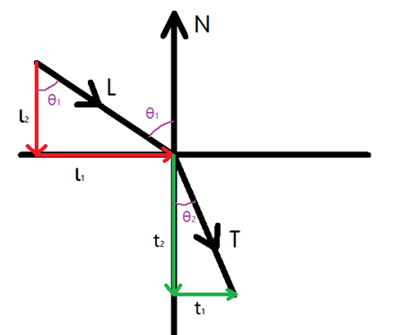
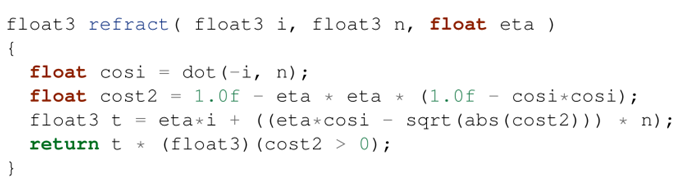
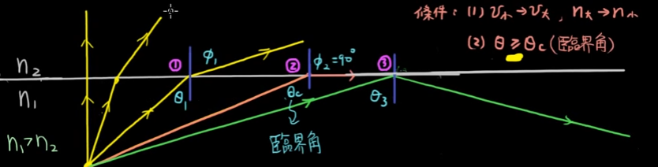
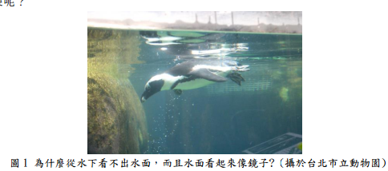
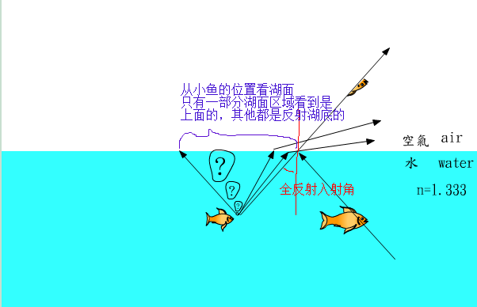
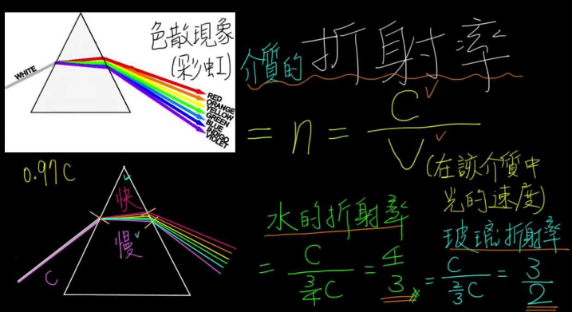
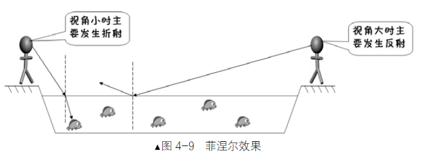

## 折射定律/斯涅尔定律

1. 当光波从一种介质传播到另一种具有不同折射率的介质时，会发生折射现象，其入射角与折射角之间的关系，可以用斯涅尔定律（Snell's Law）来描述

2. 其中入射光和折射光位于同一个平面上，并且与__界面法线__的夹角满足如下关系：`n1 sinθ1 = n2 sinθ2`  其中，`n1`  和` n2`  分别是两个介质的折射率， `θ1` 和 `θ2` 分别是入射光（或折射光）与界面法线的夹角，叫做入射角和折射角

3. OpenGL ES  refract  内置函数

   ```
   genType refract(genType I, genType N,float eta)
   
   For the incident vector I and surface normal N, and the ratio of indices of refraction eta, return the refraction vector. The result is computed by 
   k = 1.0 - eta * eta * (1.0 - dot(N, I) * dot(N, I)); 
   if (k < 0.0) return genType(0.0) 
   else return eta * I - (eta * dot(N, I) + sqrt(k)) * N. 
   
   The input parameters for the incident vector I and thesurface normal N must already be normalized to get the desired results. 输入额
   ```

   

4. 反射向量 推导

   [3D数学基础-三维空间折射向量计算]: https://www.cnblogs.com/night-ride-depart/p/7429618.html	"推导开头把斯涅尔定律公式写错了 "

    L、 N 和 T 都为单位向量 

   

   Nvidia 公司的 CG 手册 ，refract函数 的 i 对应于我们的 L，n 对应于我们的 N ， eta 分量是对应于的我们这里的 1 / e， cg 函数中最后一句 return 语句的写法，是用来处理全反射现象的。简而言之，`cosθ2 <= 0` 的时候就发生了全反射现象`θ2>=90`。（下图abs(cost2)只是起保护作用）

   

   ```
   折射系数 = 入射方的折射率  /   折射方的折射率  = sin(折射角) / sin(入射角)
   ```

5. 特殊情况：在折射定律式中，若令 `n1 = n2`  ，则得到反射定律式，因此，可以将反射定律看做折射定律的一个特例

6. 临界角：当光由__光密介质__（折射率 `n1`  比较大的介质）射入__光疏介质__（折射率`n2`  比较小的介质）时（比如由水入射到空气中），如果入射角 `θ1` 等于某一个角`θc` 时，折射光线会沿折射界面的切线进行，即折射角  `θ2 = 90`，此时会有`sinθ2 = 1`    ,则可推得 `sinθc = sinθ1 = n2/n1` 。 但如果入射角`θ1`  大于这一个值`θc`  时，入射角的正弦`  sinθ1 > n2/n1`，会推得`sinθ2 > 1`  。这在物理上是没有意义的，所以此时，__不存在折射光，而只存在反射光，于是便发生全反射__。而__使得全反射发生的最小入射角__`θc`  叫做临界角，它的值取决于两种介质的折射率的比值 ；注意，在`θ1=θc`时候已经发生__全反射__

   例：水的折射率为`1.33`，空气的折射率近似等于`1.00001`，临界角`θc`  等于`48.8` 。

   

   



5. 折射率：光在真空中的传播速度与光在该介质中的传播速度之比。材料的折射率越高，使入射光发生折射的能力越强，所以光在真空中的折射率为1 

| 材质 | 折射指数 |
| ---- | -------- |
| 空气 | 1.00     |
| 水   | 1.33     |
| 冰   | 1.309    |
| 玻璃 | 1.52     |
| 宝石 | 2.42     |


## 色散

1. 光的色散

   

2. 自然光（由多种波长的光混合组成）在穿过不同的介质时发生折射现象，组成自然光的不同波长的光線分离，这种现象称为自然光的色散，简称光的色散。 这里的自然光是指正常人类用眼睛能看到的光。 一般来说，光的波长越小，折射率越大：（在自然光中）紫色光折射率最大，红色光折射率最小（见右图）。


3. 由于不同颜色的光，对于同一材质的折射率，是不完全相同的，所以一束由不同颜色组成的光线经过折射后，不同颜色部分折射方向会有发散，所以shader中只需要__对同一个材质，r，g，b三个通道设置不同的折射率__，同一个视线向量(入射角)，r/g/b不同通道由于折射率不同，在立方体贴图上的，采样位置就不一样，采样到的颜色也只取对应的r/g/b

   ```
   // 据法向量、视线向量及斯涅尔定律计算立方图纹理采样的方法
   vec4 zs(in float zsl){   // 折射率
     vec3 vTextureCoord=refract(-eyeVary,newNormalVary,zsl); // 根据斯涅尔定律计算折射后的视线向量
     vec4 finalColor=texture(sTexture, vTextureCoord);       // 进行立方图纹理采样     
     return finalColor;
   }
   void main(){
      vec4 finalColor=vec4(0.0,0.0,0.0,0.0);
      // 同一个材质 rgb三个通道的折射率不相同
      // 由于有色散RGB三个色彩通道单独计算折射
      finalColor.r=zs(0.97).r;  // 计算红色通道的采样结果
      finalColor.g=zs(0.955).g; // 计算绿色通道的采样结果
      finalColor.b=zs(0.94).b;  // 计算蓝色通道的采样结果
      fragColor=finalColor;     // 将最终片元颜色传递给管线
   }  
   ```

4. 最终效果

   折射的效果是：出现放大镜一样，HHL：其实是近大远小，把远处天空盒的对应区域颜色搬到了透明球

   色散的效果是：放大镜+物体边缘有彩虹条纹(色散现象)

   

   


## 菲涅尔反射

[菲涅耳现象]: https://www.cnblogs.com/BlackWalnut/p/4587182.html
[菲涅尔反射是什么]: https://www.zhihu.com/question/53022233

1. 拍摄者距离河水较近，视角可以清楚的看见水下的石头，

   而图中较远的河水已经看不到水下的物体，水面上有较高的反射现象

   __夹角越小，反射越明显，所以远处倒影(反射)明显__

      

    	


2. 原因：光线到达材质接触面时，一部分光线被反射，一部分光线被折射，大致规律是，入射角较小发生折射，入射角大发生反射，在给定的情况下，反射和折射占比，计算复杂，需要为菲涅尔效果建立复杂数学模型

   

3. 在三维软件中，添加菲涅尔反射是为了更逼真的模拟物体的真实效果，__摄像机正视物体的时候，中心处角度大，反射低，四周角度小，反射高__


 4. shader实现：

    1. 若入射角小于一定的值，只计算折射效果。

    2. 若入射角大于一定的值，只计算反射效果。

    3. 若入射角在一定的范围内，则首先单独计算折射效果与反射效果，再将两种效果的计算结
       果按一定的比例进行融合。

       ```
       precision mediump float;
       uniform samplerCube sTexture;// 纹理内容数据
       in vec3 eyeVary;		// 接收从顶点着色器过来的视线向量
       in vec3 newNormalVary;	// 接收从顶点着色器过来的变换后法向量
       out vec4 fragColor;     // 输出到的片元颜色
       
       // 计算折反射纹理采样颜色的方法
       vec4 zfs( in float zsl ){   //折射率
       
           vec3 vTextureCoord;	    //用于进行立方图纹理采样的向量
       
           vec4 finalColor;  		// 最终颜色
       
           const float maxH=0.7;	    // 入射角余弦值若大于此值则仅计算折射
           const float minH=0.2;	    // 入射角余弦值若小于此值则仅计算反射
           float sizeH=maxH-minH;      // 混合时余弦值的跨度 余弦值越大 代表入射角也小
       
           float testValue=abs(dot(eyeVary,newNormalVary));	// 计算视线向量与法向量的余弦值
       
           if(testValue>maxH)  {							    // 余弦值大于maxH仅折射
       
               vTextureCoord=refract(-eyeVary,newNormalVary,zsl);
               finalColor=texture(sTexture, vTextureCoord);
       
           }else if(testValue<=maxH&&testValue>=minH) {        // 余弦值在minH～maxH范围内反射、折射融合
       
               vec4 finalColorZS;		//若是折射的采样结果
               vec4 finalColorFS;		//若是反射的采样结果
       
               vTextureCoord=reflect(-eyeVary,newNormalVary);
               finalColorFS=texture(sTexture, vTextureCoord);  	    // 反射的计算结果
       
               vTextureCoord=refract(-eyeVary,newNormalVary,zsl);
               finalColorZS=texture(sTexture, vTextureCoord);  	    // 折射的计算结果
       
               float ratio=(testValue-minH)/sizeH;					    // 融合比例
               finalColor=finalColorZS*ratio+(1.0-ratio)*finalColorFS;	// 折反射结果线性融合
       
           }else{										                // 余弦值小于minH仅反射
       
               vTextureCoord=reflect(-eyeVary,newNormalVary);
               finalColor=texture(sTexture, vTextureCoord);
           }
           return finalColor;									// 返回最终结果
       }
       
       void main(){
          vec4 finalColor=vec4(0.0,0.0,0.0,0.0);
          // 由于有色散RGB三个色彩通道单独计算折反射
          finalColor.r=zfs(0.97).r;  		// 计算红色通道
          finalColor.g=zfs(0.955).g;  		// 计算绿色通道
          finalColor.b=zfs(0.94).b;  		// 计算蓝色通道
          fragColor=finalColor; 		    // 将最终的片元颜色传递给管线
       } 
       ```

       