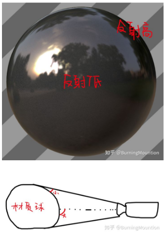

## 折射定律/斯涅尔定律

1. 当光波从一种介质传播到另一种具有不同折射率的介质时，会发生折射现象，其入射角与折射角之间的关系，可以用斯涅尔定律（Snell's Law）来描述

2. 其中入射光和折射光位于同一个平面上，并且与__界面法线__的夹角满足如下关系：`n1 sinθ1 = n2 sinθ2`  其中，`n1`  和` n2`  分别是两个介质的折射率， `θ1` 和 `θ2` 分别是入射光（或折射光）与界面法线的夹角，叫做入射角和折射角

3. OpenGL ES  refract  内置函数

   ```
   genType refract(genType I, genType N,float eta)
   
   For the incident vector I and surface normal N, and the ratio of indices of refraction eta, return the refraction vector. The result is computed by 
   k = 1.0 - eta * eta * (1.0 - dot(N, I) * dot(N, I)); 
   if (k < 0.0) return genType(0.0) 
   else return eta * I - (eta * dot(N, I) + sqrt(k)) * N. 
   
   The input parameters for the incident vector I and thesurface normal N must already be normalized to get the desired results. 输入额
   ```

   

4. 反射向量 推导

   [3D数学基础-三维空间折射向量计算]: https://www.cnblogs.com/night-ride-depart/p/7429618.html	"推导开头把斯涅尔定律公式写错了 "

    L、 N 和 T 都为单位向量 

   

   Nvidia 公司的 CG 手册 ，refract函数 的 i 对应于我们的 L，n 对应于我们的 N ， eta 分量是对应于的我们这里的 1 / e， cg 函数中最后一句 return 语句的写法，是用来处理全反射现象的。简而言之，`cosθ2 <= 0` 的时候就发生了全反射现象`θ2>=90`。（下图abs(cost2)只是起保护作用）

   

   ```
   折射系数 = 入射方的折射率  /   折射方的折射率  = sin(折射角) / sin(入射角)
   ```

5. 特殊情况：在折射定律式中，若令 `n1 = n2`  ，则得到反射定律式，因此，可以将反射定律看做折射定律的一个特例

6. 临界角：当光由__光密介质__（折射率 `n1`  比较大的介质）射入__光疏介质__（折射率`n2`  比较小的介质）时（比如由水入射到空气中），如果入射角 `θ1` 等于某一个角`θc` 时，折射光线会沿折射界面的切线进行，即折射角  `θ2 = 90`，此时会有`sinθ2 = 1`    ,则可推得 `sinθc = sinθ1 = n2/n1` 。 但如果入射角`θ1`  大于这一个值`θc`  时，入射角的正弦`  sinθ1 > n2/n1`，会推得`sinθ2 > 1`  。这在物理上是没有意义的，所以此时，__不存在折射光，而只存在反射光，于是便发生全反射__。而__使得全反射发生的最小入射角__`θc`  叫做临界角，它的值取决于两种介质的折射率的比值 ；注意，在`θ1=θc`时候已经发生__全反射__

   例：水的折射率为`1.33`，空气的折射率近似等于`1.00001`，临界角`θc`  等于`48.8` 。

   

   


5. 菲涅尔反射：

   [菲涅耳现象]: https://www.cnblogs.com/BlackWalnut/p/4587182.html
   [菲涅尔反射是什么]: https://www.zhihu.com/question/53022233

   拍摄者距离河水较近，视角可以清楚的看见水下的石头，

   而图中较远的河水已经看不到水下的物体，水面上有较高的反射现象

     

   

   __夹角越小，反射越明显，所以远处倒影(反射)明显__

   在三维软件中，添加菲涅尔反射是为了更逼真的模拟物体的真实效果，__摄像机正视物体的时候，中心处角度大，反射低，四周角度小，反射高__

   


6. 折射率：光在真空中的传播速度与光在该介质中的传播速度之比。材料的折射率越高，使入射光发生折射的能力越强，所以光在真空中的折射率为1 

   | 材质 | 折射指数 |
   | ---- | -------- |
   | 空气 | 1.00     |
   | 水   | 1.33     |
   | 冰   | 1.309    |
   | 玻璃 | 1.52     |
   | 宝石 | 2.42     |

   

   