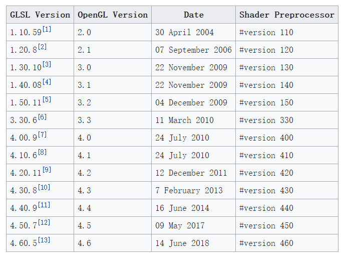
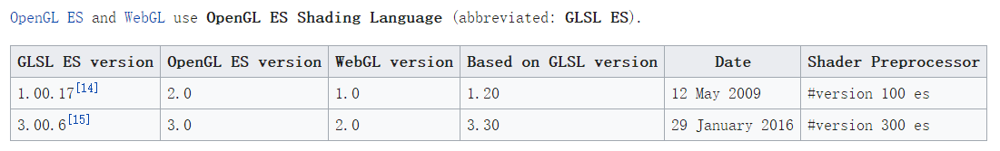

## GLSL版本号







shader文件顶部写的 "#version 300 es "  300是GLSL的版本号，不是GLES的版本号，如果不写默认是100 

由于OpenGL1.0是固定渲染管线，没有GLSL，所以GLES2.0对应的是GLSL1.0，但是后面某个版本开始，GLSL的版本号跟GLES开始一致


## 切线空间的凹凸映射

使用法线贴图是因为在低模下想获得高模凹凸表面光照效果 

线贴图（Normal mapping）在三维计算机图形学中，是凸凹贴图（Bump mapping）技术的一种应用，法线贴图有时也称为“Dot3（仿立体）凸凹纹理贴图 

凸凹与纹理贴图通常是在现有的模型法线添加扰动不同，法线贴图要完全更新法线

法向量纹理图

__法线贴图__的出现,是为了__低面数的模型__模拟出__高面数的模型__的”光照信息” 

烘焙

法线贴图是Bump Mapping（凹凸贴图）的其中一种  

对法线贴图进一步改进，出现了Parallax Mapping（视差贴图）, Relief Mapping等技术，实现了更逼真的效果 


* 高度域灰度图-转法向量纹理图（干扰法向量，表面点法向量坐标系）

* 表面点的切线

  * 已知三个顶点坐标，分别可以做成  向量v1 和 向量v2

  * 假设该点的切向量为T(angent) 和 副法向量为B(iNormal) ，作为两个基向量/分量

  * 3个顶点的纹理坐标s,t之间的变化量(Δs1,Δt1)，(Δs2,Δt2)，分别作为这两个T，B分量的值

    ```
    v1 = Δs1*T + Δt1*B
    v2 = Δs2*T + Δt2*B
    ```

  * 使用消元法，去掉B(不用求，在shader中对T和N做叉积即可)，即可求出T向量(x,y,z)坐标

  * 使用建模工具贴纹理后生成的纹理坐标时，纹理坐标在整个物体面上是一致的，通过这种方式保证切向量方向的一致

  

* 表面点到摄像机的视线向量 表面点到光源的光照向量 从世界坐标系 转换到 切线空间

  * 由于法向量纹理图中，干扰法向量是放在z轴，所以变换矩阵是：

    ```
    ︹                                    ︹
    x                                     x0 
    y  (世界坐标系) = [ T , BN,  N  ]  *   y0 (表面点法向量坐标系)
    z                                     z0
    ︺                                    ︺
    
    T和BN互换没有什么影响
    如果 N 要跟其他更换位置的话， z0(代表干扰法线) 也要换同样换位置，比如
    ︹                                    ︹
    x                                     x0 
    y  (世界坐标系) = [ T , N , BN  ]  *   z0  (表面点法向量坐标系)
    z                                     y0
    ︺                                    ︺
    ```

    

  ```
  // 从法线纹理图中读出值 将值恢复到-1～+1范围
  vec4 normalColor = texture(sTextureNormal, vTextureCoord);
  vec3 cNormal= (normalColor*2.0 - 1.0).rgb;
  cNormal=normalize(cNormal);   
  
  
  // 变换后的法向量 过圆心旋转,xyz同时缩放等是正交矩阵 所以同样是世界变换矩阵
  vec3 newNormal =normalize(mat3(uMMatrix)*fNormal);
  
  // 变换后的切向量 切向量的变换矩阵就是世界变换矩阵
  vec3 newTangent = normalize(mat3(uMMatrix)*ftNormal);
  
  // 副法向量
  vec3 binormal=normalize(cross(newTangent,newNormal));
  
  // 变换后的片元位置
  vec3 newPosition=(uMMatrix*vec4(vPosition,1)).xyz;
  
  // 用切向量、副法向量、法向量搭建变换矩阵，此矩阵用于将向量
  // 从实际坐标系变换到标准法向量所属坐标系
  // 这里需要inverse求逆矩阵 否则左右两个茶壶的光照方向看起来就会不一样
  mat3 rotation=inverse(mat3(newTangent,binormal,newNormal));
  //mat3 rotation=inverse(mat3(binormal,newTangent,newNormal));   // 副法和法调换没有差别
  // x轴--切线   y轴--副法线  z轴--法线(确定的)
  // 因为NormalMapUtil工具导出来的时候，使用z轴代表法线
  //mat3 rotation=inverse(mat3(newTangent,newNormal,binormal)); // 若把法线定义改为y轴:修改1/2处
  
  //  表面点到光源的光线向量 进行变换
  vec3 vp = normalize(rotation*normalize(uLightLocationSun-newPosition));
  //  表面点到摄像机的视线向量 进行变换
  vec3 eye= normalize(rotation*normalize(uCamera-newPosition));
  
  
  vec4 ambient,diffuse,specular; // 用来接收三个通道最终强度的变量
  pointLight( cNormal,
              //cNormal.xzy,    // 如果把法线定义改为y轴:修改-2/2处
              ambient,diffuse,specular,
              vp,
              eye,
     	        vec4(0.05,0.05,0.05,1.0),
     	        vec4(1.0,1.0,1.0,1.0),
     	        vec4(0.3,0.3,0.3,1.0));
  
  // 根据纹理坐标采样出片元颜色值
  vec4 finalColor=texture(sTextureWg, vTextureCoord);	 
  
  // 综合三个通道光的最终强度及片元的颜色计算出最终片元的颜色并传递给渲染管线
  fragColor = finalColor*ambient+finalColor*specular+finalColor*diffuse;
  ```

  


