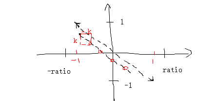

* 光源的位置 是 世界坐标系的

* 根据VP，和透视除法，计算得到光源在标准设备空间的坐标

* 然后根据   x标 * radio  和 y标 * 1  , 等到 屏幕坐标空间的坐标 （相当于投影视椎体的近平面）

* 经过 光源的屏幕空间坐标，并且成45角的直线上， 按照一定的距离（distance，每个光晕的距离不一样），计算出所有光晕的位置（x和y坐标）

* 光晕的z坐标也要计算，因为需要深度，避免光晕重叠，第一个光晕应该越深

* 再根据光源与屏幕中心的距离，计算整体缩放比例，如果距离越近，整体缩放比例越大

* 每个具体光晕，也有自己的原始大小

* 光晕的绘制，使用blend颜色混合，加上，使用正交投影，近平面在-radio,radio~-1,1 

  

* flare.png 只有rgb通道，相当于灰度图，每个光晕基于3个flare.png，有各自的颜色和alpha
* 计算blend的因子是 GL_SRC_COLOR  GL_ONE 

