### 投影贴图

* 模拟在光源前，放置一个透明胶片，投射到物体上

* 

* near和far

  near：光源与胶片之间的距离

  far：最远接收投影的物体的距离

* 近平面：

  光源虚拟摄像头的投影近平面，应该按照胶片的比例，来设置近平面的宽高，相当于限制可以接收投影的区域视按照胶片的比例，这样不会导致胶片不是1:1尺寸时候，导致的变形

* 光源虚拟摄像头的旋转

  视线方向向量(z轴)固定不变

  up分量，根据视线方向向量，最平行的方向，作为旋转轴，旋转：

  比如example中，虚拟摄像头的位置(光源) (60,80,60)，望向的是（10f,0f,10f），视线方向向量是：(0.47, 0.75, 0.47)  所以更加贴近y轴，旋转以y轴旋转

* Matrix.setLookAtM 

  这个up向量会被重新计算, lx,ly,lz和look_x,look_y,look_z的视线向量是固定的; 

  内部会先计算 坐标系轴CoordAxis(跟传入的up向量和视线向量垂直)，然后重新计算 前方向轴 UpAxis

* 计算最终颜色

  * 如果不在透明阴影下，按照物体本身的颜色 分别 乘以 环境光 散射光 和镜面光颜色
  * 如果在透明阴影下，环境光还是 物体*环境光 ，散射光 和 镜面光 ，还要分别乘上 从贴图中读取到纹理的颜色(作为因子)


### 阴影的重要性

* 帮助判断物体在三维空间中的位置关系

  

* 反映接收物体的形状

  

* 表现当前视点看不见的物体信息

  

* 判断光源的数目和位置

  

### 平面阴影

* 思想：把物体的顶点(坐标)沿着光线投影到绘制的阴影平面上，也就是阴影平面上有一个顶点，很多这样的顶点在平面上，绘制，形成阴影

* 三维空间，平面的表达方式

  ```
  ### 
  Ax+By+Cz+D=0
  参数,A,B,C,D是描述平面空间特征的常数
  (A,B,C) 是平面的法向量(没有归一化)
  
  ###
  一个点 + 法向量 ，可以确定一个平面
  设平面内该点为(X1,Y1,Z1),法向量为(a，b，c)，设该平面另外一点为(X,Y,Z)
  (X-X1)a+(Y-Y1)b+(Z-Z1)c=0
  
  
  ```

  

* 三维空间，直线的表达方式

  ```
  两个平面的夹线
  a*x + b*y + c*z + d = 0
  a2*x + b2*y + c2*z + d2 = 0
  
  向量法
  X = a + tx
  Y = b + ty
  Z = c + tZ
  
  点和直线方向，可以确定一条直线
  (x-x0)/a = (y-y0)/b = (z-z0)/c 
  
  空间两点确定一直线
  (x - x1) / (x2 - x1) = (y  - y1) / (y2 - y1) = (z - z1)/(z2 - z1)
  
  ```


* 一个向量 和 一个单位方向向量 的 内积  等于 这个向量 在这个方向上的投影长度

* 求出一个模型的一个顶点，在一个点光源下，投影在一个平面上的位置：


* 平面阴影技术，需要阴影的物体，需要绘制两次，第一次绘制阴影(在一个平面上)，第二次绘制物体 
* 在shader中，模型顶点要经过模型转换/仿射变换，得到世界坐标系，然后计算出投影点，再用视图矩阵和投影矩阵，得到gl_Position


### 阴影映射图

* 把光源作为虚拟摄像机，设置**摄像机九参数矩阵**，和，**投影矩阵**，near far 和 近平面的尺寸

* 例子中 使用 正方形的距离纹理 和  视口和近平面都是正方形

* **摄像机的位置(点光源)** 和 **透视投影的视椎体** 构成了 **投影的范围** 

* shader中把距离写入 **颜色纹理(内部格式是R16F  外部格式是GL_RED，每像素格式是GL_FLOAT)**，FBO需要**有深度附件**(纹理图或者RBO渲染缓冲对象)，打开**深度检测**，这样**写入颜色纹理的距离，就是最近光源的距离**

  ```
  顶点着色器：
     	gl_Position = uMVPMatrix * vec4(aPosition,1); // 根据总变换矩阵计算此次绘制此顶点的位置
    	vPosition = uMMatrix * vec4(aPosition,1);     // 计算出变换后的顶点位置并传递给片元着色器
     
  片元着色器：
   	float dis=distance(vPosition.xyz,uLightLocation);// 计算被照射片元到光源的距离
     	fragColor=dis; // 给此片元最终颜色值 
     
     
  ```

* 需要接收投影的物体，必须在**光源的虚拟摄像机的视椎体**中（透视投影矩阵）

* 当前距离 和 距离纹理图记录的距离 之间的差，引入一个修正值，超过这个距离才算是阴影，修正值不对会引入**“自身阴影”问题 ( 阴影瑕疵（Shadow acne ）/阴影失真 )**。可以用一个叫做阴影偏移（shadow bias）的技巧来解决这个问题

  https://learnopengl-cn.readthedocs.io/zh/latest/05%20Advanced%20Lighting/03%20Shadows/01%20Shadow%20Mapping/

  因为阴影贴图受限于解析度，在距离光源比较远的情况下，多个片元可能从深度贴图的同一个值中去采样。图片每个斜坡代表深度贴图一个单独的纹理像素。你可以看到，多个片元从同一个深度值进行采样。

  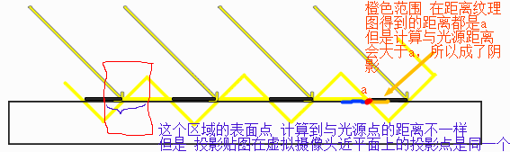 

* 对于阴影的片元，仅用环境光着色；其他都用计算环境，散射，镜面等三个通道光照着色

* 光的属性：位置，方向，颜色，强度，衰减

* 平行光：几何属性只有方向，没有起始点，（阴影映射图，用正交投影矩阵?)

* 点光源：

* **聚光灯**:  有方向，方向向量，在计算顶点光照的时候，把模型顶点坐标转换到世界坐标系，然后计算 **顶点与光源的向量** 与 **聚光灯方向向量**的 **夹角余弦值**  ( cosθ = a*b / |a||b|) ，设置**没光照的颜色**，然后和 **物体颜色在顶点光照计算出来的最终颜色**，如果在过渡区就**混合**。 在片元着色器中计算，可以避免像平面那样顶点比较少的物体表面。

* **半球光照**：光线经过**环境反射**，属于**区域光源**。就是原来漫反射时候，计算**光线向量** 与 **法向量** 之间的**夹角的余弦值**，从**1~0~-1**  转成到 **1.0 ~ 0.0**，**作为alpha值**，然后在**skyColor 和 groundColor 之间mix**，skyColor可以是灯光的颜色，groundColor是周围环境反射的颜色 ，??这个颜色由什么决定??

  ```
  fragColor = mix(uGroundColor,uSkyColor,a);
  ```

* 面光源:

* 2.0 需要渲染到深度纹理(创建深度纹理) 需要扩展支持GL_OES_depth_texture (深度检测的值保存到纹理)

* 3.0 使用R16F 半浮点纹理 也需要查询支持  GL_R16F (在shader中输出非归一化的具体距离值到FBO颜色附件纹理)

* 阴影映射的问题：

  * 自身阴影
  * 加入纠正距离后导致阴影部分不是阴影

  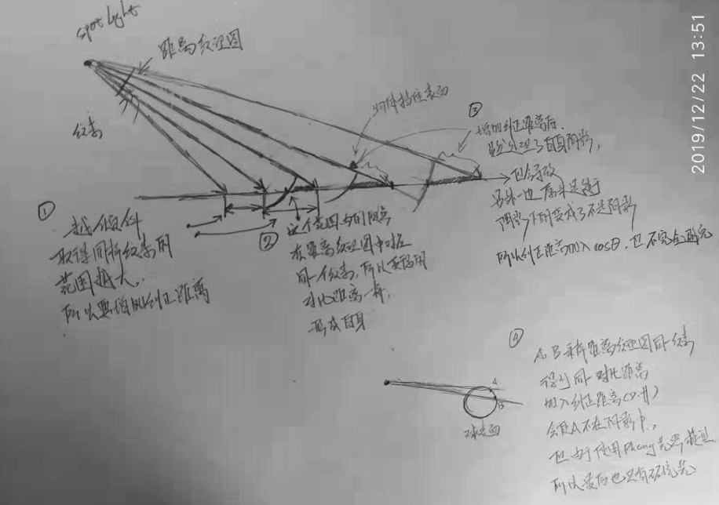

  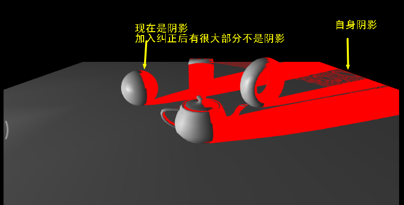

  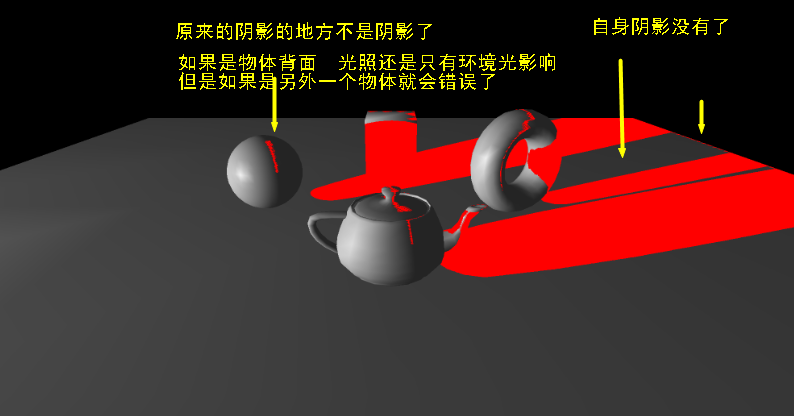

* glClearColor清空深度纹理。

  * 使用浮点纹理之前，必须先**设置clear color为光源视椎体的zFar** , 否则会导致某些顶点在距离纹理图中，由于精度问题，获取到的对比深度是0 (glClearColor(0,0,0,1)情况下)，从而成为了阴影，如下黄色箭头

    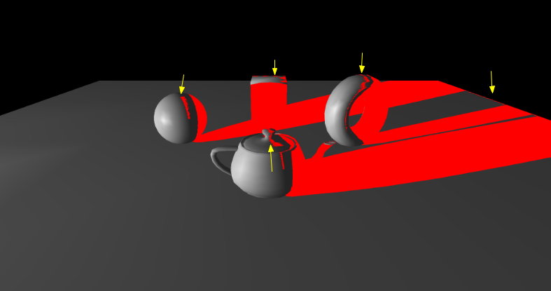

    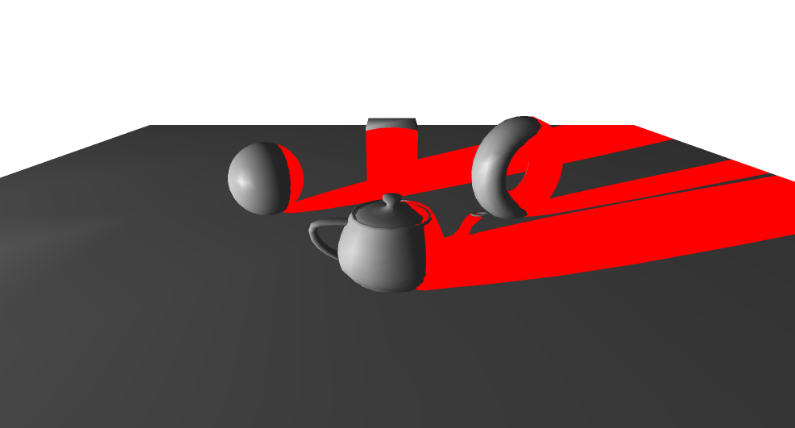

  

* 正面剔除：**渲染深度贴图**时候使用**正面剔除（front face culling）** OpenGL默认是背面剔除 

  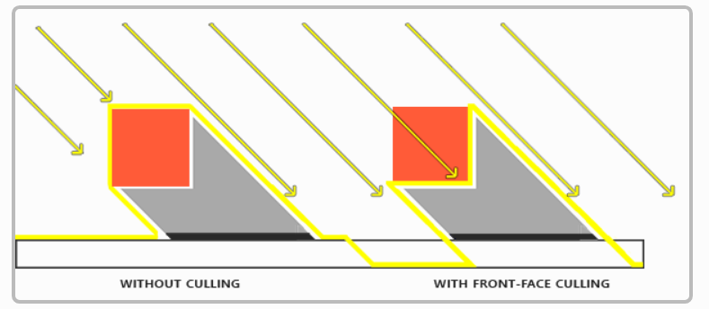

  * 这样可以使**纠正距离值降低**，减弱了peter漂移/悬浮现象
  * 使**物体背面不再成为阴影**(物体背面：对于灯光来说是背面)
  * **接近阴影的物体仍然会出现不正确的效果**
  * 但在地板上无效，因为**正面剔除完全移除了地板**。地面是一个**单独的平面**，不会被完全剔除。

* 正面剔除，以光源来看是物体“背面”，刚好是 从摄像机来看是物体“正面”的时候，如果光源是接近“平行”于这个“背面”，也就会产生“自身阴影”，暂时无法完全解决，增加距离纠正值可优化，但会peter漂浮。

  所以，**总的来看，还是"不要正面剔除" 但 加上 偏移值**  会好些，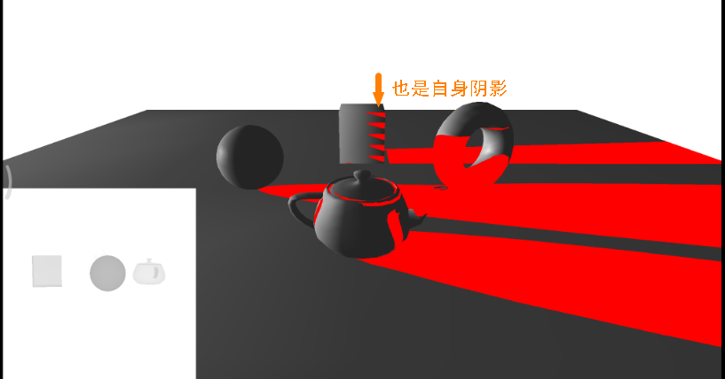


* 现在没有阴影瑕疵了，但地面的光照效果还是不对，看上去墙面好像悬在半空（因此术语称为“阴影悬空”）。实际上，**加上偏差**会加剧**阴影悬空**。

* 悬浮(Peter Panning)，由于上面加入了偏移值(阴影偏移)，过大的偏移值，会导致另外一种阴影失真，**悬浮**

  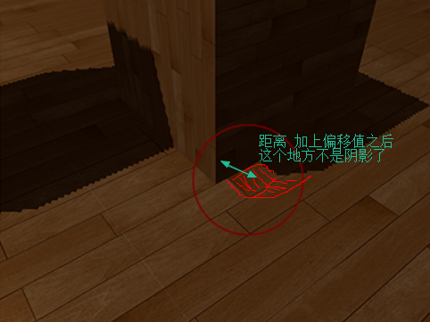

* 这个问题很好修正：避免使用薄的几何形体就行了 

  * 首先，（把物体增厚）解决了阴影悬空问题：只要物体比偏差值要大得多 
  * 其次，可在渲染光照贴图时启用背面剔除，因为现在，墙壁上有一个面面对光源，就可以遮挡住墙壁的另一面，而这另一面恰好作为背面被剔除了，无需渲染 
  * 缺点就是要渲染的三角形增多了，每帧**多了一倍的三角形** 

  


* FBO附件

  * [glTexImage2D 2.0]: https://www.khronos.org/registry/OpenGL-Refpages/es2.0/xhtml/glTexImage2D.xml

  * [glTexImage2D 3.0]: https://www.khronos.org/registry/OpenGL-Refpages/es3.0/html/glTexImage2D.xhtml

  * 绑定FBO附件的两个方法: 分别是把**texture或者RBO**作为**framebuffer的附件**

    * 在GLES3.0中，如果不用输出颜色，可以设置FBO的颜色附件为GL_NONE

      ```
      GLES30.glDrawBuffers(1, new int[]{GLES30.GL_NONE}, 0);
      GLES30.glReadBuffer(GLES30.GL_NONE);
      ```

      

    * glFramebufferTexture2D

      * 2.0  attachment 附件可以是 GL_COLOR_ATTACHMENT0, GL_DEPTH_ATTACHMENT, or GL_STENCIL_ATTACHMENT
      * **3.0 attachment 附件**可以是 GL_COLOR_ATTACHMENTi GL_DEPTH_ATTACHMENT GL_STENCIL_ATTACHMENT  GL_DEPTH_STENCIL_ATTACHMENT 
        * **支持 多渲染目标(Multiple Render Targets)**
        * **支持 深度和模板共用一个纹理**
      * textarget  可以是 GL_TEXTURE_2D 或者 是 GL_TEXTURE_CUBE_MAP_? 2D纹理或者立方贴图

    * glFramebufferRenderbuffer

  * 使用渲染到深度纹理

    * 如果是2.0 glTextImage2D要是 GLES20.GL_DEPTH_COMPONENT，并且设备要支持**GL_OES_depth_texture**
    * 采样方式必须是 **GL_NEAREST** （拉伸方式没有限制）

    

    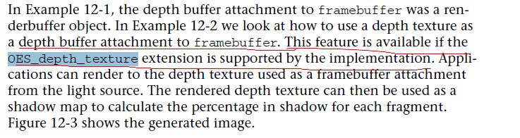

    * 查询扩展支持

      ```
      String exts = GLES30.glGetString(GLES30.GL_EXTENSIONS);
      boolean hasR16F_asRenderTarget = exts.contains("GL_EXT_color_buffer_half_float");
      boolean supportDepthTexture = exts.contains("GL_OES_depth_texture");
                  
      ```

      

* GLES 浮点纹理

  * R16F的浮点纹理 清空 需要设置clearColor,在距离纹理图中一般为光源的虚拟摄像头视椎体zFar

    ```
    GLES30.glClearColor(400,400,400,400);
    GLES30.glClear(GLES30.GL_COLOR_BUFFER_BIT);
    ```

  * 使用**浮点纹理GL_R16F**，可视化时候shader拿到的数据不是0~1.0，例子中**大部分距离再20~100.0之间**

  * **GL_R16F** is not color-renderable in standard ES 3.0 

  * table 3.13 on pages 130-132 lists all texture formats and their properties. R16F does not have the checkmark in the "Color-renderable" column, which means that it **can not be used as a render target.** 

  * Correspondingly, **R16F** is also listed under **Texture-only color formats** in section "Required Texture Formats" on pages 129-130 

  * R16F 是否支持 RenderTarget ，需要查询扩展支持

    https://www.khronos.org/registry/OpenGL/extensions/EXT/EXT_color_buffer_half_float.txt

  * color-renderalbe, depth-renderable, stencil-renderable 

  * 显示设置GL特性的APK

    https://play.google.com/store/apps/details?id=com.realtechvr.glview

  * 查询纹理是否可以作为输出(Color-renderable)，或者作为输入(Texure-filterable 纹理采样)

  * https://www.khronos.org/registry/OpenGL-Refpages/es3.1/html/glTexImage2D.xhtml

  * 

  * OpenGL ES does not support glReadPixels() on the depth buffer. ???? 


* GLSL的浮点数精度
  * lowp float变量用10位表示
  * medium float用16位表示,
    * 相对于short int 16bit  float16 可以表示范围更大，但是有效位数会变小 
  * highp用32位来表示

* 半浮点数 half  

  * 处理更大的数据集，也可以通过存储和操作更低精度的数据来获得性能

  * 使用半精度来储存数据，然后用32位的单精度来处理这些数据

  * IEEE 754浮点数标准（半精度）

    * 符号：1 bit

    * 指数位：5 bits

    * 精度位：10 bits  （显式存储 ，隐式存储了1bit，始终是1）

    * 半精度数的范围大约是5.96×10^-8   ~   6.55×10^4 (65,500)

    * 指数部分   00000和11111有其他意义，偏正值是15，所以实际范围是-14~15

    * 2^15 =32,768  尾数部分 1.xxx  最大还是2，max= 65536

  * 计算公式：alue = (-1)^sign X 2^(e - 16) X (1 + M / 2^10) 

  * 单精度浮点数float的这三部分所占的位宽分别为：1，8，23

    半精度浮点数half的这三部分所占的位宽分别为：1，5，10

  * half2结构在一个32位字里存储两个half值 

     

  * IEEE 754 单精度--32bit

    * [浮点数二进制的科学计数法]: https://blog.csdn.net/zhengyanan815/article/details/78550073

    * [32bit 在线转换工具]: https://www.h-schmidt.net/FloatConverter/IEEE754.html

    * [16bit 半浮点在线]: https://oletus.github.io/float16-simulator.js/

    * [Sign bit](https://en.wikipedia.org/wiki/Sign_bit): 1 bit

    * [Exponent](https://en.wikipedia.org/wiki/Exponent) width: 8 bits

    * [Significand](https://en.wikipedia.org/wiki/Significand) [precision](https://en.wikipedia.org/wiki/Precision_(arithmetic)): 24 bits (23 explicitly stored)

      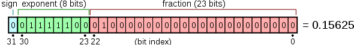  

      **指数位**，位宽8bit，这8位可以表示为8bit的有符号数，也可以表示为8bit的无符号数，当表示成8bit的无符号数 [0，255] 时，指数的实际值 = E(指数表示的值) - 127，127被称为 exponent - bias  (阶数部分使用**偏正值**形式表示，偏正值为实际的指数与127的和)  。这样做之后指数的实际值的范围为 -126 ~ +127   ( 只有254个实际值)，而**-127和+128保留做其他用处**。 **2^127**  = 1.7 * 10^38 ，由于尾数部分最大不超过2* (2^0) = 2 也即是 最大可以表示 3.4* 10^38
      **有效位数**，也被称为**尾数**，24bit中最高1bit为隐式存储，且值为1，剩下的23bit显式存储为32bit中的低23bit。

      其数值范围为-3.4E-38～3.4E+38，单精度浮点数最多有**7位有效小数**  (2^23)

    * 计算公式： value = (-1)^sign X 2^(e - 127) X (1 + M / 2^23)；（M的值为23bit表示的整数值）；

      8.25 用 十进制的科学计数法表示就为:8.25x10^0 ,  而120.5可以表示为:1.205*x10^3

      8.25 用二进制 可表示为1000.01  用二进制的科学计数法 表示为1.0001 x 2^3

      120.5 用二进制 可表示为 1110110.1  用二进制的科学计数法 表示为1.1101101x2^6

      任何一个数都的科学计数法表示都为1.xxx*2^n , 尾数部分就可以表示为xxxx，第一位都是1嘛，干嘛还要表示呀？可以将小数点前面的1省略，所以23bit的尾数部分，可以表示的精度却变成了24bit 

    * OpenGL的定义：**半精度浮点数 的 范围是-14~14** 

      * [glsl spec]: https://www.khronos.org/files/opengles_shading_language.pdf

      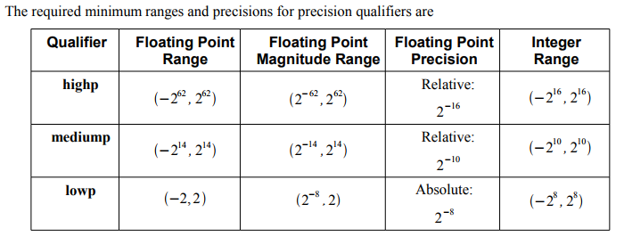

    * 声明精度：

      ```
      uniform highp float h1;
      
      highp float h2 = 2.3*4.7;操作和结果都是高精度
      
      mediump float m;
      
      m = 3.7*h1*h2;//所有操作都是高精度
      
      h2 = m * h1;//操作是高精度
      
      m = h2 - h1;//操作是高精度
      
      h2 = m + m;//加法和结果都是mediump精度 <<<< 注意这个
       
      ```

      

* 深度范围0~1  **1是最深**

  * https://www.khronos.org/registry/OpenGL-Refpages/es3.0/html/glClearDepthf.xhtml

    ```
    glClearDepthf(GLfloat depth);
    The initial value is 1.
    clamped to the range [0,1]
    ```

  * 深度纹理可视化

    * 例子中 depthValue  没有<0也没有>1 大部分在0.95~1.0 整个场景都距离光源比较远的位置

    * **越是白色，就越靠近1，深度越深，距离越远**

    * 通过pow(depthValue,4) 4次方 **增强在0.5~1.0部分的对比度**

      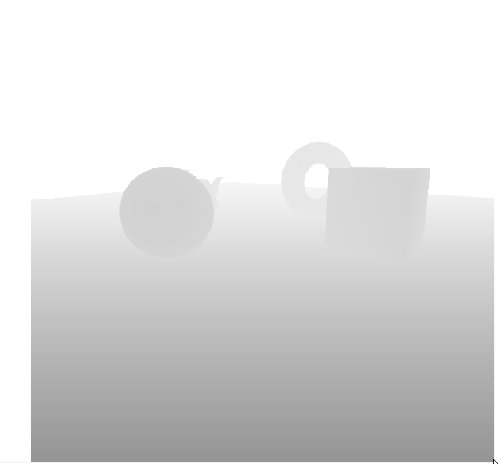 

      

* glsl

  ```
  genType step( genType edge, genType x);
  x  < edge  =  0.0 
  x >= edge  =  1.0
  
  genType sign( genType x);
  x < 0   = -1.0
  x = 0   = 0.0
  x > 0   = 1.0 
  
  三次埃尔米特插值
  genType smoothstep(	genType edge0, genType edge1, genType x);
  edge0 Hermite function的下边界
  edge1 Hermite function的上边界
  
  计算公式是: (埃尔米特插值多项式)
  genType t;  /* Or genDType t; */
  t = clamp((x - edge0) / (edge1 - edge0), 0.0, 1.0);
  return t * t * (3.0 - 2.0 * t);
  
  ```

  

* 阴影贴图

  * 对应平面接收阴影，使用 **平面阴影**

  * 对于固定不动物体(阴影投射体在比较远处 形状固定)，使用预先设计好的阴影图，**投影贴图** ，比如房间里的网格形天窗

  * 阴影下，可以考虑有**环境光** 和  **弱化的散射光(e.g 30%)**

  * **阴影图是没有过渡的**，纹理使用**线性采样 **GL_LINEAR 的话，就会有过渡，GL_NEAREST 就没有过渡,效果了

    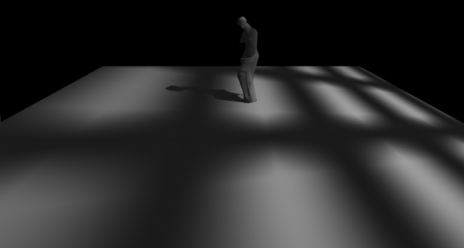


* 向量 与 矩阵

  * |a•b|≤|a|•|b| 

  * (a•b)•c ≠ a•(b•c)

  * 由 a•b=a•c (a≠0)，推不出 b=c

  * **向量的模的平方**等于**向量平方**，向量a平方=a模点乘a模乘以cos0=a模的平方  a^2 = a*a = |a||a|*cos0 = |a|^2

  * **|a+b|^2** =  (a+b) ^2 =  (a+b) . (a+b)
    = a.a +a.b +b.a +b.b
    =**|a|^2 + |b|^2 + 2.a.b**

  * **向量相乘 不满足 结合律**  ，但是**矩阵相乘满足 结合律**

  * **齐次坐标**：

    *  若增加**第四个分量1**，以表示该**四元组为点**
    *  若增加**第四个分量0**，以表示该**四元组为向量**

  * 叉乘：θ为向量夹角，n是一个向量，与a和b都垂直，方向满足**右手螺旋法则** 

    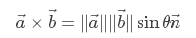

    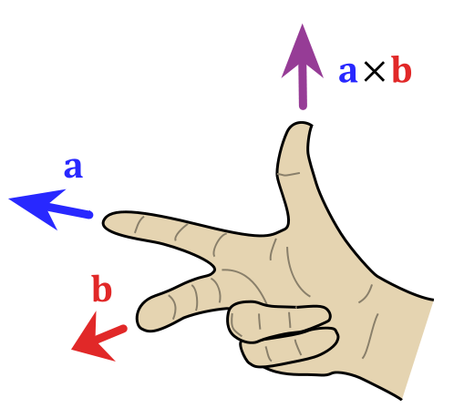


* 求空间直线与平面的交点

  * 若直线不与平面平行，将存在交点 

    * 已知直线L过点m（m1，m2，m3），且方向向量为VL（v1，v2，v3） 
    * 平面P过点n（n1，n2，n3），且法线方向向量为VP（vp1，vp2，vp3） 
    * 求得直线与平面的交点O的坐标（x，y，z） 

  * **直线方程**写成**参数方程**形式 

    * ```
      x = m1+ v1 * t
      
      y = m2+ v2 * t                                                    (1)
      
      z = m3+ v3 * t
      ```

  * **平面方程**写成**点法式**方程形式

    * ```
      vp1 * (x – n1) + vp2 * (y – n2) + vp3 * (z – n3) = 0 		     (2)
      ```

  * 直线与平面的交点一定满足式（1）和（2），联立两式 

    * ```
         t = ((n1 – m1)*vp1+(n2 – m2)*vp2+(n3 – m3)*vp3) / (vp1* v1+ vp2* v2+ vp3* v3)                                                                       (3)
         ```
      ```
    
      ```

  *  如果（3）式中分母(vp1* v1+ vp2* v2+ vp3* v3)为0，则表示**直线与平面平行**，即直线与平面没有交点。 否则求解出t后，然后将t代入式（1）即可求得交点O的坐标（x，y，z） 

  * 如果不是直线，而只是**射线**，那么必须 **t>0** 

  * 如果只是**线段**，那么**t 应该满足 [0,1]** ，直线的方程 (m1,m2,m3) 应该是线段的开始，(v1,v2,v3) = (e1,e2,e3) - (m1,m2,m3)  也就是线段终点坐标-起始坐标 

* 判断**两个向量的是否同向**可以用**点积**实现，如果点积大于0，则两向量夹角是锐角，否则是钝角 

*  求空间中直线与一个平面的交点并判断**交点是否在某个三角形区域内部**

  * 用面积来判断 

    * 点P与三角形三边的组成个了三个三角形：PAB，PAC，PBC。判断它们的面积之和是否与ABC的面积相等。如果相等则需要判断的点在三角形区域内部，否则就在三角形区域外部。

    * 向量**叉乘**后得到的向量，**模一半**即为所要求的**三角形面积**S  

    * [求三角形面积]: https://blog.csdn.net/enjoy_ying/article/details/51886240

  * 用角度来判断 

  * 用向量积来判断 (同向法)

    * 沿 △ABC 各有向边按一定方向走（顺时针或逆时针），判断点 P 是否在该边的某侧（右侧或左侧），若点 P 在三条边的同侧，则点 P 在 △ABC 内 

      * 三角形三条边沿着一个方向，比如AB ，BC，CA  ，计算C点在AB的哪一侧( 计算AC和AB的叉乘) ①
      * 分别计算AP与AB②，BP与BC③，CP与CA④的叉乘 
      * 最后将  向量① 点乘 向量 ②  向量① 点乘 向量 ③  向量① 点乘 向量 ④ 等待3个符号，如果同样的话，代表是在内部

    * [同向法-点在直线哪一侧]: https://www.cnblogs.com/graphics/archive/2010/08/05/1793393.html

  * 重心法

    * P = A +  u * (C – A) + v * (B - A) 

    * p点在三角形内部的充分必要条件是：1 >= u >= 0,   1 >= v >= 0,   u+v <= 1 

    * [重心法-计算uv]: https://www.cnblogs.com/graphics/archive/2010/08/05/1793393.html

      

* OpenGL 坐标系

  * 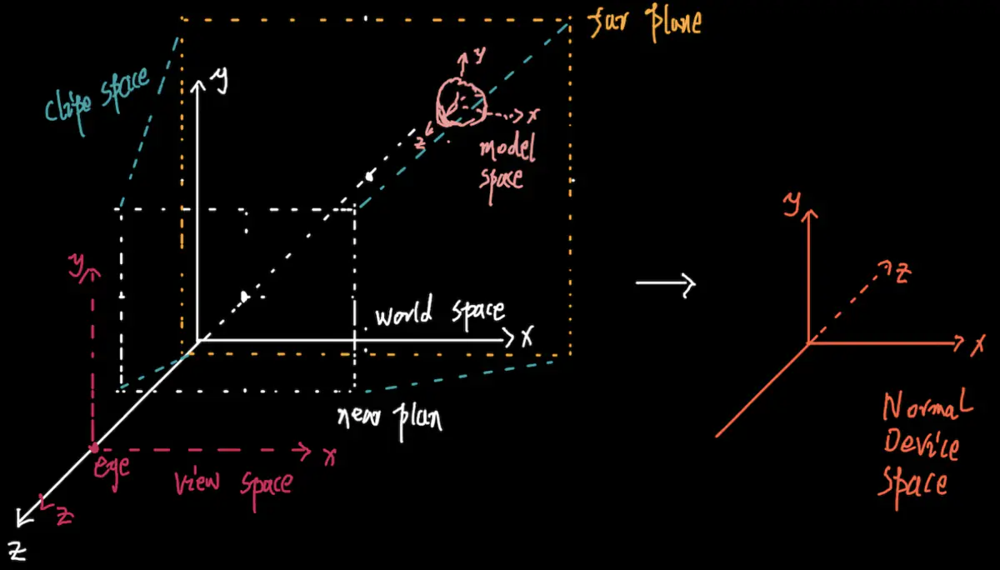 

  * 为了适配不同的设备，OpenGL采用标准设备空间(Normalized Device Space)，x轴正方向水平向右，y轴正方向垂直向上，z轴正方向垂直向内，它们的取值范围都是[-1, 1] ，也就是**z=1是最深**

  * 模型空间、世界空间、相机空间都是基于笛卡尔右手坐标系建立不同。标准设备空间是基于**笛卡尔左手直角坐标系**建立的 

  * 摄像机的三个向量：Right(x轴)、Up(y轴)、Forward (z轴)

  * [OpenGL-3-空间几何]: https://www.jianshu.com/p/a294a864f4f5

  * [scratchapixel]: https://www.scratchapixel.com/lessons/3d-basic-rendering/perspective-and-orthographic-projection-matrix/opengl-perspective-projection-matrix

    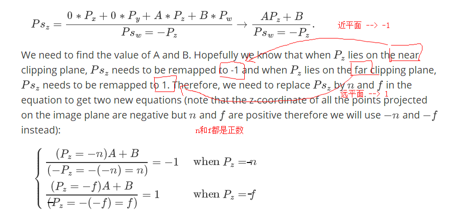

  * 结合上图，实际投影就如下（只是投影到-1(近)到1(远) 而不是0到1），左手坐标系

    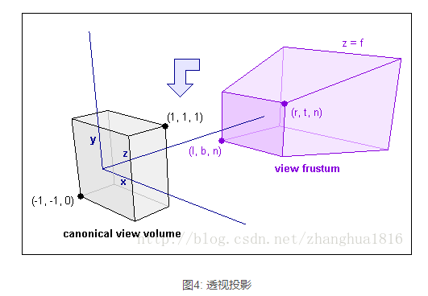

    

* 光线追踪

  * 在shader中渲染的不是场景中的物体，而是近平面的每个小矩形/基本块
  * 不用模型顶点传入管线
  * 光追的射线，可以通过模型变化矩阵，转成模型坐标系下


* 3D空间中的平面对称点

  * 平面的点法式方程  F (x,y,z) =  Xn* (x - X0) + Yn * ( y - Y0) + Zn * (z - Z0)    (Xn,Yn,Zn) 为法向量  (X0,Y0,Z0)为平面上的点

  * 某个点是 (X1,Y1,Z1)  那么过这个点的，垂直于平面的直线点向式方程 是  

    x = X1 + Xn*t  

    y  = Y1 + Yn*t

    z = Z1 + Zn*t

  * 代入平面的点法式方程 可以计算出时间t，然后对称点就是 

    x = X1 + Xn*t * 2  

    y  = Y1 + Yn*t * 2

    z = Z1 + Zn*t * 2


* 3dsmax 贴图

  * [第6章 第4节 1.贴图类型简介 3ds Max 2011白金手册]: https://www.youtube.com/watch?v=S9xLeloce0U

  * [第6章 第4节 2.位图坐标参数 3ds Max 2011白金手册]: https://www.youtube.com/watch?v=yVRxldwGeZU

  * [第6章 第4节 11.混合贴图  3ds Max 2011白金手册]: https://www.youtube.com/watch?v=M7QGrE_qgcs&amp;amp;amp;amp;amp;amp;amp;amp;t=134s


* 3dsmax 
  * LightingMap 光照贴图 :  ??  需要不同表面的纹理坐标不重合，因为不同表面即使对应同一个位图中一区域，但是关照之后的效果也会不一样，所以可以把UV坐标放到超过1的地方，**平铺UV**
  * 3dsmax： 是**Z轴向上的右手坐标系**，导出的时候可以设置Y和Z轴调换，具体是，y轴和z轴，沿x轴右手螺旋90度，变成Y轴向上的右手坐标系，坐标变成了z = -y  y = z 


