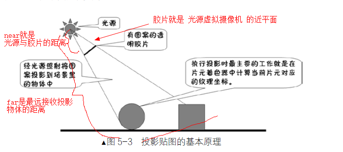
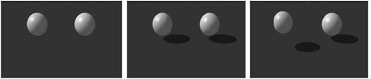
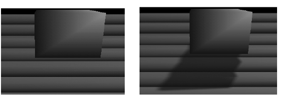
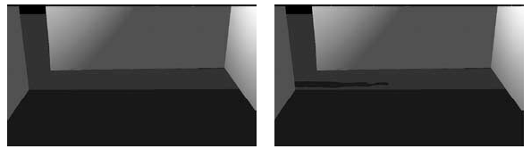
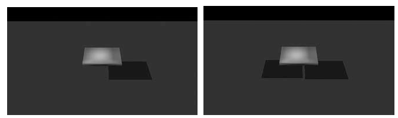
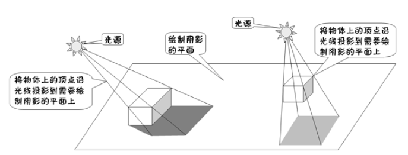
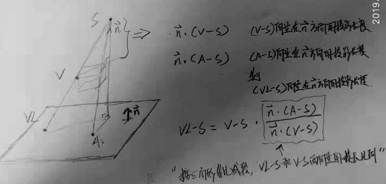
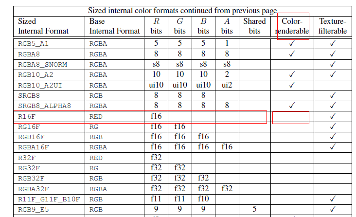
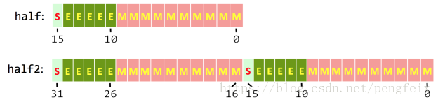

### 投影贴图

* 模拟在光源前，放置一个透明胶片，投射到物体上

* 

* near和far

  near：光源与胶片之间的距离

  far：最远接收投影的物体的距离

* 近平面：

  光源虚拟摄像头的投影近平面，应该按照胶片的比例，来设置近平面的宽高，相当于限制可以接收投影的区域视按照胶片的比例，这样不会导致胶片不是1:1尺寸时候，导致的变形

* 光源虚拟摄像头的旋转

  视线方向向量(z轴)固定不变

  up分量，根据视线方向向量，最平行的方向，作为旋转轴，旋转：

  比如example中，虚拟摄像头的位置(光源) (60,80,60)，望向的是（10f,0f,10f），视线方向向量是：(0.47, 0.75, 0.47)  所以更加贴近y轴，旋转以y轴旋转

* Matrix.setLookAtM 

  这个up向量会被重新计算, lx,ly,lz和look_x,look_y,look_z的视线向量是固定的; 

  内部会先计算 坐标系轴CoordAxis(跟传入的up向量和视线向量垂直)，然后重新计算 前方向轴 UpAxis

* 计算最终颜色

  * 如果不在透明阴影下，按照物体本身的颜色 分别 乘以 环境光 散射光 和镜面光颜色
  * 如果在透明阴影下，环境光还是 物体*环境光 ，散射光 和 镜面光 ，还要分别乘上 从贴图中读取到纹理的颜色(作为因子)


### 阴影的重要性

* 帮助判断物体在三维空间中的位置关系

  

* 反映接收物体的形状

  

* 表现当前视点看不见的物体信息

  

* 判断光源的数目和位置

  

### 平面阴影

* 思想：把物体的顶点(坐标)沿着光线投影到绘制的阴影平面上，也就是阴影平面上有一个顶点，很多这样的顶点在平面上，绘制，形成阴影

* 三维空间，平面的表达方式

  ```
  ### 
  Ax+By+Cz+D=0
  参数,A,B,C,D是描述平面空间特征的常数
  (A,B,C) 是平面的法向量(没有归一化)
  
  ###
  一个点 + 法向量 ，可以确定一个平面
  设平面内该点为(X1,Y1,Z1),法向量为(a，b，c)，设该平面另外一点为(X,Y,Z)
  (X-X1)a+(Y-Y1)b+(Z-Z1)c=0
  
  
  ```

  

* 三维空间，直线的表达方式

  ```
  两个平面的夹线
  a*x + b*y + c*z + d = 0
  a2*x + b2*y + c2*z + d2 = 0
  
  向量法
  X = a + tx
  Y = b + ty
  Z = c + tZ
  
  点和直线方向，可以确定一条直线
  (x-x0)/a = (y-y0)/b = (z-z0)/c 
  
  空间两点确定一直线
  (x - x1) / (x2 - x1) = (y  - y1) / (y2 - y1) = (z - z1)/(z2 - z1)
  
  ```


* 一个向量 和 一个单位方向向量 的 内积  等于 这个向量 在这个方向上的投影长度

* 求出一个模型的一个顶点，在一个点光源下，投影在一个平面上的位置：






* 平面阴影技术，需要阴影的物体，需要绘制两次，第一次绘制阴影(在一个平面上)，第二次绘制物体 
* 在shader中，模型顶点要经过模型转换/仿射变换，得到世界坐标系，然后计算出投影点，再用视图矩阵和投影矩阵，得到gl_Position


### 阴影映射图

* 把光源作为虚拟摄像机，设置摄像机九参数矩阵，和，投影矩阵，near far 和 近平面的尺寸

* ??? 虚拟摄像机，望向的地方和起始点 连线 应该 跟 真实摄像头，视线向量(望向的目标-位置) 相互垂直

* shader中把距离写入 颜色纹理(内部格式是R16F  外部格式是GL_RED，每像素格式是GL_FLOAT)，FBO需要有深度附件(纹理图或者RBO渲染缓冲对象)，打开深度检测，这样写入颜色纹理的距离，就是最近光源的距离

  ```
  顶点着色器：
     	gl_Position = uMVPMatrix * vec4(aPosition,1); // 根据总变换矩阵计算此次绘制此顶点的位置
    	vPosition = uMMatrix * vec4(aPosition,1);     // 计算出变换后的顶点位置并传递给片元着色器
     
  片元着色器：
   	float dis=distance(vPosition.xyz,uLightLocation);// 计算被照射片元到光源的距离
     	fragColor=dis; // 给此片元最终颜色值 
     
     
  ```

* 需要接收投影的物体，必须在，光源的虚拟摄像机的，视椎体中（透视投影矩阵）

* 当前距离 和 距离纹理图记录的距离 之间的差，引入一个修正值，超过这个距离才算是阴影，修正值不对会引入“自身阴影”问题 ( 阴影瑕疵（Shadow acne ）/阴影失真 )。可以用一个叫做阴影偏移（shadow bias）的技巧来解决这个问题

  https://learnopengl-cn.readthedocs.io/zh/latest/05%20Advanced%20Lighting/03%20Shadows/01%20Shadow%20Mapping/

  因为阴影贴图受限于解析度，在距离光源比较远的情况下，多个片元可能从深度贴图的同一个值中去采样。图片每个斜坡代表深度贴图一个单独的纹理像素。你可以看到，多个片元从同一个深度值进行采样。

   

* 对于阴影的片元，仅用环境光着色；其他都用计算环境，散射，镜面等三个通道光照着色

* 光的属性：位置，方向，颜色，强度，衰减

* 平行光：几何属性只有方向，没有起始点，（阴影映射图，用正交投影矩阵?)

* 点光源：

* 聚光灯:

* 面光源:


* GLES 浮点纹理
  * **GL_R16F** is not color-renderable in standard ES 3.0 

  * table 3.13 on pages 130-132 lists all texture formats and their properties. R16F does not have the checkmark in the "Color-renderable" column, which means that it **can not be used as a render target.** 

  * Correspondingly, **R16F** is also listed under **Texture-only color formats** in section "Required Texture Formats" on pages 129-130 

  * R16F 是否支持 RenderTarget ，需要查询扩展支持

    https://www.khronos.org/registry/OpenGL/extensions/EXT/EXT_color_buffer_half_float.txt

  * color-renderalbe, depth-renderable, stencil-renderable 

  * 显示设置GL特性的APK

    https://play.google.com/store/apps/details?id=com.realtechvr.glview

  * 

  * OpenGL ES does not support glReadPixels() on the depth buffer. ???? 

    

* 半浮点数 half  

  * 处理更大的数据集，也可以通过存储和操作更低精度的数据来获得性能

  * 使用半精度来储存数据，然后用32位的单精度来处理这些数据

  * IEEE 754浮点数标准（半精度）

    * 符号：1 bit
    * 指数位：5 bits
    * 精度位：10 bits
    * 半精度数的范围大约是5.96×10^-8~6.55×10^4 (65,500)

  * 单精度浮点数float的这三部分所占的位宽分别为：1，8，23

    半精度浮点数half的这三部分所占的位宽分别为：1，5，10

  * half2结构在一个32位字里存储两个half值 

     

  