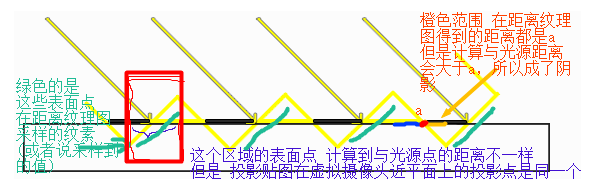
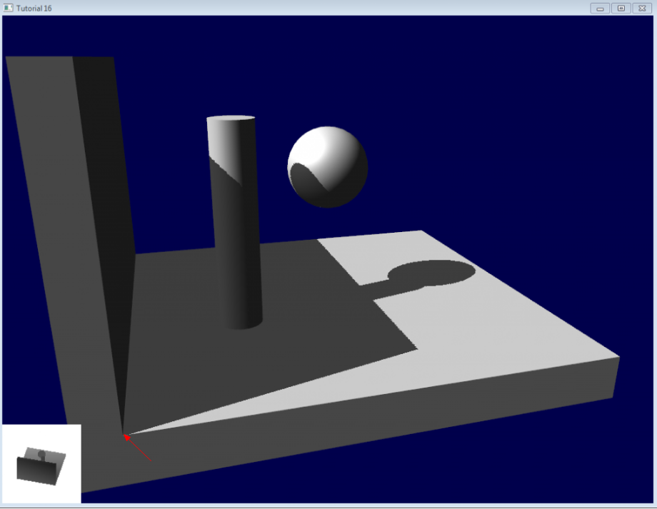
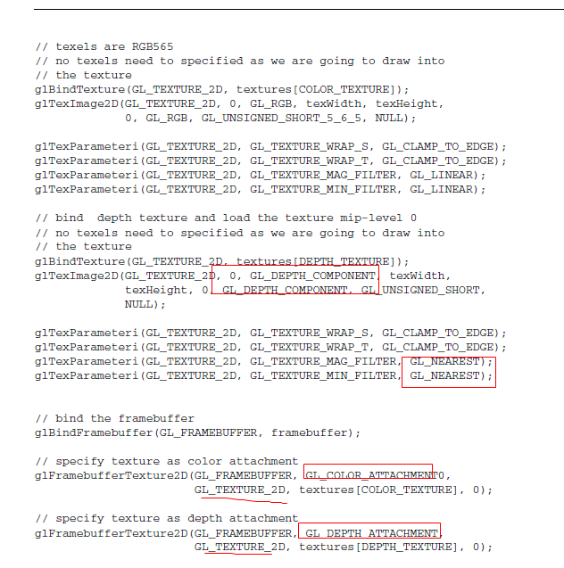

### 投影贴图

* 模拟在光源前，放置一个透明胶片，投射到物体上

* 

* near和far

  near：光源与胶片之间的距离

  far：最远接收投影的物体的距离

* 近平面：

  光源虚拟摄像头的投影近平面，应该按照胶片的比例，来设置近平面的宽高，相当于限制可以接收投影的区域视按照胶片的比例，这样不会导致胶片不是1:1尺寸时候，导致的变形

* 光源虚拟摄像头的旋转

  视线方向向量(z轴)固定不变

  up分量，根据视线方向向量，最平行的方向，作为旋转轴，旋转：

  比如example中，虚拟摄像头的位置(光源) (60,80,60)，望向的是（10f,0f,10f），视线方向向量是：(0.47, 0.75, 0.47)  所以更加贴近y轴，旋转以y轴旋转

* Matrix.setLookAtM 

  这个up向量会被重新计算, lx,ly,lz和look_x,look_y,look_z的视线向量是固定的; 

  内部会先计算 坐标系轴CoordAxis(跟传入的up向量和视线向量垂直)，然后重新计算 前方向轴 UpAxis

* 计算最终颜色

  * 如果不在透明阴影下，按照物体本身的颜色 分别 乘以 环境光 散射光 和镜面光颜色
  * 如果在透明阴影下，环境光还是 物体*环境光 ，散射光 和 镜面光 ，还要分别乘上 从贴图中读取到纹理的颜色(作为因子)


### 阴影的重要性

* 帮助判断物体在三维空间中的位置关系

  

* 反映接收物体的形状

  

* 表现当前视点看不见的物体信息

  

* 判断光源的数目和位置

  

### 平面阴影

* 思想：把物体的顶点(坐标)沿着光线投影到绘制的阴影平面上，也就是阴影平面上有一个顶点，很多这样的顶点在平面上，绘制，形成阴影

* 三维空间，平面的表达方式

  ```
  ### 
  Ax+By+Cz+D=0
  参数,A,B,C,D是描述平面空间特征的常数
  (A,B,C) 是平面的法向量(没有归一化)
  
  ###
  一个点 + 法向量 ，可以确定一个平面
  设平面内该点为(X1,Y1,Z1),法向量为(a，b，c)，设该平面另外一点为(X,Y,Z)
  (X-X1)a+(Y-Y1)b+(Z-Z1)c=0
  
  
  ```

  

* 三维空间，直线的表达方式

  ```
  两个平面的夹线
  a*x + b*y + c*z + d = 0
  a2*x + b2*y + c2*z + d2 = 0
  
  向量法
  X = a + tx
  Y = b + ty
  Z = c + tZ
  
  点和直线方向，可以确定一条直线
  (x-x0)/a = (y-y0)/b = (z-z0)/c 
  
  空间两点确定一直线
  (x - x1) / (x2 - x1) = (y  - y1) / (y2 - y1) = (z - z1)/(z2 - z1)
  
  ```


* 一个向量 和 一个单位方向向量 的 内积  等于 这个向量 在这个方向上的投影长度

* 求出一个模型的一个顶点，在一个点光源下，投影在一个平面上的位置：


* 平面阴影技术，需要阴影的物体，需要绘制两次，第一次绘制阴影(在一个平面上)，第二次绘制物体 
* 在shader中，模型顶点要经过模型转换/仿射变换，得到世界坐标系，然后计算出投影点，再用视图矩阵和投影矩阵，得到gl_Position


### 阴影映射图

* 把光源作为虚拟摄像机，设置**摄像机九参数矩阵**，和，**投影矩阵**，near far 和 近平面的尺寸

* 例子中 使用 正方形的距离纹理 和  视口和近平面都是正方形

* **摄像机的位置(点光源)** 和 **透视投影的视椎体** 构成了 **投影的范围** 

* shader中把距离写入 **颜色纹理(内部格式是R16F  外部格式是GL_RED，每像素格式是GL_FLOAT)**，FBO需要**有深度附件**(纹理图或者RBO渲染缓冲对象)，打开**深度检测**，这样**写入颜色纹理的距离，就是最近光源的距离**

  ```
  顶点着色器：
     	gl_Position = uMVPMatrix * vec4(aPosition,1); // 根据总变换矩阵计算此次绘制此顶点的位置
    	vPosition = uMMatrix * vec4(aPosition,1);     // 计算出变换后的顶点位置并传递给片元着色器
     
  片元着色器：
   	float dis=distance(vPosition.xyz,uLightLocation);// 计算被照射片元到光源的距离
     	fragColor=dis; // 给此片元最终颜色值 
     
     
  ```

* 需要接收投影的物体，必须在**光源的虚拟摄像机的视椎体**中（透视投影矩阵）

* 当前距离 和 距离纹理图记录的距离 之间的差，引入一个修正值，超过这个距离才算是阴影，修正值不对会引入**“自身阴影”问题 ( 阴影瑕疵（Shadow acne ）/阴影失真 )**。可以用一个叫做阴影偏移（shadow bias）的技巧来解决这个问题

  https://learnopengl-cn.readthedocs.io/zh/latest/05%20Advanced%20Lighting/03%20Shadows/01%20Shadow%20Mapping/

  因为阴影贴图受限于解析度，在距离光源比较远的情况下，多个片元可能从深度贴图的同一个值中去采样。图片每个斜坡代表深度贴图一个单独的纹理像素。你可以看到，多个片元从同一个深度值进行采样。

   

* 对于阴影的片元，仅用环境光着色；其他都用计算环境，散射，镜面等三个通道光照着色

* 光的属性：位置，方向，颜色，强度，衰减

* 平行光：几何属性只有方向，没有起始点，（阴影映射图，用正交投影矩阵?)

* 点光源：

* **聚光灯**:  有方向，方向向量，在计算顶点光照的时候，把模型顶点坐标转换到世界坐标系，然后计算 **顶点与光源的向量** 与 **聚光灯方向向量**的 **夹角余弦值**  ( cosθ = a*b / |a||b|) ，设置**没光照的颜色**，然后和 **物体颜色在顶点光照计算出来的最终颜色**，如果在过渡区就**混合**

* **半球光照**：光线经过**环境反射**，属于**区域光源**。就是原来漫反射时候，计算**光线向量** 与 **法向量** 之间的**夹角的余弦值**，从**1~0~-1**  转成到 **1.0 ~ 0.0**，**作为alpha值**，然后在**skyColor 和 groundColor 之间mix**，skyColor可以是灯光的颜色，groundColor是周围环境反射的颜色 ，??这个颜色由什么决定??

  ```
  fragColor = mix(uGroundColor,uSkyColor,a);
  ```

* 面光源:

* 2.0 需要渲染到深度纹理(创建深度纹理) 需要扩展支持GL_OES_depth_texture (深度检测的值保存到纹理)

* 3.0 使用R16F 半浮点纹理 也需要查询支持  GL_R16F (在shader中输出非归一化的具体距离值到FBO颜色附件纹理)

* 阴影映射的问题：

  * 自身阴影
  * 加入纠正距离后导致阴影部分不是阴影

  

  

  

* glClearColor清空深度纹理。

  * 使用浮点纹理之前，必须先**设置clear color为光源视椎体的zFar** , 否则会导致某些顶点在距离纹理图中，由于精度问题，获取到的对比深度是0 (glClearColor(0,0,0,1)情况下)，从而成为了阴影，如下黄色箭头

    

    

  

* 正面剔除：**渲染深度贴图**时候使用**正面剔除（front face culling）** OpenGL默认是背面剔除 

  

  * 这样可以使**纠正距离值降低**，减弱了peter漂移/悬浮现象
  * 使**物体背面不再成为阴影**(物体背面：对于灯光来说是背面)
  * **接近阴影的物体仍然会出现不正确的效果**
  * 但在地板上无效，因为**正面剔除完全移除了地板**。地面是一个**单独的平面**，不会被完全剔除。

* 正面剔除，以光源来看是物体“背面”，刚好是 从摄像机来看是物体“正面”的时候，如果光源是接近“平行”于这个“背面”，也就会产生“自身阴影”，暂时无法完全解决，增加距离纠正值可优化，但会peter漂浮。

  所以，**总的来看，还是"不要正面剔除" 但 加上 偏移值**  会好些，


* 现在没有阴影瑕疵了，但地面的光照效果还是不对，看上去墙面好像悬在半空（因此术语称为“阴影悬空”）。实际上，**加上偏差**会加剧**阴影悬空**。

* 悬浮(Peter Panning)，由于上面加入了偏移值(阴影偏移)，过大的偏移值，会导致另外一种阴影失真，**悬浮**

  

* 这个问题很好修正：避免使用薄的几何形体就行了 

  * 首先，（把物体增厚）解决了阴影悬空问题：只要物体比偏差值要大得多 
  * 其次，可在渲染光照贴图时启用背面剔除，因为现在，墙壁上有一个面面对光源，就可以遮挡住墙壁的另一面，而这另一面恰好作为背面被剔除了，无需渲染 
  * 缺点就是要渲染的三角形增多了，每帧**多了一倍的三角形** 

  


* FBO附件

  * [glTexImage2D 2.0]: https://www.khronos.org/registry/OpenGL-Refpages/es2.0/xhtml/glTexImage2D.xml

  * [glTexImage2D 3.0]: https://www.khronos.org/registry/OpenGL-Refpages/es3.0/html/glTexImage2D.xhtml

  * 绑定FBO附件的两个方法: 分别是把**texture或者RBO**作为**framebuffer的附件**

    * 在GLES3.0中，如果不用输出颜色，可以设置FBO的颜色附件为GL_NONE

      ```
      GLES30.glDrawBuffers(1, new int[]{GLES30.GL_NONE}, 0);
      GLES30.glReadBuffer(GLES30.GL_NONE);
      ```

      

    * glFramebufferTexture2D

      * 2.0  attachment 附件可以是 GL_COLOR_ATTACHMENT0, GL_DEPTH_ATTACHMENT, or GL_STENCIL_ATTACHMENT
      * **3.0 attachment 附件**可以是 GL_COLOR_ATTACHMENTi GL_DEPTH_ATTACHMENT GL_STENCIL_ATTACHMENT  GL_DEPTH_STENCIL_ATTACHMENT 
        * **支持 多渲染目标(Multiple Render Targets)**
        * **支持 深度和模板共用一个纹理**
      * textarget  可以是 GL_TEXTURE_2D 或者 是 GL_TEXTURE_CUBE_MAP_? 2D纹理或者立方贴图

    * glFramebufferRenderbuffer

  * 使用渲染到深度纹理

    * 如果是2.0 glTextImage2D要是 GLES20.GL_DEPTH_COMPONENT，并且设备要支持**GL_OES_depth_texture**
    * 采样方式必须是 **GL_NEAREST** （拉伸方式没有限制）

    

    

    * 查询扩展支持

      ```
      String exts = GLES30.glGetString(GLES30.GL_EXTENSIONS);
      boolean hasR16F_asRenderTarget = exts.contains("GL_EXT_color_buffer_half_float");
      boolean supportDepthTexture = exts.contains("GL_OES_depth_texture");
                  
      ```

      

* GLES 浮点纹理

  * R16F的浮点纹理 清空 需要设置clearColor,在距离纹理图中一般为光源的虚拟摄像头视椎体zFar

    ```
    GLES30.glClearColor(400,400,400,400);
    GLES30.glClear(GLES30.GL_COLOR_BUFFER_BIT);
    ```

  * 使用**浮点纹理GL_R16F**，可视化时候shader拿到的数据不是0~1.0，例子中**大部分距离再20~100.0之间**

  * **GL_R16F** is not color-renderable in standard ES 3.0 

  * table 3.13 on pages 130-132 lists all texture formats and their properties. R16F does not have the checkmark in the "Color-renderable" column, which means that it **can not be used as a render target.** 

  * Correspondingly, **R16F** is also listed under **Texture-only color formats** in section "Required Texture Formats" on pages 129-130 

  * R16F 是否支持 RenderTarget ，需要查询扩展支持

    https://www.khronos.org/registry/OpenGL/extensions/EXT/EXT_color_buffer_half_float.txt

  * color-renderalbe, depth-renderable, stencil-renderable 

  * 显示设置GL特性的APK

    https://play.google.com/store/apps/details?id=com.realtechvr.glview

  * 查询纹理是否可以作为输出(Color-renderable)，或者作为输入(Texure-filterable 纹理采样)

  * https://www.khronos.org/registry/OpenGL-Refpages/es3.1/html/glTexImage2D.xhtml

  * 

  * OpenGL ES does not support glReadPixels() on the depth buffer. ???? 

    

* 半浮点数 half  

  * 处理更大的数据集，也可以通过存储和操作更低精度的数据来获得性能

  * 使用半精度来储存数据，然后用32位的单精度来处理这些数据

  * IEEE 754浮点数标准（半精度）

    * 符号：1 bit
    * 指数位：5 bits
    * 精度位：10 bits
    * 半精度数的范围大约是5.96×10^-8~6.55×10^4 (65,500)

  * 单精度浮点数float的这三部分所占的位宽分别为：1，8，23

    半精度浮点数half的这三部分所占的位宽分别为：1，5，10

  * half2结构在一个32位字里存储两个half值 

     

  

* 深度范围0~1  **1是最深**

  * https://www.khronos.org/registry/OpenGL-Refpages/es3.0/html/glClearDepthf.xhtml

    ```
    glClearDepthf(GLfloat depth);
    The initial value is 1.
    clamped to the range [0,1]
    ```

  * 深度纹理可视化

    * 例子中 depthValue  没有<0也没有>1 大部分在0.95~1.0 整个场景都距离光源比较远的位置

    * **越是白色，就越靠近1，深度越深，距离越远**

    * 通过pow(depthValue,4) 4次方 **增强在0.5~1.0部分的对比度**

       

      

* glsl

  ```
  genType step( genType edge, genType x);
  x  < edge  =  0.0 
  x >= edge  =  1.0
  
  genType sign( genType x);
  x < 0   = -1.0
  x = 0   = 0.0
  x > 0   = 1.0 
  
  三次埃尔米特插值
  genType smoothstep(	genType edge0, genType edge1, genType x);
  edge0 Hermite function的下边界
  edge1 Hermite function的上边界
  
  计算公式是: (埃尔米特插值多项式)
  genType t;  /* Or genDType t; */
  t = clamp((x - edge0) / (edge1 - edge0), 0.0, 1.0);
  return t * t * (3.0 - 2.0 * t);
  
  ```

  

* 阴影贴图

  * 对应平面接收阴影，使用 **平面阴影**

  * 对于固定不动物体(阴影投射体在比较远处 形状固定)，使用预先设计好的阴影图，**投影贴图** ，比如房间里的网格形天窗

  * 阴影下，可以考虑有**环境光** 和  **弱化的散射光(e.g 30%)**

  * **阴影图是没有过渡的**，纹理使用**线性采样 **GL_LINEAR 的话，就会有过渡，GL_NEAREST 就没有过渡,效果了

    


* 3dsmax 贴图

  * [第6章 第4节 1.贴图类型简介 3ds Max 2011白金手册]: https://www.youtube.com/watch?v=S9xLeloce0U

  * [第6章 第4节 2.位图坐标参数 3ds Max 2011白金手册]: https://www.youtube.com/watch?v=yVRxldwGeZU

  * [第6章 第4节 11.混合贴图  3ds Max 2011白金手册]: https://www.youtube.com/watch?v=M7QGrE_qgcs&amp;amp;amp;t=134s


* 3dsmax 
  * LightingMap 光照贴图 :  ??  需要不同表面的纹理坐标不重合，因为不同表面即使对应同一个位图中一区域，但是关照之后的效果也会不一样，所以可以把UV坐标放到超过1的地方，**平铺UV**
  * 3dsmax： 是**Z轴向上的右手坐标系**，导出的时候可以设置Y和Z轴调换，具体是，y轴和z轴，沿x轴右手螺旋90度，变成Y轴向上的右手坐标系，坐标变成了z = -y  y = z 


