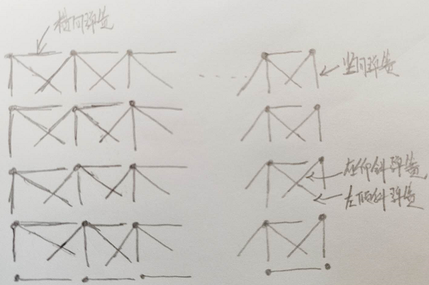
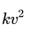
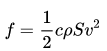
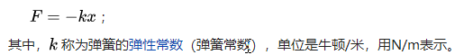
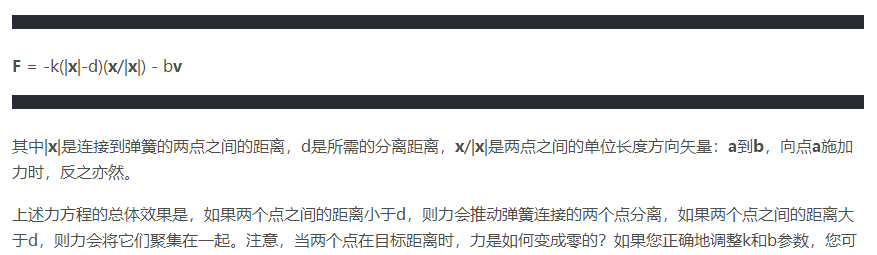
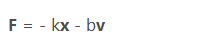
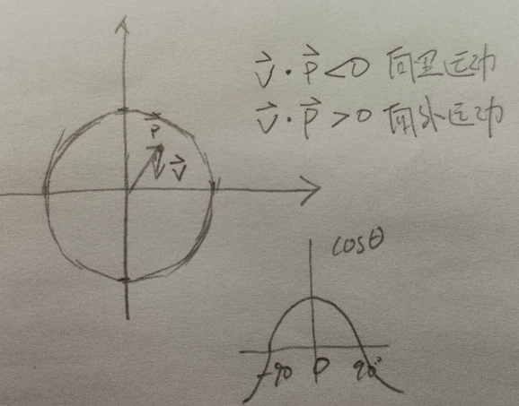
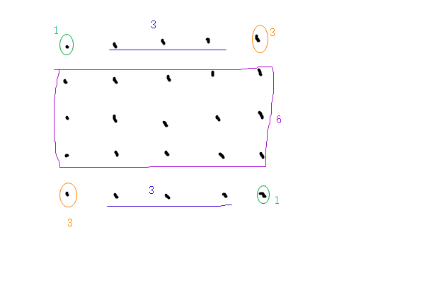

* 弹簧质点模型




* 空气阻力，与速度大小平方成正比， 方向与速度相反  

[空气阻力经验公式]: https://www.zhihu.com/question/68565717



​	c 是空气阻力系数， ρ是空气密度，S是物体的迎风面积，v是物体相对于空气速度。 

​	计算公式： F = normalize(v)  *  (|v|^2) I * k          前半部代表方向 , 后半部代表大小


* 弹力， 弹簧伸长的长度与弹簧的弹力 F，两者之间的关系是胡克定律要表述的内容，其内容是：当弹簧发生弹性形变时，弹力的大小F 跟弹簧伸长（或缩短）的长度 x 成正比 

  

  计算公式：对于p1点的弹力    

  ​		  x  = mod(p1-p0) - len       len是不变形情况下的长度， x是拉长了多少

  ​		  F =  normalize (p1 - p0) *  (-k) * x  

  所以弹簧合力公式：

  

  

* 阻尼力 damping 

  * 阻尼模拟能量损失，并用于物理模拟，以确保弹簧不会永远振荡，而是随着时间的推移而静止 

  * 阻尼的力学模型一般是一个与振动速度大小成正比，与振动速度方向相反的力 

    **F** = -b **v**

    其中b是阻尼系数，v是弹簧连接两点之间的相对速度。b值越大，阻尼越大，物体就越快静止。

  计算公式：

  ​	P1点的阻尼力

  **v**  =   ( **v1** - **v0** )  * (**p1** - **p0**)/|**p1** - **p0**|    速度在弹簧线上的分量的相对速度

  **F** = - b |**v**| * normalize (**p1** - **p0**) 

  * 模拟的时候， 弹簧系数在横向/竖向/斜向可以是不同的

    ```
    // 构造弹簧参数  弹簧横着或者竖着时候的弹簧系数/劲度系数/胡克系数 
    final static float SPRING_TENSION_CONSTANT = 500.f;	
    // 剪力弹簧参数  弹簧斜着时候的弹簧参数
    final static float SPRING_SHEAR_CONSTANT = 300.f;	
    ```

    

    

* 弹簧物理-如何模拟弹簧和阻尼

  * [弹簧物理-如何模拟弹簧和阻尼]: https://blog.csdn.net/maozi_bsz/article/details/95936998

  * 弹簧-阻尼系统的模型如下 

    

    


* 靠圆内运动(企图进入)

  


* 模拟旗帜--布料仿真

  然后再除以8，即可??




* 碰撞
  * 记录碰撞的质点，以及碰撞点的法线
  * 取到质点的速度(大小和方向)，然后通过法线，等到在垂直方向上的速度 和  切向速度
  * 对两个分量分别乘以 反弹系数 和 动摩擦系数  等待衰减后的两个速度分量，再加起来得到最终的速度


