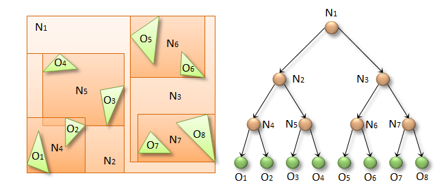

**层次包围结构/层次包围盒** 三角组碰撞 形状， 适合**静态的复杂的**物体（e.g 山地）

BvhTriangleMeshShape 

## BVH

**层次包围体**（Bounding volume hierarchies, BVH）是一种基于图元Primitive，构成场景的基本元素如三角形、球面等）划分的空间索引结构

层次包围盒(Bounding Volume Hierarchy, BVH)是一种基于物体的场景管理技术，广泛用于碰撞检测，光线追踪，视锥体物体剔除等场合。对于三维场景的实时渲染来说，BVH是最常用的数据结构。场景以层次树形结构进行组织，包含一个根节点、内部节点、叶子节点。树中的每个节点，包括叶子节点都有一个包围体，可以将其子树的所有几何体包围起来，这就是BVH名字的由来。

**盒子（**Bounding Volume**）**

[《一周学习光线追踪》（二）层次包围盒BVH]: https://zhuanlan.zhihu.com/p/36439822
[PBRT-E4.3-层次包围体(BVH)（一）]: https://zhuanlan.zhihu.com/p/50720158

**二分法思想**

为了实现这个机制，我们需要一个**高效的方法将空间分割为不同的盒子** 

